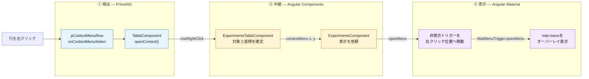

# Bulletin解析: 実験一覧の行を右クリックしてメニューを表示する

## 30秒で分かる結論

この処理では、2種類のメニュー機能を使い分けている。

| 担当 | 技術 | 実際の役割 |
|---|---|---|
| 右クリック検出 | PrimeNG `p-context-menu` | 対象行とマウス座標を取得する。自身は非表示 |
| メニュー表示 | Angular Material `mat-menu` | 右クリック位置に実際のメニューを表示する |

> **PrimeNGで検出し、Angular Materialで表示する。**

## 全体図



## コードを追う6地点

### 1. 行の右クリックを検出

`<tr>` の `pContextMenuRow` が対象行をPrimeNGへ登録する。右クリックすると、`p-table` の `onContextMenuSelect` から `openContext($event)` へ進む。

- [`pContextMenuRow`](./src/app/webapp-common/shared/ui-components/data/table/table.component.html#L127)
- [`onContextMenuSelect`](./src/app/webapp-common/shared/ui-components/data/table/table.component.html#L36)

### 2. 共通テーブルから実験テーブルへ通知

`TableComponent.openContext()` が、マウスイベントと行データを `rowRightClick` でemitする。実験テーブル側は `(rowRightClick)="openContextMenu($event)"` で受け取る。

- [`TableComponent.openContext()`](./src/app/webapp-common/shared/ui-components/data/table/table.component.ts#L421)
- [`rowRightClick` の受信](./src/app/webapp-common/experiments/dumb/experiments-table/experiments-table.component.html#L31)

### 3. 対象実験と座標を確定

`ExperimentsTableComponent.openContextMenu()` が次の3つを行う。

1. 対象実験を `contextExperiment` Signalへ保存
2. `preventDefault()` でブラウザ標準メニューを抑止
3. `clientX` / `clientY` を `contextMenu` outputで親へ通知

- [`ExperimentsTableComponent.openContextMenu()`](./src/app/webapp-common/experiments/dumb/experiments-table/experiments-table.component.ts#L349)
- [`contextMenu.emit({x, y})`](./src/app/webapp-common/experiments/dumb/experiments-table/experiments-table.component.ts#L361)

### 4. 実験管理画面からメニューへ表示依頼

親の `ExperimentsComponent` が `contextMenu` を受け取り、メニューComponentの `openMenu({x, y})` を呼ぶ。

- [`contextMenu` の受信](./src/app/webapp-common/experiments/experiments.component.html#L111)
- [`ExperimentsComponent.onContextMenuOpen()`](./src/app/webapp-common/experiments/experiments.component.ts#L735)

### 5. 非表示トリガーを右クリック位置へ移動

`BaseContextMenuComponent.openMenu()` が座標を `position` Signalへ設定する。テンプレートでは、その値が `position: fixed` の非表示トリガーへ反映される。

- [`BaseContextMenuComponent.openMenu()`](./src/app/webapp-common/shared/components/base-context-menu/base-context-menu.component.ts#L48)
- [座標を受け取る非表示トリガー](./src/app/webapp-common/experiments/shared/components/experiment-menu/experiment-menu.component.html#L11)

```text
MouseEvent.clientX / clientY
        ↓
position Signal
        ↓
非表示トリガーの left / top
```

### 6. `mat-menu`を表示

座標更新後に `MatMenuTrigger.updatePosition()` と `openMenu()` を実行する。これにより、`#experimentMenu` が右クリック位置を基準としてAngular CDK Overlay上へ表示される。

- [`MatMenuTrigger.openMenu()`](./src/app/webapp-common/shared/components/base-context-menu/base-context-menu.component.ts#L56)
- [`mat-menu #experimentMenu`](./src/app/webapp-common/experiments/shared/components/experiment-menu/experiment-menu.component.html#L18)

## 選択状態による分岐

右クリック時の違いは、Step 3の対象確定だけである。表示までの経路は変わらない。

```text
チェック済みの行を右クリック
  → 現在の複数選択を維持

未チェックの行を右クリック
  → 選択を右クリックした1件へ変更
```

該当処理: [`openContextMenu():350-358`](./src/app/webapp-common/experiments/dumb/experiments-table/experiments-table.component.ts#L350)

## 補足: メニュー本体は事前に準備されている

右クリックより前に、親が定義した `contextMenuExtendedTemplate` を実験テーブルが `ngTemplateOutlet` で描画している。そのため、右クリック時は既存のメニューComponentに対して `openMenu()` を呼ぶだけでよい。

[`contextMenuExtendedTemplate`](./src/app/webapp-common/experiments/experiments.component.html#L140)
→ [`contextMenuTemplate` input](./src/app/webapp-common/experiments/experiments.component.html#L94)
→ [`ngTemplateOutlet` で描画](./src/app/webapp-common/experiments/dumb/experiments-table/experiments-table.component.html#L1)

## Bulletin解析到達点

実験一覧の行を右クリックしてから、その位置へ `experimentMenu` が表示されるまでを確認した。

メニュー項目をクリックした後の処理は、このBulletin解析の対象外とする。
