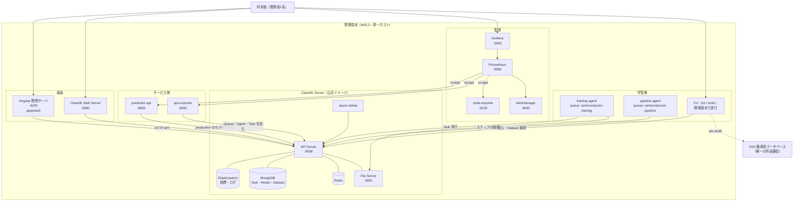
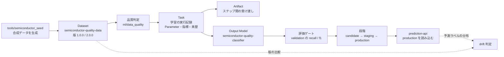

# システム構成設計

## 文書情報

| 項目 | 内容 |
| --- | --- |
| 文書名 | システム構成設計 |
| 文書ID | DOC-04 |
| Version | 0.1 |
| Status | ドラフト |
| 作成日 | 2026-09-12 |
| 最終更新日 | 2026-09-12 |
| Author | 本リポジトリの開発者（単独） |
| Reviewer | なし |

## 1. 目的

この文書は、どのプロセスが何を担い、どこで繋がり、状態をどこに置くかを示す。
方式の選択理由は 03 が、コードの配置は 61 が持つ。

## 2. 適用範囲

`infra/clearml/compose.yaml` が起動するプロセス群と、開発端末で動かす Angular・CLI を対象とする。

## 3. 前提

すべてのプロセスが単一ホスト（WSL2）上で動く。既定のポートは `.env` で上書きできる。
以下の番号はいずれも既定値である。

## 4. 定義

### 4.1 全体構成

### 4.2 プロセス一覧

| プロセス | イメージ | 既定ポート | 待ち受け | 役割 |
| --- | --- | --- | --- | --- |
| `apiserver` | `clearml/server:2.4.0` | 8008 | 公開 | Task・Dataset・Model・Queue の保管と検索 |
| `fileserver` | 同上 | 8081 | 公開 | Artifact とモデル本体の保管 |
| `webserver` | 同上 | 8080 | 公開 | ClearML 公式 UI の配信 |
| `async-delete` | 同上 | — | — | 削除された URL の後片付け |
| `elasticsearch` | `elasticsearch:8.19.9` | — | backend のみ | 指標とログの保管 |
| `mongo` | `mongo:8.0.15` | — | backend のみ | 実体の保管 |
| `redis` | `redis:8.2.3` | — | backend のみ | ClearML の内部利用 |
| `training-agent` | `stackup/semiconductor-agent:0.1.0` | — | host | `semiconductor-training` を購読して Task を実行する |
| `pipeline-agent` | 同上 | — | host | `semiconductor-pipeline` を購読して Pipeline の制御役を実行する |
| `prediction-api` | `stackup/semiconductor-prediction-api:0.1.0` | 8090 | 既定は 127.0.0.1 | production のモデルで推論に答える |
| `ops-exporter` | `stackup/semiconductor-ops-exporter:0.1.0` | 8091 | 既定は 127.0.0.1 | 学習側の状態を Prometheus 形式で中継する |
| `node-exporter` | `prom/node-exporter:v1.9.1` | 9100 | 既定は 127.0.0.1 | ホストの CPU・メモリ・ディスク |
| `prometheus` | `prom/prometheus:v3.7.3` | 9090 | 既定は 127.0.0.1 | 収集と警報判定。7日保持 |
| `alertmanager` | `prom/alertmanager:v0.28.1` | 9093 | 既定は 127.0.0.1 | 警報の集約 |
| `grafana` | `grafana/grafana:12.3.1` | 3000 | 既定は 127.0.0.1 | 可視化。匿名は閲覧のみ |
| Angular 開発サーバ | — | 4200 | `--host 0.0.0.0` | 自作画面を含む Web の配信 |

ホストのネットワークを使うプロセス（Agent 2台・両サービス・監視一式）は、
開発者が使うのと同じ URL で ClearML を見る。Compose 内部のサービス名で繋ぐと、
Agent が上げた成果物の URL に `http://fileserver:8081` が入り、ホストのブラウザから開けなくなる。

待ち受けアドレスの既定を 127.0.0.1 にしているのは、ホストのネットワークをそのまま使うためである。
0.0.0.0 にすると家庭内 LAN の誰でも推論を呼べる。

### 4.3 ネットワーク

| ネットワーク | 種別 | 所属 |
| --- | --- | --- |
| `backend` | internal（外へ出ない） | apiserver, fileserver, webserver, async-delete, elasticsearch, mongo, redis |
| `frontend` | 通常 | apiserver, fileserver, webserver |
| ホストのネットワーク | `network_mode: host` | 両 Agent、prediction-api、ops-exporter、監視一式 |

データベース3つは `backend` にのみ所属し、ホストへポートを公開しない。

### 4.4 状態の置き場所

| ボリューム | 内容 | 失ったときに起きること |
| --- | --- | --- |
| `clearml-elasticsearch` | 指標・コンソール出力 | 実験の記録が読めなくなる |
| `clearml-mongo-db` / `clearml-mongo-config` | Task・Model・Dataset・Queue の実体 | 実験とモデルの一切を失う |
| `clearml-files` | Artifact とモデル本体 | 学習済みモデルを取得できなくなる |
| `clearml-logs` / `clearml-config` | サーバのログと設定 | 設定を作り直す |
| `clearml-agent-home` | Agent ごとの実行環境と pip キャッシュ | 再構築に時間がかかるだけで、記録は失わない |
| `prediction-api-cache` / `ops-exporter-cache` | SDK のキャッシュ | 同上 |
| `prometheus-data` | 時系列（7日） | 直近の推移を失う |
| `alertmanager-data` | 警報の状態 | 沈黙設定を失う |
| `grafana-data` | ダッシュボードの状態 | provisioning から作り直せる |

バックアップの仕組みは無い（02 §4.7）。
`docker volume prune` と `docker system prune --volumes` は、併存プロジェクトの停止中ボリュームを
消すため実行しない。

### 4.5 ClearML 上の資産の対応

プロジェクトの構成は次のとおり。

| ClearML Project | 内容 |
| --- | --- |
| `Semiconductor Quality Prediction` | Dataset の置き場所 |
| `Semiconductor Quality Prediction/Training` | 学習 Task の既定の置き場所 |

Queue は2つある。`semiconductor-training` が学習とステップを、
`semiconductor-pipeline` が Pipeline の制御役を受け持つ。

### 4.6 外部利用者と外部システム

外部の利用者はいない。画面・サービス・監視のいずれも、既定ではホスト内からのみ到達できる。

Angular を家庭内 LAN へ公開する場合だけ、Windows 側のポート転送を経由して別端末から 4200 へ届く。
その手順と、スリープ復帰後に転送が切れる現象は `AGENTS.local.md` にある。

外部システムは OSV だけである（03 §4.13）。

## 5. 判断事項

| 判断 | 内容 |
| --- | --- |
| Agent をホストのネットワークに置く | 成果物の URL を、誰が実行しても同じものにするため |
| Agent の worker 名を明示する | 2台が同じホスト名と PID を名乗ると id が衝突し、稼働中の Queue が無人に見えて `QueueUnattended` が誤って鳴る |
| Queue を学習用と Pipeline 用に分ける | 制御役が待つ間 Agent を占有するため |
| 作業ツリーを読み取り専用で Agent へ渡す | Agent が作業ツリーを書き換えないことを権限の側で担保する |
| Grafana の匿名閲覧を許す | 待ち受けをループバックへ寄せたうえでの判断。役割は閲覧のみに固定する |
| node-exporter を v1.9.1 に留める | v1.10.0 はこのホストの overlay マウントを解析できず、ディスクの空きが取れなくなる |

## 6. 未決事項

* バックアップ対象と取得方法（02 §4.7、`backlog/11_バックアップ手順が無い.md`）
* Agent を増やしたときの挙動。確認していない。
* 警報の通知先。Alertmanager から外部へ出す経路が無い。

## 7. 関連資料

* `infra/clearml/compose.yaml`（この文書の一次情報）
* `infra/observability/{prometheus.yml.template,alerts.yml,alertmanager.yml,grafana/}`
* `scripts/backend-up.sh`, `scripts/security-tokens.sh`（起動時の生成物）
* `_archive/runbooks/001_20260908_queue_and_agent.md`, `_archive/runbooks/006_20260908_observability.md`
* `02_非機能要件定義書.md`、`03_方式設計書.md`

## 8. 更新履歴

| Version | Date | 内容 |
| ------- | ---------- | ------- |
| 0.1 | 2026-09-12 | 初版 |
