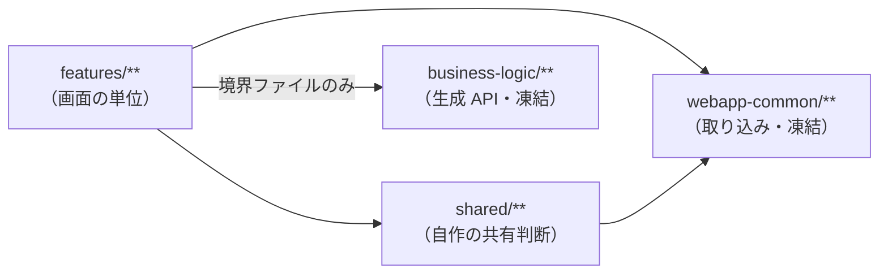

# アーキテクチャ規約

## 文書情報

| 項目 | 内容 |
| --- | --- |
| 文書名 | アーキテクチャ規約 |
| 文書ID | DOC-61 |
| Version | 0.1 |
| Status | ドラフト |
| 作成日 | 2026-09-12 |
| 最終更新日 | 2026-09-12 |
| Author | 本リポジトリの開発者（単独） |
| Reviewer | なし |

## 1. 目的

この文書は、コードをどこに置き、依存をどちら向きに流すかを定める。
方式の選択理由は 03 が、書き方の規約は 60（未着手）が持つ。

規約のうち機械で検査できるものは、検査の名前を併記する。
検査のない規約は、人が見て守るものとして区別する。

## 2. 適用範囲

`apps/web`（自作分）、`ml`、`services`、`tools`、`scripts` を対象とする。

取り込んだ ClearML Web（`src/app/webapp-common/**` と、`features/` のうち取り込み由来のもの）は
凍結領域であり、この規約の適用対象は「そこへ新しい判断を足さない」という1点に限られる（ADR 003）。

## 3. 前提

`apps/web` は ClearML Web を fork した作業ツリーである。自作分は
`features/quality-pipeline`、`features/data-catalog`、`shared/clearml` の3つだけである。

## 4. 定義

### 4.1 Angular の配置

| ディレクトリ | 置くもの | 由来 |
| --- | --- | --- |
| `src/app/features/**` | 画面の単位。経路ごとに独立する | 取り込み＋自作 |
| `src/app/shared/**` | 自作 feature が共有する判断 | 自作 |
| `src/app/webapp-common/**` | ClearML Web の共通層 | 取り込み（凍結） |
| `src/app/business-logic/**` | 生成された API クライアントと model | 取り込み（凍結） |
| `src/app/core/**` | アプリ全体の初期化 | 取り込み |
| `src/app/layout/**` | 画面枠 | 取り込み |

別名は2つある。`~/*` が `src/app/*` を、`@common/*` が `src/app/webapp-common/*` を指す。

### 4.2 依存の方向

3つの規則があり、`pnpm web:boundaries` が検査する。

| 規則 | 内容 |
| --- | --- |
| feature は他の feature を直接参照しない | 共有するものは `src/app/shared` へ置く。`webapp-common` へは足さない |
| 生成 API に触れるのは feature の境界ファイルだけ | `*-api.service.ts` と `*.adapter.ts`（およびその spec）に限る |
| 共有層は feature に依存しない | `webapp-common` と `shared` から `features` を参照しない |

取り込み時点で既に規則に反している箇所は、既知の違反として一覧に固定してある。
新しい違反だけが検出される。既知の違反を減らすことは求めるが、増やすことは受け入れない。

依存を図にすると次のようになる。矢印は参照してよい向きである。

### 4.3 feature の内部構成

自作 feature は次の構成を持つ。`quality-pipeline` と `data-catalog` の両方が同じ形である。

| 場所 | 置くもの |
| --- | --- |
| `<feature>.routes.ts` | 経路と、その経路でだけ用意する provider |
| `<feature>.model.ts` | この feature が扱う語彙。ClearML の語彙ではない |
| `<feature>.consts.ts` | 定数 |
| `data-access/<feature>-api.service.ts` | 生成 API の呼び出し。ここだけが ClearML の形を知る |
| `data-access/<feature>.adapter.ts` | ClearML の応答を feature の語彙へ変換する |
| `state/<feature>.actions.ts` | 操作と結果 |
| `state/<feature>.reducer.ts` | 状態の遷移と feature の宣言 |
| `state/<feature>.effects.ts` | 取得と副作用 |
| `state/<feature>.selectors.ts` | 導出される値 |
| `containers/**` | store に触れる component。feature ごとに1つ |
| `components/**` | 入力と出力だけで動く component |
| `styles/**` | この feature のためのスタイル |

Effects は、更新する対象の state と同じ場所に置く。

### 4.4 container と presentational の分担

store に触れるのは container だけである。container は state を読んで子へ渡し、
子から返ってきた操作を action にする。

presentational component は store を知らない。単体で組み立てて確かめられることが、
知らないことの目的である。

ClearML の語彙は container まで届かない。届いていれば、adapter か Effects の漏れである。

### 4.5 state の登録

state・Effects・API 境界は、経路に入ったときだけ `provideState` / `provideEffects` で登録する。
アプリ全体には登録しない。

一覧と詳細のように同じ state を共有する経路では、provider を親の経路に置く。
子ごとに置くと、詳細へ移った時点で state が作り直され、戻ったときに一覧を引き直すことになる。

### 4.6 自作共有層に置いてよいもの

`src/app/shared` に置くのは、複数の feature が共有する「方針の実体」に限る。
行数の削減を理由に寄せない。

現在ここにあるのは ClearML API の失敗を1行に変換する処理だけで、
これは「失敗は state に載せる」という方針が feature ごとに割れないようにするために置いてある。

`libs/` としてライブラリに切り出すことは、現時点では行わない。
再検討の条件は ADR 009 が持つ。

### 4.7 Python の層

3つのパッケージがあり、それぞれ役割が違う。

| パッケージ | 役割 |
| --- | --- |
| `ml/` | 判断。データ品質、学習、評価、ゲート、段階管理、探索 |
| `services/` | 配信。推論の応答と、監視のための中継 |
| `tools/` | 道具。種まき、秘密の検査、供給網の検査、在庫の確認 |

`ml` の各サブパッケージは、内部をさらに3つに分ける。

| 種別 | ファイル名の傾向 | 依存してよいもの |
| --- | --- | --- |
| データ契約 | `domain.py` | 標準ライブラリと numpy のみ |
| 判断 | `checks.py`, `gate.py`, `trials.py`, `evaluate.py` ほか | データ契約 |
| ClearML 境界 | `clearml_tracking.py`, `registry.py`, `steps.py`, `controller.py`, `optimizer.py`, `model_source.py`, `clearml_source.py`, `clearml_tasks.py` | SDK |

ClearML SDK を呼ぶのは、上の表の3行目だけである。この規則に自動の検査は無い。
守られている状態を保つのは、単体テストがサーバ無しで動くという事実である。
境界の外で SDK を呼べば、その層のテストがサーバを要求し始める。

### 4.8 設定の置き場所

| 種類 | 置き場所 | 理由 |
| --- | --- | --- |
| 接続先・資格情報 | 環境変数と `./clearml.conf`（git 管理外） | 記録に残さないため |
| データの構造（列・型） | コード（`domain.py`） | 型と処理の全段がこれに依存するため |
| データの値域 | `config/data_quality.yaml` | 工程とともに変わり、変える人と配備する人が別だから |
| モデルの合格基準 | `config/model_gate.yaml` | 基準の変更でコード変更と配備を要さないため |
| 探索の意味 | `config/experiment/base.yaml` | どの環境でも同じだから |
| 探索の予算・Queue | `config/experiment/<env>.yaml` | 環境ごとに違うから |
| リリースゲートの方針 | `config/supply_chain.yaml` | 判断を1か所に集めるため |
| 秘密検査の除外 | `config/security.yaml` | 除外は設定ではなく判断であり、理由を要するため |

設定ファイルに無いキーを足すと読み込みが失敗する。
綴りを間違えた設定が既定値で黙って走るのを防ぐためである。

### 4.9 検査の一覧

| 規約 | 検査 |
| --- | --- |
| 依存の方向（§4.2） | `pnpm web:boundaries` |
| 型の厳格化 | `pnpm web:typecheck:strict` |
| lint の負債を増やさない | `pnpm web:lint:baseline` |
| テストの層と置き場所（§4.3 の spec を含む） | `pnpm test:pyramid` |
| 公開 API の形 | `pnpm web:contract` |
| Python の型 | `pnpm py:typecheck` |
| ClearML 境界（§4.7） | 自動検査なし |
| container と presentational の分担（§4.4） | 自動検査なし |
| 共有層に置いてよいもの（§4.6） | 自動検査なし |

## 5. 判断事項

| 判断 | 記録 |
| --- | --- |
| 取り込み領域を凍結し、負債を増やさない形で扱う | `_archive/adr/003_20260908_angular_boundaries_and_strict.md` |
| 自作 feature の組み立て方 | `_archive/adr/007_20260912_angular_feature_composition.md` |
| 共有層の切り出しと `libs/` を切らない判断 | `_archive/adr/009_20260912_shared_layer_and_deferred_decisions.md` |
| 台帳のメタデータ編集で楽観更新をしない | `_archive/adr/008_20260912_catalog_metadata_editing.md` |

## 6. 未決事項

* ClearML 境界の規約に検査が無いこと。破っても、テストがサーバを要求し始めるまで気付かない
* `libs/` への分離（`backlog/04_libsを切る.md`）
* zoneless への移行（`backlog/05_zoneless.md`）
* `typecheck:strict` の範囲外に残る365件（`backlog/08_strict範囲外365件.md`）

## 7. 関連資料

* `apps/web/web-boundaries.json`（依存の規則と既知の違反）
* `test-pyramid.json`（層の宣言）
* `03_方式設計書.md`、`30_テスト計画書.md`
* `60_コーディング規約.md`（未着手）、`62_レビュー基準.md`（未着手）
* `_archive/adr/`（各判断の経緯）

## 8. 更新履歴

| Version | Date | 内容 |
| ------- | ---------- | ------- |
| 0.1 | 2026-09-12 | 初版 |
