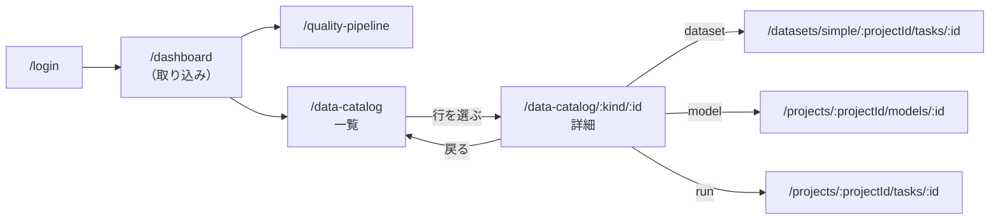
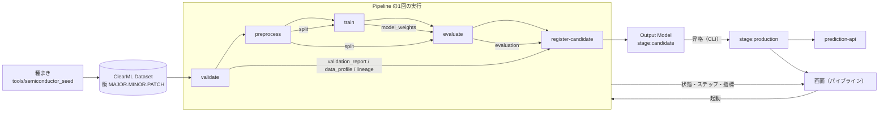
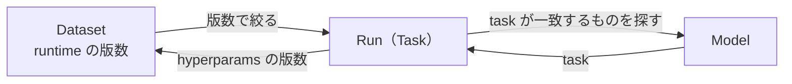

# 基本設計書

## 文書情報

| 項目 | 内容 |
| --- | --- |
| 文書名 | 基本設計書 |
| 文書ID | DOC-05 |
| Version | 0.1 |
| Status | ドラフト |
| 作成日 | 2026-09-12 |
| 最終更新日 | 2026-09-12 |
| Author | 本リポジトリの開発者（単独） |
| Reviewer | なし |

## 1. 目的

この文書は、外から見える振る舞いを定める。どの画面で何ができ、どの API を呼び、
どの順でデータが流れ、何を断り、何を外へ出すかを示す。

方式の選択理由は 03 が、プロセスの配置は 04 が、実装可能な粒度の内部構造は 06 が持つ。

## 2. 適用範囲

自作の2画面（`quality-pipeline`、`data-catalog`）と、`services/prediction_api`・
`services/ops_exporter` が公開する HTTP を対象とする。

取り込んだ ClearML Web の既存画面は対象外である。凍結領域であり、本プロジェクトは
そこへ新しい判断を足さない（ADR 003）。自作画面から既存画面への行き先だけを §4.2 に示す。

## 3. 前提

画面は ClearML の HTTP API の利用者であり、自分のサーバを持たない。
学習と昇格の判断は `ml/` 側にあり、画面はその結果を読むか、実行を起動するだけである。

## 4. 定義

### 4.1 主要画面

自作の画面は3つで、feature としては2つである。

| 画面 | 経路 | できること | 構成する component |
| --- | --- | --- | --- |
| 品質判定パイプライン | `/quality-pipeline` | Dataset 版を指定して学習 Pipeline を起動する。走っている実行とステップを追う。止める。評価指標と、いま提供されているモデルを読む | `start-run-form` / `run-summary` / `pipeline-steps-table` / `evaluation-scores-table` / `production-model-card` |
| 資産台帳（一覧） | `/data-catalog` | Dataset・Model・Run を1つの語彙で横断して絞り込む。見えているものをファイルに書き出す | `catalog-filters` / `catalog-assets-table` |
| 資産台帳（詳細） | `/data-catalog/:kind/:id` | 1つの資産の固有情報と来歴を読む。タグと説明を直す | `catalog-asset-facts` / `catalog-lineage` / `catalog-metadata-form` |

台帳は横断の入口であり、種別ごとの詳細画面の置き換えではない。深い情報は、
それを持っている既存の ClearML 画面へ渡す（§4.2）。

台帳が書き込むのはタグと説明の2つだけである。名前・プロジェクト・状態は
ClearML 側の実体が決めるもので、台帳が上書きしてよいものではない。

### 4.2 画面遷移

台帳の絞り込み条件は URL のクエリに載る。条件を変える操作は、まず URL の書き換えとして
現れ、書き換わった URL を読んで一覧を引き直す。利用者が自分で絞った場合と、
条件つきの URL を渡されて開いた場合が、これで同じ1本の経路になる。

| クエリ鍵 | 条件 |
| --- | --- |
| `q` | 名前の部分一致 |
| `kind` | 種別（`dataset` / `model` / `run`、コンマ区切り） |
| `project` | プロジェクト名の完全一致 |
| `tag` | タグ（コンマ区切り、AND） |
| `from` / `to` | 更新日時の下限と上限（`YYYY-MM-DD`） |

絞り込みの URL は履歴を積まずに置き換える。1文字ごとに履歴が積まれると、
戻るボタンで画面を出られなくなる。

詳細は URL 単体で開ける。一覧を経由しなくてよい。種別を経路に入れているのは、
ClearML の Task と Model が別の ID 空間を持ち、片方の ID をもう片方へ問い合わせても
失敗ではなく「見つからない」が返るためである。

### 4.3 主要 API

#### 画面から ClearML へ

画面が呼ぶのは次の操作だけである。いずれも取り込み時に生成された API クライアント経由で、
feature の境界ファイルからのみ呼ぶ（61 §4.2）。

| 操作 | ClearML API | 使う画面 |
| --- | --- | --- |
| 起動元の Pipeline Task を探す / 直近の実行を読む | `tasks.get_all_ex` | パイプライン |
| 実行の状態を読み直す | `tasks.get_by_id_ex` | パイプライン・台帳 |
| ステップを親 Task で引く | `tasks.get_all_ex` | パイプライン |
| 評価ステップの指標を読む | `events.get_task_latest_scalar_values` | パイプライン |
| 起動する（複製する / Queue へ入れる） | `tasks.clone` → `tasks.enqueue` | パイプライン |
| 止める | `tasks.stop` | パイプライン |
| 提供中のモデルを読む | `models.get_all_ex` | パイプライン・台帳 |
| プロジェクト名から ID を引く | `projects.get_all_ex` | パイプライン・台帳 |
| 絞り込みの選択肢を読む | `projects.get_task_tags` / `projects.get_model_tags` | 台帳 |
| タグと説明を直す | `tasks.update` / `models.update` | 台帳 |

起動は利用者にとって1つの操作だが、ClearML 上では複製・パラメータの書き換え・
Queue への投入の3つである。この手順を画面側に散らさず、API 境界が1つの操作として公開する。

絞り込みはすべてサーバへ渡す。全件を取って手元で絞ると、件数が増えたときに
「画面が重い」ではなく「途中までしか無い」という形で壊れる。手元に残しているのは、
3種別の結果を1つの表へ混ぜて並べ替える処理だけで、混ぜる先は ClearML に無い。

#### 推論サービス

| 操作 | 経路 | 必要な権限 | 返す状態 |
| --- | --- | --- | --- |
| 生存確認 | `GET /health` | なし | 200 |
| 提供可否とモデルの素性 | `GET /ready` | `model:read` | 200 / 401 / 403 / 503 |
| 一括判定 | `POST /predict` | `predict` | 200 / 401 / 403 / 422 / 503 |

`/health` はモデルに触れずに答える。プロセスが生きていることと、提供できることは別の問いで、
片方の答えでもう片方を代弁させると、モデルを持たないプロセスが健全として扱われる。

#### 監視の中継

| 操作 | 経路 | 必要な権限 |
| --- | --- | --- |
| 生存確認 | `GET /health` | なし |
| Queue・Agent・直近の Task の指標 | `GET /metrics` | `metrics:read` |

ClearML へ到達できたかどうかを `clearml_reachable` として併せて出す。
監視が落ちている状態と、監視対象が無事な状態を見分けるためである。

### 4.4 データフロー

ステップは5つで、依存の宣言は `ml/pipeline/domain.py` の1か所にしかない。
各ステップは前のステップの Artifact を名前で読む。共有ディレクトリを介して暗黙に渡さないので、
1ステップだけを後から別のマシンで再実行できる。

候補から先の昇格は画面が行わない。段階の遷移は `ml/model_lifecycle` の CLI が扱い、
画面はいま production にあるモデルを読むだけである。

### 4.5 Dataset・Task・Model・Artifact の対応

資産そのものの対応は 04 §4.5 にある。ここで定めるのは、画面がそれらを**どの手掛かりで辿るか**である。

繋がりの手掛かりは2つしかない。

| 向き | 手掛かり |
| --- | --- |
| Model → Run | Model が生成元の Task を `task` に持つ |
| Run → Dataset | Run が使った版数を hyperparams の `Dataset/dataset_version` に持つ |

逆向き（Dataset から Run、Run から Model）は、その値で絞り込んで引き当てる。
Dataset 側の版数は ClearML が `runtime` に置いているので、そこを条件にする。

辿った先が見つからない場合も、節そのものは残して「ここに何かがあったが、もう無い」と示す。
節ごと落とすと、切れている鎖が繋がっているように見える。3つ揃わなかったことは画面に明示する。

### 4.6 Dataset Version 管理

Dataset の版は `MAJOR.MINOR.PATCH` で表す。現在登録してあるのは 1.0.0 と 2.0.0 の2版である
（10 データディクショナリ）。

画面は起動時に版を受け取り、送る前に書式を確かめる。書式の違う値でも起動要求そのものは通り、
Pipeline が実行時に Dataset を見つけられずに落ちるまで誤りが分からない。

学習の入力は版を指定して取得し、読み取り専用の複製を受け取る。版の選び直しは
Pipeline を起動し直すことであり、実行中に版が差し替わることはない。

モデル側は、どの版から来たかを2か所に持つ。

| 置き場所 | 内容 |
| --- | --- |
| `model_version` | Dataset 版・学習 Task の ID・作成時刻から組み立てた識別子 |
| metadata の `dataset_version` / `dataset_id` | 学習に使った Dataset の版と ID |

版の間の変化は、生の行ではなく測った統計どうしで比較する。両方の版を手元に持たなくても
比較できる（03 §4.10）。

### 4.7 権限モデル

画面とサービスで、認可の扱いが違う。

画面は ClearML 自身の認証だけを通る。画面側に独自の役割は無く、機能の出し分けもしない。
台帳の詳細でタグと説明を直せるのは、ClearML にログインできた利用者すべてである。

サービス側は、行為で表した権限を役割に束ね、呼び手には役割を与える。

| 役割 | `predict` | `model:read` | `metrics:read` |
| --- | --- | --- | --- |
| `predictor` | ○ | ○ | — |
| `operator` | — | ○ | ○ |
| `scraper` | — | — | ○ |

`predictor` が `model:read` を持つのは、どのモデルが答えたかが応答の一部だからである。
監視の数字は業務に要らないので持たせない。

拒否は2つを区別する。401 は資格情報が無いか誰のものでもないこと、403 は誰か分かったうえで
許していないことを意味する。判断は許可も含めてすべて監査ログに残す。
記録するのは指紋の断片までで、資格情報そのものは残さない。

### 4.8 エラー表示

画面の失敗は state に載せ、1行の説明として出す。例外をそのまま投げると、その effect は
以後何も受け取らなくなり、画面は「押しても無反応」になる。

失敗の重みは3段に分ける。

| 種類 | 例 | 画面の振る舞い |
| --- | --- | --- |
| 画面全体の失敗 | 一覧・詳細・起動・停止・保存の失敗 | 説明を出す。直前まで見えていた結果は消さない |
| 部分の失敗 | 来歴が辿れない、絞り込みの選択肢が読めない、指標が読めない | 何も出さない。その部分だけ空にする |
| 失敗ではない欠落 | 資産が消えている | 「消えている」として出す。再読込では戻らないため、失敗と分ける |

黙って減らさないことを2か所で守る。一覧とステップはどちらも上限で打ち切るので、
打ち切ったこと自体を画面に書く。件数だけを出して切り捨てを隠すと、
表から消えたものが「無かったもの」と区別できなくなる。

一覧が空のときは理由を出し分ける。「まだ何も無い」と「条件に合うものが無い」を
同じ0件で済ませると、絞り込みを外せば見えるものを、存在しないものとして読ませることになる。

保存の成否は応答から読む。ClearML は存在しない ID への更新でも 200 を返し、
`updated: 0` で「何も変えなかった」と言う。応答を読まないと、消された資産への編集が
成功として画面に残る。

サービス側は、拒否の理由を状態コードで分ける（§4.3）。モデルを持たないときは 503 を返し、
要求の形が合わないときは 422 を返す。

### 4.9 主要バリデーション

断る場所を、誤りが分かる最も早い地点に置く。

| 対象 | 断る場所 | 条件 | 外れたとき |
| --- | --- | --- | --- |
| Dataset 版 | 起動フォーム | `MAJOR.MINOR.PATCH` | 送らない。書式の例を出す |
| 絞り込みの日付 | URL の読み取り | `YYYY-MM-DD` | その条件を無かったものとして扱う |
| 絞り込みの種別 | URL の読み取り | `dataset` / `model` / `run` | 読めない値は落とす |
| 詳細の種別と ID | URL の読み取り | 語彙に合う種別と空でない ID | 問い合わせない |
| 推論の要求 | 推論サービス | 各測定値の範囲、識別子の長さ、1回の件数の上限 | 422 を返す |
| 学習の入力 | 学習の実行前 | 列の並びと型、識別子の重複、ラベルの語彙 | 理由をすべて挙げて止まる |
| Dataset の値 | 品質判定 | `config/data_quality.yaml` の値域・未知カテゴリの割合・ラベルの偏り・識別子の重複 | 違反を挙げて学習へ進めない |
| モデルの成績 | 登録の直前 | `config/model_gate.yaml` の recall と f1 | 候補として登録しない |

誤りは1件ずつではなくまとめて報告する。1回の実行で全部直せるようにするためである。

設定ファイルに無い鍵を足すと読み込みが失敗する。綴りを間違えた設定が既定値のまま
黙って走るのを防ぐ（61 §4.8）。

### 4.10 外部公開機能

外部の利用者はいない（04 §4.6）。ここで言う外部とは、この画面とこのプロセスの外へ
持ち出される形のことである。

| 出口 | 形 | 変化を検出する仕組み |
| --- | --- | --- |
| 台帳の参照 URL | `/data-catalog` と §4.2 のクエリ鍵 | 面のスナップショットとの突き合わせ |
| 台帳の書き出し | JSON の封筒（種別・版・書き出し時刻・参照 URL・条件・打ち切りの有無・件数・資産） | 同上 |
| 推論サービス | OpenAPI | 公開している形のスナップショットとの突き合わせ |
| 監視の中継 | Prometheus のテキスト形式 | なし |

書き出すのは台帳の語彙であって、ClearML API の応答ではない。生の応答を渡すと、
ClearML の更新に追従するたびに受け取った側が壊れる。

封筒が打ち切りの有無を自分で名乗る。画面はそれを注記で言うが、注記はファイルに付いてこない。
打ち切られた台帳は台帳ではなく抜粋であり、抜粋を台帳として渡さないためにこの欄がある。

書き出しは引き直さない。いま画面に見えているものの写しである。引き直して全件を出すと、
渡した相手と画面を見ている人が違うものを見て話すことになる。

台帳の内容を HTTP で読める口は開けない。呼ぶプログラムがいないまま形を決めると、
ClearML の読み取りが2言語に重複する（`../backlog/03_カタログ参照API.md`）。

## 5. 判断事項

| 判断 | 記録 |
| --- | --- |
| 自作 feature の組み立て方（失敗を state に載せる、経路ごとの state） | `../_archive/adr/007_20260912_angular_feature_composition.md` |
| 台帳のメタデータ編集で楽観更新をしない | `../_archive/adr/008_20260912_catalog_metadata_editing.md` |
| 台帳の外向きの面を2つに限る | `../_archive/adr/010_20260912_catalog_external_surface.md` |
| 公開 API をスナップショットで守る | `../_archive/adr/006_20260911_published_api_snapshot.md` |
| サービスの認証・認可の方式 | `../_archive/adr/002_20260908_service_authorization.md` |
| 取り込み領域を凍結する | `../_archive/adr/003_20260908_angular_boundaries_and_strict.md` |

## 6. 未決事項

* 画面側の認可。現在、画面は ClearML 自身の認証だけを通り、役割による出し分けを持たない。
* 台帳の参照 API。採らないと決めてあるが、再検討の条件がある（`../backlog/03_カタログ参照API.md`）。
* 台帳が運用手順のどこにも現れないこと（`../backlog/01_台帳が運用手順に現れない.md`）。
* 一連の流れを通しで確かめる筋書きが無いこと（`../backlog/02_通し台本が無い.md`）。

## 7. 関連資料

* `src/app/features/quality-pipeline/`、`src/app/features/data-catalog/`
* `src/app/app.routes.ts`（自作画面の経路）
* `services/prediction_api/openapi.json`、`src/app/features/data-catalog/data-catalog.surface.published.json`
* `ml/pipeline/domain.py`（ステップと依存の宣言）、`ml/model_lifecycle/domain.py`（段階と遷移）
* `config/data_quality.yaml`、`config/model_gate.yaml`
* `03_方式設計書.md`、`04_システム構成設計.md`、`06_詳細設計書.md`、`../phase7_チーム開発標準/61_アーキテクチャ規約.md`

## 8. 更新履歴

| Version | Date | 内容 |
| ------- | ---------- | ------- |
| 0.1 | 2026-09-12 | 初版 |
