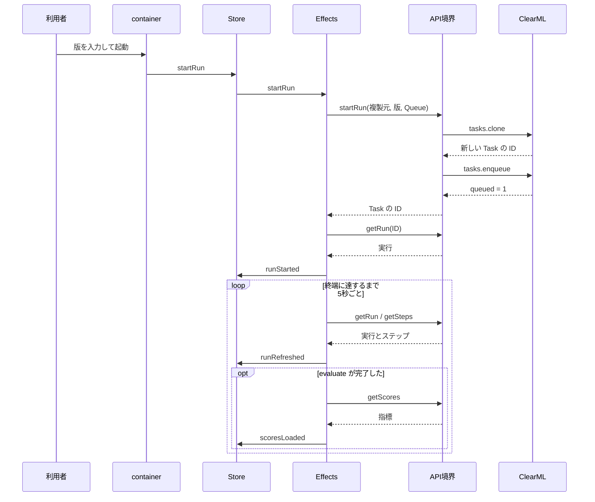
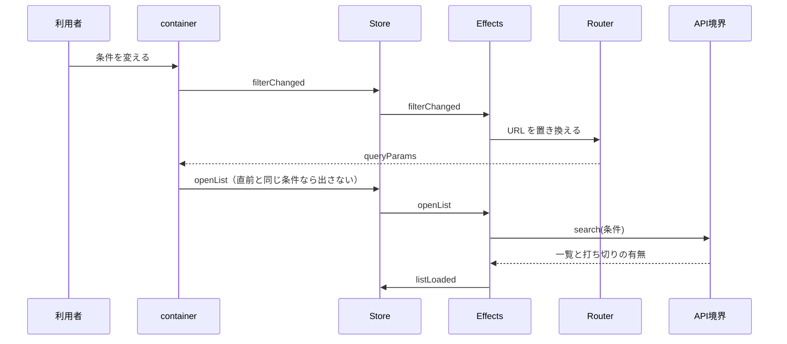
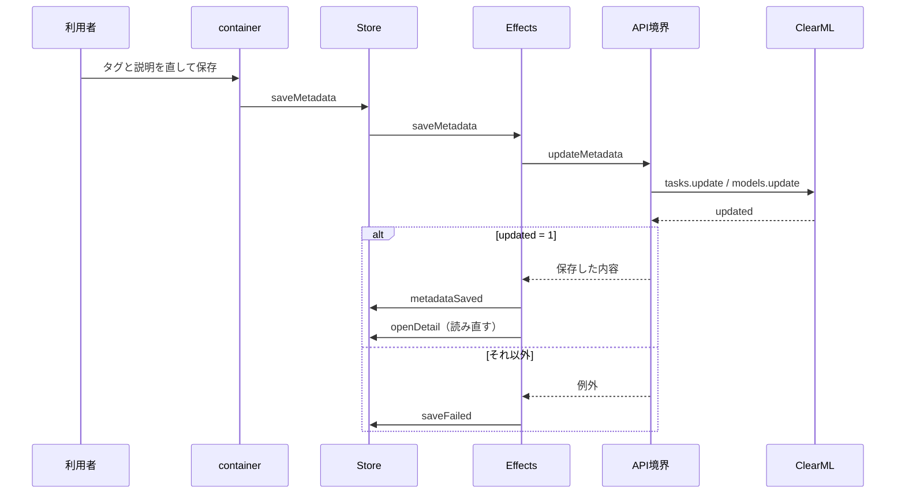

# 詳細設計書

## 文書情報

| 項目 | 内容 |
| --- | --- |
| 文書名 | 詳細設計書 |
| 文書ID | DOC-06 |
| Version | 0.1 |
| Status | ドラフト |
| 作成日 | 2026-09-12 |
| 最終更新日 | 2026-09-12 |
| Author | 本リポジトリの開発者（単独） |
| Reviewer | なし |

## 1. 目的

この文書は、自作 feature の内部構造を実装可能な粒度で定める。どのファイルが何を持ち、
どの演算子をなぜ選び、どの順で処理が流れるかを示す。

外から見える振る舞いは 05 が、配置と依存の規約は 61 が持つ。
ここではコードを写さず、読んだだけでは分からない決めごとを書く。

## 2. 適用範囲

`apps/web/src/app/features/quality-pipeline`、`apps/web/src/app/features/data-catalog`、
`apps/web/src/app/shared/clearml` を対象とする。

取り込んだ ClearML Web の内部構造は対象外である。ただし自作 feature が依存する
Routing・Guard・Interceptor は取り込み由来なので、依存している範囲だけを §4.3 に示す。

## 3. 前提

自作 feature は standalone component と NgRx の feature state で組み立てる。
state は経路に入ったときだけ登録し、アプリ全体には登録しない（ADR 007）。

## 4. 定義

### 4.1 feature の内部構成

両 feature が同じ形を持つ。ファイルの置き場所の規約は 61 §4.3 にあり、ここでは
それぞれが答える問いを示す。

| ファイル | 答える問い |
| --- | --- |
| `<feature>.routes.ts` | この画面はどの経路で、何を用意してから開くか |
| `<feature>.model.ts` | この画面は何を扱うか（ClearML の語彙ではない） |
| `<feature>.consts.ts` | ClearML 上の名前・上限・外向きの文字列は何か |
| `data-access/<feature>-api.service.ts` | ClearML へ何を頼むか |
| `data-access/<feature>.adapter.ts` | ClearML の応答を、この画面の形へどう移すか |
| `state/<feature>.actions.ts` | 何が起こりうるか |
| `state/<feature>.reducer.ts` | 何が起きたら状態がどう変わるか |
| `state/<feature>.effects.ts` | 何が起きたら外の世界へ何をするか |
| `state/<feature>.selectors.ts` | 状態から何が導かれるか |
| `containers/**` | 利用者の操作をどう action にするか |
| `components/**` | 与えられたものをどう見せるか |

store に触れる component は、パイプラインが1つ、台帳が2つ（一覧と詳細）である。
container は state を signal として読んで子へ渡し、子から返ってきた操作を action にする。
それ以外の component は入力と出力だけで動き、store も Router も知らない。
単体で組み立てて確かめられることが、知らないことの目的である。

台帳だけが余分に3つ持つ。URL のクエリとの相互変換、書き出す文書の組み立て、
組み立てた文書を手元へ渡す境界である。前の2つは純粋な変換で、最後の1つだけが
ブラウザに触れる。

### 4.2 Routing と provider の置き方

| feature | 経路 | provider を置く場所 |
| --- | --- | --- |
| パイプライン | 単一 | その経路 |
| 台帳 | 一覧と詳細の親子 | 親の経路 |

台帳の provider を親に置くのは、一覧と詳細が同じ state を共有するためである。
子ごとに置くと、詳細へ移った時点で state が作り直され、戻ったときに一覧を引き直す。

パンくずの `data` は逆に子ごとに置く。Angular の既定（`paramsInheritanceStrategy: 'emptyOnly'`）
では、パラメータを持つ子は親の `data` を受け継がず、親にだけ置くと詳細で消える。

component はどちらも `loadComponent` で遅延させる。

### 4.3 Guard と Interceptor

自作 feature は Guard も Interceptor も持たない。認証は ClearML 自身が扱い、
画面側に役割による出し分けが無い（05 §4.7）ため、経路の手前で断る条件が存在しない。

依存しているのは取り込み由来の次の3つである。

| 種別 | 対象 | 役割 |
| --- | --- | --- |
| Guard | `/login` の `canActivate` | すでにログイン済みなら元の経路へ戻す |
| Guard | プロジェクト配下の `canActivate` / `canDeactivate` | 既定の子経路への振り分けと、文脈メニューの後始末 |
| Interceptor | すべての HTTP 要求 | クライアント名のヘッダを足し、401 でログアウトさせる |

401 の扱いが Interceptor にあることは、自作 feature の失敗処理に影響する。
資格情報が切れた場合は画面の state に載る前にログアウトが起きるので、
`describeClearmlFailure`（§4.9）が扱うのは、それ以外の失敗である。

### 4.4 Model と state

state が持つのは「いま何が入っているか」だけである。導かれる問いは selectors が持つ。

パイプラインの state は次のとおりである。

| 項目 | 意味 |
| --- | --- |
| `template` | 複製の元にする Pipeline Task。無ければ起動そのものができない |
| `run` / `steps` / `stepsTruncated` | 追跡している実行と、そのステップ。打ち切りの有無を併せて持つ |
| `scores` | 評価ステップが記録した指標 |
| `productionModel` | いま提供されているモデル |
| `loading` / `starting` / `cancelling` | 読み込み中・起動中・停止中 |
| `error` | 直前の失敗の説明 |

台帳の state は次のとおりである。

| 項目 | 意味 |
| --- | --- |
| `filter` | いま効いている条件。URL のクエリと同じものを指す |
| `assets` / `hasMore` | 一覧と、打ち切りの有無 |
| `projects` / `availableTags` | 絞り込みの選択肢。一覧とは別に読む |
| `detail` / `lineage` | 開いている資産と、その来歴 |
| `loading` / `detailLoading` / `saving` | 一覧の読み込み中・詳細の読み込み中・保存中 |
| `error` | 直前の失敗の説明 |

進行中を表すフラグを1つにまとめない。一覧の再読込中でも起動ボタンを押せてよいが、
起動中の二度押しは通してはならない。1つのフラグで表すと、どれかが必ず不自然になる。

無い値は既定値で埋めず `null` として残す。更新日時を既定の日付で埋めると、
「更新されていない」と「いつ更新されたか分からない」が区別できなくなる。

台帳の共通の語彙は7つ（種別・名前・プロジェクト・更新日時・タグ・状態・元の ID）に限る。
種別ごとの固有情報を入れると、型が3実体の和集合になり、どのフィールドがいつ埋まるのかを
誰も言えなくなる。固有情報は詳細として、名前と値の並びで持つ。

### 4.5 Actions

action は「何が起きたか」を書き、「次に何をするか」は書かない。
`startRun` は利用者が起動を押した事実で、`runStarted` は ClearML が受け付けた事実である。

失敗は成功と同じ重みで宣言し、1つにまとめない。一覧の失敗と起動の失敗では、
画面の戻し方が違う。

台帳では、条件の変更（`filterChanged`）と一覧を開くこと（`openList`）を分ける。
条件の変更は URL の書き換えで終わり、書き換わった URL を container が読んで `openList` になる。
この2つを1つにすると、利用者が絞った場合と URL を渡された場合で経路が2本になり、
片方だけ直って「自分で絞ると出るのに、URL を渡すと出ない」という壊れ方をする。

詳細が読めたことを表す action は、資産が `null` の場合を失敗と区別する。
消えているものは再読込しても戻らないので、戻し方が違う。

### 4.6 Reducer

4つの決めごとがある。

成功したら失敗を消す。前の失敗が残ると、成功しているのに説明が出続ける。

失敗しても直前の結果は消さない。取得に失敗したからといって、見えていた実行結果まで
消える必要はない。消すのは画面を離れたときだけである。

追跡する実行が変わったら、前の実行のステップと指標は持ち越さない。同じ実行を読み直した
だけなら残す。

導かれる問いは書かない。「起動できるか」「保存してよいか」は selectors が答える。

### 4.7 Selectors

| selector | 答える問い |
| --- | --- |
| `selectCanStart` | 複製元があり、いま起動中でないか |
| `selectRunInProgress` | 利用者が止められる相手がいるか |
| `selectCanCancel` | 止められる実行があり、まだ停止要求を送っていないか |
| `selectRunIsTemplate` | 複製元と直近の実行が同じ Task を指しているか |
| `selectFilterIsEmpty` | 何も絞っていないか |
| `selectEmptyReason` | 一覧が空なのは「まだ無い」か「合うものが無い」か |
| `selectCanSave` | 開いている資産があり、いま保存中でないか |
| `selectLineageNodes` | 来歴を `Dataset → Run → Model` の順に並べたもの |
| `selectLineageIsPartial` | 鎖が途中で切れているか |

`selectRunIsTemplate` が要るのは、Python 側が Pipeline を走らせるたびに同じ名前・同じ
プロジェクトで制御役の Task を作り、専用のテンプレート Task を持たないためである。
複製元と直近の実行が同じ1つの Task を指すことがあり、画面はそれを隠さない。

来歴は起点がどれでも並び順を変えない。台帳が答えたいのは「このモデルはどのデータから
来たのか」であり、それはデータからモデルへ流れる向きで読む。起点を先頭へ置き換えると、
同じ鎖が開いた場所によって逆向きに見える。

どの selector も state しか見ない。入力途中の文字のような、まだ誰にも共有していない値は
container 側の関心である。

### 4.8 Effects

演算子は、打ち切ってよいかどうかで選ぶ。

| 種類 | 演算子 | 理由 |
| --- | --- | --- |
| 読み取り | `switchMap` | 新しい要求で置き換えてよい。古い条件の結果が後から届いて上書きするのを防ぐ |
| 書き込み | `exhaustMap` | 送信中の要求を後から来た要求で置き換えない。打ち切ると ClearML 側に中途半端なものが残る |
| 複数の読み取りをまとめる | `forkJoin` | それぞれが1回ずつ答えたら揃った結果を1つ。`combineLatest` は後続の emit まで拾う |
| 手順の連結 | `concatMap` | 複製から投入までを送り切る |
| state の参照 | `concatLatestFrom` | action が届くまで store を購読しない |

effect の一覧は次のとおりである。

| effect | 引き金 | すること |
| --- | --- | --- |
| `loadOverview` | 画面を開く | 複製元・直近の実行・提供中のモデルをまとめて読む |
| `startRun` | 起動 | 複製元が無ければその場で失敗にし、あれば起動して状態を読む |
| `followRun` | 起動の受付、または読み込み完了 | 終端に達するまで一定間隔で読み直す |
| `refreshRun` | 再読込 | 1回だけ読み直す |
| `loadScores` | 読み直しの完了 | 評価ステップが終わっていれば指標を読む |
| `cancelRun` / `refreshAfterCancel` | 停止 | 止めて、直後に読み直す |
| `loadList` | 一覧を開く | 条件で引く |
| `syncUrl` | 条件の変更 | URL を置き換える。ここでは引かない |
| `loadOptions` | 画面を開く | 絞り込みの選択肢を読む |
| `loadDetail` / `loadLineage` | 詳細を開く / 詳細が読めた | 詳細を読み、その後で来歴を辿る |
| `saveMetadata` / `reloadAfterSave` | 保存 | 保存し、その資産を読み直す |

来歴を詳細と同時に投げない。来歴は詳細の中身（どの Dataset 版で走ったか）を起点にするため、
詳細が読めるまで辿る相手が決まらない。

保存の後に読み直すのは、同じ資産が既存の ClearML 画面から編集されている可能性があるためである。
読み直すことで、自分の変更が他の変更を上書きしていた場合にその結果が画面に出る（ADR 008）。

`syncUrl` だけが `dispatch: false` である。URL の書き換えは state を変えない。

### 4.9 API Service・DTO・Mapping

応答は生成済みの型で受ける。生成サービスの公開シグネチャは `Observable<any>` なので、
`map` の引数に手書きの型を書いても検査されない。実際の応答と食い違っていても気付けない。

DTO は生成済みモデルから `Pick` で導く。必要な部分だけを宣言することと、実際の形から
外れないことを両立させるためである。例外は `hyperparams` で、生成側が `any` なので
読む形をこちらで明示する。明示しないと、節やパラメータ名の綴り間違いに気付けない。

写像の規則は4つである。

知らない状態は捨てずに `unknown` として残す。落とすと「動いているのか終わったのか
分からない」ことすら分からなくなる。

無い値は `null` として残す。0 や空文字で埋めると「測っていない」と「0 だった」が
区別できなくなる。

並びが実行ごとに変わりうるものは、こちらで固定する。評価指標の応答は指標ごとに系列が並ぶ形で、
split の出現順は Python 側が指標を書いた順に引きずられる。採用の可否を決めるのは validation で、
test はその判断を一度だけ確かめるためのものなので、この2つをこの順で先頭に置く。

変換は一方向にしか行わない。画面用の形から API の形へ戻す必要はない。

ClearML の語彙（`Task`、`data_processing`、`hyperparams`、`meta.result_msg`）は
この層の内側に留める。container まで届いていれば、adapter か Effects の漏れである。

検索条件に名前を渡すときは正規表現の記号を退避する。ClearML はパターンとして解釈するため、
退避しないと `.` を含む名前が別のものに一致する。

### 4.10 Signals

container は `selectSignal` で state を読み、入力として子へ渡す。RxJS は Effects の内側に留め、
component では使わない。

URL は `toSignal` で読む。詳細の `paramMap` には初期値を置かない。`toSignal` の初期値は
本来の型でなければならず、`ParamMap` の「まだ無い」を表す値が存在しないためである。
購読前は `undefined` のまま扱い、読めない URL と同じ扱いにする。

URL が変わったら `effect()` で action を出す。一覧は直前に引いた条件を保持して比較する。
同じ条件でも別のオブジェクトとして流れてくる（戻る・進む・自分で書き換えた直後）ので、
参照だけで見ると同じ条件で何度も引くことになる。

### 4.11 Validation

画面が断る条件は 05 §4.9 にある。ここでは実装上の位置を示す。

| 対象 | 実装 |
| --- | --- |
| Dataset 版 | 起動フォームの `Validators.pattern`。書式の説明は定数として持つ |
| 絞り込みの日付・種別 | URL からの読み取り関数。読めない値は落とす |
| 詳細の種別と ID | container の `computed`。読めなければ action を出さない |

URL との相互変換は container に埋めず、独立して確かめられる形で置く。
絞り込んだ一覧の URL は人に渡され、外向きの面の一部だからである（ADR 010）。

変換は往復しても同じものになる。復元した条件を再び URL にした結果が元と食い違うと、
URL を開いた瞬間に URL が書き換わる。

### 4.12 Error handling

ClearML API の失敗を1行にするのは、共有層の1か所だけである。元は両 feature の Effects に
同じものが2つあった。寄せた理由は行数ではなく、「失敗は state に載せる」という方針の実体が
1つでなければ方針にならないためである。

見る順は狭いほうからで、`HttpErrorResponse`・`Error`・それ以外の順に判定する。
`HttpErrorResponse` が `meta` を伴わない場合（接続断・タイムアウト・502）は状態コードを出す。
状態コードが 0 のときは要求がサーバまで届かなかったということなので、コードではなく
通信そのものの説明を出す。読める文字列がどこからも取れない場合は、何が起きたか言えないと明示する。

どの失敗を state へ載せ、どれを流すかは feature の判断で、共有層では決めない。
来歴・絞り込みの選択肢・評価指標の失敗は `EMPTY` で流し、その部分だけを空にする。

### 4.13 Subscription 管理

追跡は `timer` で始め、2つの条件で止める。

終端に達したら止める。判定は読み直した結果に対して行う。実行の状態は追跡を始めた時点の
ものしか手元に無いので、開始時の状態で判断するといつまでも止まらない。終端に達したものも
1つ流してから止める。流さないと最後の状態が画面に出ない。

画面を離れたら止める。container の `ngOnDestroy` が離脱の action を出し、effect が
それを `takeUntil` で受ける。付けないと、別の画面へ移った後も裏で問い合わせが続く。

読み直しの失敗では止めない。一度の通信の失敗で追跡が終わると、繋がり直しても画面は
止まったままになる。

詳細から戻るときは詳細だけを捨て、一覧は残す。戻るたびに一覧を引き直さないためである。

書き出しの境界は、生成した URL を必ず取り消す。取り消さないと、書き出すたびに Blob が
ページを離れるまで残る。`click()` は同期に始まるので、その時点で取り消してよい。

### 4.14 非同期処理

追跡の間隔は5秒である。短くしても Pipeline は分単位で進むため、得られる情報は増えないまま
問い合わせだけが増える。

読む件数には上限を置く。現在の Pipeline は5ステップなので届かないが、上限を置かないと、
親を取り違えた問い合わせがそのまま Task の全件取得になる。台帳は種別ごとに引いてから混ぜるので、
実際に運ぶのは表示件数の3倍までになる。

二重送信は state のフラグと `exhaustMap` の両方で防ぐ。フラグはボタンを押させないためで、
`exhaustMap` は押せてしまった場合に要求を捨てるためである。

自分で Queue へ入れた直後の実行は、状態を見ずに追う。ClearML が `queued` を返すまでに
わずかな間があり、そこで見送ると、起動した本人が起動の結果を見られない。

### 4.15 主要処理シーケンス

#### Pipeline を起動して追う

投入が 1 件にならなかった場合は失敗として扱う。複製だけできて Queue に載っていない Task を
「起動した」と表示すると、利用者は誰も拾わないものを待ち続ける。

#### 台帳を絞り込む

#### メタデータを直す

保存中は画面を先に進めない。楽観更新をしないのは、ClearML 側が受け付けたかどうかが
応答を読むまで決まらないためである（ADR 008）。

## 5. 判断事項

| 判断 | 記録 |
| --- | --- |
| standalone / Signals / 経路ごとの state / 失敗の扱い | `../_archive/adr/007_20260912_angular_feature_composition.md` |
| 楽観更新をせず、保存後に読み直す | `../_archive/adr/008_20260912_catalog_metadata_editing.md` |
| 共有層の切り出しと、保留した3つの判断 | `../_archive/adr/009_20260912_shared_layer_and_deferred_decisions.md` |
| 台帳の外向きの面を2つに限る | `../_archive/adr/010_20260912_catalog_external_surface.md` |
| 取り込み領域の凍結と境界の検査 | `../_archive/adr/003_20260908_angular_boundaries_and_strict.md` |

## 6. 未決事項

* zoneless への移行（`../backlog/05_zoneless.md`）。現在は zone.js のまま動く。
* `@defer` の適用（`../backlog/06_defer.md`）。
* `libs/` への分離（`../backlog/04_libsを切る.md`）。
* `typecheck:strict` の範囲外に残る365件（`../backlog/08_strict範囲外365件.md`）。
* 一覧の続きを読む手段。現在は上限に達したことを伝えるだけで、次のページを読む操作が無い。

## 7. 関連資料

* `apps/web/src/app/features/quality-pipeline/`、`apps/web/src/app/features/data-catalog/`
* `apps/web/src/app/shared/clearml/clearml-failure.ts`
* `apps/web/src/app/webapp-common/core/interceptors/webapp-interceptor.ts`、`apps/web/src/app/app.routes.ts`
* `apps/web/web-boundaries.json`（依存の規則）
* `05_基本設計書.md`、`../phase7_チーム開発標準/61_アーキテクチャ規約.md`、`../phase4_テスト品質保証/30_テスト計画書.md`

## 8. 更新履歴

| Version | Date | 内容 |
| ------- | ---------- | ------- |
| 0.1 | 2026-09-12 | 初版 |
