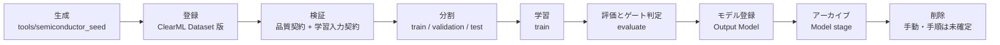

# データライフサイクル

## 文書情報

| 項目 | 内容 |
| --- | --- |
| 文書名 | データライフサイクル |
| 文書ID | DOC-11 |
| Version | 0.1 |
| Status | ドラフト |
| 作成日 | 2026-09-12 |
| 最終更新日 | 2026-09-12 |
| Author | 本リポジトリの開発者（単独） |
| Reviewer | なし |

## 1. 目的

この文書は、データが生まれてから消えるまでを段に分け、各段で何が作られ、誰が実行し、
どこで止まるかを定める。

10（データディクショナリ）が「列が何を意味するか」を決めるのに対し、この文書は
「その列を持つファイルがいつ何になるか」を決める。保持期間と削除条件は 12 で扱う。

## 2. 適用範囲

対象は Dataset `semiconductor-quality-data` と、その Dataset から学習が作る派生物
（profile・品質報告・lineage・split・学習済みモデル・評価結果）である。

ClearML Server が内部で行う保管の実装は対象外とする。扱うのは、このリポジトリの
コマンドが起こす変化に限る。

## 3. 前提

データは `tools/semiconductor_seed` が生成した合成データであり、工程から届く実データの
受け入れ口は無い。したがって「収集」の段は現在存在せず、生成が起点になる。

実行環境は単一マシンである。段の間でデータを運ぶのは ClearML Server と、
`.generated/` 以下のローカルファイルだけである。

## 4. 定義

### 4.1 段の一覧

| 段 | 作られるもの | 実行するもの | 残る場所 |
| --- | --- | --- | --- |
| 生成 | CSV | `pnpm seed:semiconductor:dataset` | `.generated/semiconductor/datasets/` |
| 登録 | Dataset 版 | 同上（`Dataset.create` → `upload` → `finalize`） | ClearML Server（fileserver + MongoDB） |
| 検証 | profile・品質報告・lineage | `pnpm ml:data check` / Pipeline の validate ステップ | Task の Artifact |
| 分割 | train / validation / test | preprocess ステップ | `split.npz`（Artifact） |
| 学習 | 学習済み Pipeline | train ステップ | Task の Output Model |
| 評価 | 評価結果・ゲート判定 | evaluate ステップ | Task の Artifact |
| モデル登録 | 候補モデル | register_candidate ステップ | ClearML Model |
| アーカイブ | `archived` の段を持つモデル | `pnpm ml:model promote` | Model のタグとメタデータ |
| 削除 | — | 手動。手順は未確定（§6） | — |

### 4.2 生成

生成器は乱数種と行数を受け取り、CSV を1つ書く（`tools/semiconductor_seed/generator.py`）。
既定の種は `SEMICONDUCTOR_RANDOM_SEED`（既定値 20260904）で、同じ種と同じ定義からは
同じ CSV が出る。定義は `DATASET_VERSIONS` にあり、1.0.0 が 1,200 行、2.0.0 が 2,500 行である。

このリポジトリで生成以外の入力経路は無い。工程から実データを受け入れる場合、
raw を受け取る場所と、そこから curated を作る手順を先に決める必要がある（§6）。

### 4.3 登録

登録は、生成した CSV を ClearML Dataset の1つの版にする操作である。
`Dataset.create` で版を作り、`upload` でファイルを送り、`finalize` で閉じる。
閉じた版のファイルは変えられない。版を直したいときは、直した版を新しく作る。

2つの版は親子で繋がる。2.0.0 は 1.0.0 を親として作られ、
これが版の並び順を Server 側に残す唯一の手段である（`tools/semiconductor_seed/dataset_seeding.py`）。

全ての版に `generated-by-semiconductor-seed-v1` のタグが付く。
生成器が作ったものであることは、このタグでしか判別できない。

### 4.4 検証

検証は2回行われ、見ているものが違う。

| 検証 | 実装 | 何を見るか | 落ちたとき |
| --- | --- | --- | --- |
| 品質契約 | `ml/data_quality` | 生の文字列のまま測った統計が、`config/data_quality.yaml` の条件を満たすか | 違反を全て挙げて終了コード1 |
| 学習入力契約 | `ml/semiconductor_quality/dataset.py` | 列・型・ラベルが学習の入力にできるか | 問題のある列と行を挙げて拒否 |

順序は品質契約が先である。学習入力契約は欠損値をその場で拒否するため、
先に走らせると「欠損が何件あったか」を数える相手が残らない（`ml/data_quality/profile.py`）。

Pipeline では validate ステップがこの2つを続けて行い、どちらかが落ちれば
以降のステップは動かない（`ml/pipeline/steps.py`）。基準の内訳は 14 で定める。

検証と同時に、来歴（raw → curated → training）と、前の版との比較が記録される。
比較で閾値を超えた列があっても実行は止まらず、Task に `data-drift` のタグと
警告が残る。動いたデータで学習してよいかは人が決める。

### 4.5 版

版を名乗るのは Dataset だけである。CSV そのものは版を持たず、
Dataset 版に取り込まれて初めて「あとから同じものを取得できる状態」になる。

学習・検証・比較のいずれも、版を文字列で受け取る。推測はしない
（`--dataset-version` が無ければ止まる）。どの版で学習したかは Task の
Parameters に残り、再現の起点になる（22）。

### 4.6 利用

検証を通った行だけが分割に進む。分割はラベルで層化し、
train 0.6 / validation 0.2 / test 0.2 の比で3つに割る（`ml/semiconductor_quality/config.py`）。
割り当てはラベルごとに最大剰余法で行い、どのラベルもどの部分に1行以上残る。
乱数種が同じなら同じ割り方になる。

3つの部分は、使ってよい場面が違う。

| 部分 | 使う場面 |
| --- | --- |
| train | 学習。ここにしかモデルを当てない |
| validation | ゲート判定（`config/model_gate.yaml`）。候補として登録してよいかを決める |
| test | 選んだ後の最終確認。1回だけ使う |

分割の結果は pickle ではなく数値と文字列の配列として保存される。
pickle は書き出したときのクラス定義を持ち込むため、コードを変えた後では読めなくなる。
古い実行の1ステップだけをやり直すときに、それでは目的を果たせない（`ml/pipeline/artifacts.py`）。

### 4.7 保存

保存先は3つに分かれる。

| 置き場 | 何が入るか | 実体 |
| --- | --- | --- |
| fileserver | Dataset のファイル、Artifact、モデルの重み | Docker ボリューム `clearml-files` |
| MongoDB | Dataset・Task・Model の属性 | `clearml-mongo-db` |
| Elasticsearch | 指標とコンソール出力 | `clearml-elasticsearch` |

ローカルの `.generated/` には、生成した CSV と SDK のキャッシュが残る。
これらは Server 側の複製であるか、生成し直せるものであり、失っても再現に影響しない。

### 4.8 アーカイブ

アーカイブの段を持つのはモデルだけである。`production` のような排他的な段へ
別のモデルを昇格させると、いま持っているモデルは `archived` へ押し出される
（`ml/model_lifecycle/registry.py`）。押し出されたモデルは消えず、
rollback の戻り先として残る。

Dataset と Task にはアーカイブの仕組みが無い。古い Dataset 版も、
失敗した Task も、作られたまま残り続ける。

### 4.9 削除

削除は現在すべて手動であり、手順は決めていない（12 §6）。

Task を消したときに fileserver 上の実体まで消えるかどうかだけは決めてある。
`CLEARML__services__async_urls_delete__enabled` を有効にしてあるため、
削除された URL は async-delete サービスが後から実体ごと消す
（`infra/clearml/compose.yaml`）。この設定が無いと、属性だけ消えてファイルが残る。

監視の時系列だけは期限がある。Prometheus は7日で捨てる（`--storage.tsdb.retention.time=7d`）。

## 5. 判断事項

| 判断 | 理由 |
| --- | --- |
| 品質契約を学習入力契約より先に走らせる | 後にすると、欠損が拒否された後の行を数えることになり、欠損率が常に0になるため |
| drift を報告にとどめ、実行を止めない | 動いたデータも学習に使う価値はある。止めるべきは「動いたと気付かないまま学習すること」だけであるため |
| finalize 済みの版を直さず、新しい版を作る | 直せる版があると、同じ版番号で学習した2つの Task が別の結果を持ちうるため |
| 分割の保存に pickle を使わない | クラス定義が変わると読めなくなり、古い実行のやり直しが最も必要な場面で失敗するため |

## 6. 未決事項

* 実データを受け入れる場合の raw の受け口と、curated を作る手順。現在は生成器しか無い。
* 削除の手順と実行の契機。12 で扱うが、実行の仕組み自体が無い。
* 失敗した Task と古い Dataset 版の整理。積み上がる一方である。
* バックアップ。取得も復旧も手段が無い（`../backlog/11_バックアップ手順が無い.md`）。

## 7. 関連資料

* `tools/semiconductor_seed/`（生成と登録）
* `ml/data_quality/`（検証・profile・lineage・drift）
* `ml/pipeline/steps.py`（各段の実行順と停止条件）
* `ml/semiconductor_quality/preprocess.py`（分割）
* `ml/model_lifecycle/registry.py`（段の昇格とアーカイブ）
* `infra/clearml/compose.yaml`（保存先のボリュームと非同期削除）
* `../_archive/runbooks/002_20260908_training_pipeline.md`、`../_archive/runbooks/005_20260908_data_quality.md`
* `10_データディクショナリ.md`、`12_データ保持ポリシー.md`、`14_データ品質基準.md`、`../phase3_ML固有/22_再現性検証書.md`

## 8. 更新履歴

| Version | Date | 内容 |
| ------- | ---------- | ------- |
| 0.1 | 2026-09-12 | 初版 |
