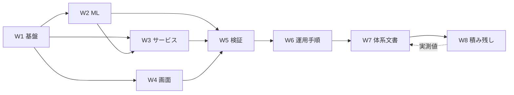

# WBS

## 文書情報

| 項目 | 内容 |
| --- | --- |
| 文書名 | WBS |
| 文書ID | DOC-70 |
| Version | 0.3 |
| Status | 運用中（継続的に更新する） |
| 作成日 | 2026-09-12 |
| 最終更新日 | 2026-09-13 |
| Author | 本リポジトリの開発者（単独） |
| Reviewer | なし |

## 1. 目的

この文書は、本プロジェクトの作業を成果物の単位へ分解し、各作業の状態と依存を1か所で見えるようにする。

各作業が何を満たせば終わりかは、それぞれの成果物を定める文書が持つ。
着手しないと決めたものは `../backlog/00_未解決ストーリー一覧.md` が持ち、ここには状態の参照だけを置く。

## 2. 適用範囲

対象は本リポジトリで作る成果物である。実装（`ml` / `services` / `tools` / `apps/web` / `infra`）、
文書（`docs/**`）、実機確認の3種類を扱う。

工数と日程は対象外とする。単独の学習プロジェクトであり、作業時間を測っていない。
測っていない値を見積として書くと、根拠のない数字が計画として扱われる。
規模は「コード変更の有無」「文書の行数」「実機起動の要否」で表す。

## 3. 前提

実装は Stage N / K / P / E の全項目が完了した状態にある（`x-plan-改訂/_old/01_チェックリスト.md`、更新しない）。
自発的に着手すべき実装項目は空であり、残っているのはトリガー待ちの判断と、文書・実機確認の積み残しである。

文書は `x-plan-改訂/20_ドキュメント作成プラン.md` が定める48本を単位とする。

## 4. 定義

### 4.1 第1階層

| ID | 作業 | 成果物 | 状態 |
| --- | --- | --- | --- |
| W1 | 基盤構築 | `infra/clearml/compose.yaml`、`scripts/backend-up.sh` | 完了 |
| W2 | ML 処理の実装 | `ml/`（学習・パイプライン・評価・モデル管理・探索・品質判定） | 完了 |
| W3 | サービスの実装 | `services/prediction_api`、`services/ops_exporter` | 完了 |
| W4 | 画面の実装 | `apps/web`（ClearML Web の fork と自作 feature） | 完了 |
| W5 | 検証の仕組み | `pnpm verify`、CI の5ジョブ、4つのゲート | 完了 |
| W6 | 運用手順 | `docs/_archive/runbooks/` 9本 | 完了（積み残しは W8） |
| W7 | 体系文書 | `docs/phase1`〜`phase8` の48本 | 進行中（§4.3） |
| W8 | 積み残し | `docs/backlog/` の19ストーリー | 未着手・判断待ち（§4.4） |

W1〜W6 は本文書の作成時点で既に完了している。ここでの分解は、着手前の計画ではなく、
何が出来ているかの記録である。W7 と W8 だけが今後の作業を持つ。

### 4.2 W5 の内訳

検証の仕組みは、他の作業の完了判定に使うため、内訳を残す。

| ID | 仕組み | 実行 | 何を防ぐか |
| --- | --- | --- | --- |
| W5-1 | 手元の一括検証 | `pnpm verify` | 変更を入れる前の見落とし |
| W5-2 | CI の5ジョブ | `.github/workflows/ci.yml` | 手元で走らせなかった検証の欠落 |
| W5-3 | 検証の同期 | `pnpm ci:parity` | 手元にある検証が CI から落ちること |
| W5-4 | テストの層 | `pnpm test:pyramid` | テストが意図した層から外れること |
| W5-5 | lint の後退 | `pnpm web:lint:baseline` | 既知の指摘件数が増えること |
| W5-6 | 依存の向き | `pnpm web:boundaries` | 61 が定める依存方向の違反 |
| W5-7 | 契約 | `pnpm web:contract` | パイプラインの入出力と画面の食い違い |
| W5-8 | 供給網 | `pnpm sec:sbom` / `sec:audit` / `sec:gate` | 脆弱性とライセンスの見落とし |

### 4.3 W7（体系文書）の内訳

| Phase | 帯 | 本数 | 状態 |
| --- | --- | --- | --- |
| 1 上流設計 | 01〜06 | 6 | 完了 |
| 2 データ管理 | 10〜14 | 5 | 完了 |
| 3 ML固有 | 20〜25 | 6 | 完了 |
| 4 テスト・品質保証 | 30〜33 | 4 | 完了 |
| 5 運用 | 40〜44 | 5 | 完了 |
| 6 セキュリティ・ガバナンス | 50〜58 | 9 | 完了 |
| 7 チーム開発標準 | 60〜64 | 5 | 完了 |
| 8 プロジェクト管理 | 70〜77 | 8 | 6本を作成。75・77 は書く対象が無く、backlog へ起票（BL-14・BL-15） |

75（議事録テンプレート）と 77（リリース履歴）は作っていない。会議体が無く、リリースの実績が0件であり、
記入される欄の無い様式だけが残るためである。書ける条件は BL-14・BL-15 が持つ。

46本が作られても、Status は「ドラフト」または「運用中」である。
「確定」へ移すには実装との突き合わせが要り、その条件は文書ごとに定まっていない（64 §6）。

### 4.4 W8（積み残し）の内訳

`../backlog/` の19ストーリーを、着手できるかどうかで分ける。

| 区分 | ID | 着手の条件 |
| --- | --- | --- |
| いつでも着手できる | BL-01（台帳が運用手順に現れない）、BL-08（strict 範囲外365件） | 無し |
| 実機の時間が要る | BL-11（バックアップ手順）、BL-15（リリース履歴） | 半日〜1日の連続した実行時間 |
| 2026-09-13 に片付いたもの | BL-10（実測欄）、BL-16（退行の判定基準）は完了。BL-02（通し台本）・BL-12（乖離検出）・BL-18（upstream の追跡）・BL-19（読む順序）は一部着手 | 残りは各ストーリーの「なお残るもの」にある |
| トリガー待ち | BL-03〜BL-07、BL-09、BL-17 | ADR 009・010 が定める数値条件、25 §4.5 の見直し条件、または方針の変更 |
| 判断待ち | BL-13（資料の置き場の不整合） | 利用者の判断 |
| 体制が要る | BL-14（議事録テンプレート） | 会議体ができたとき |
| 読み手が要る | BL-19（新規参画者の読み通し確認） | 資料を初めて読む相手が現れたとき。読む順序の整備だけなら条件は無い |

BL-10（モデルカードと再現性検証書の実測欄）は 2026-09-13 に片付いた。
20・22・23 は数値を持つようになったが、Status は引き続き「ドラフト」である。
「確定」へ移す条件そのものが文書ごとに定まっていないためである（72 の I-03）。

### 4.5 依存

W7 から W8 への破線は、実測欄（BL-10）と乖離検出（BL-12）が文書側へ戻る経路である。
文書を書いた結果として積み残しが見つかり、その解消がまた文書を変える。

### 4.6 作業の粒度

1つの作業は、1つの成果物と1つの完了判定を持つ。
「Angular の改善」のように、成果物が特定できない単位を置かない。
判定できない作業は、終わったかどうかを誰も言えないまま残る。

分解をどこで止めるかは、`pnpm verify` か文書1本かで判断する。
検証の1コマンドで合否が出るか、文書1本が出来上がるところまで下ろし、その下は下ろさない。

## 5. 判断事項

| 判断 | 理由 |
| --- | --- |
| 工数と日程を持たない | 作業時間を測っていない。測っていない値を計画として書かない |
| 完了した W1〜W6 も残す | 何が出来ているかを、新しく読む人が1か所で見られるようにするため |
| 積み残しの本体は backlog に置く | 着手条件つきの記述が既にあり、写すと二重管理になる |

## 6. 未決事項

* W7 の各文書を「確定」へ移す条件が文書ごとに定まっていない（64 §6）
* 積み残しの優先順位を付けていない（`../backlog/00_未解決ストーリー一覧.md` §6）
* 複数人になったときの担当割り当てが無い（73）

## 7. 関連資料

* `../backlog/00_未解決ストーリー一覧.md`（W8 の本体）
* `71_リスク登録簿.md`（作業を止める要因）
* `72_課題管理表.md`（進行中に見つかった問題）
* `x-plan-改訂/20_ドキュメント作成プラン.md`（W7 の定義）
* `x-plan-改訂/将来的展望/02_20260912_将来TODO.md`（W8 の元になった記録）
* `package.json`（W5 の実行単位）、`.github/workflows/ci.yml`

## 8. 更新履歴

| Version | Date | 内容 |
| ------- | ---------- | ------- |
| 0.1 | 2026-09-12 | 初版 |
| 0.2 | 2026-09-12 | W8 の本数を19へ更新し、BL-18・BL-19 を §4.4 の区分へ追加 |
| 0.3 | 2026-09-13 | §4.4 の区分を、2026-09-13 の実施結果に合わせて更新（BL-10・BL-16 完了、BL-02・BL-12・BL-18・BL-19 一部着手） |
