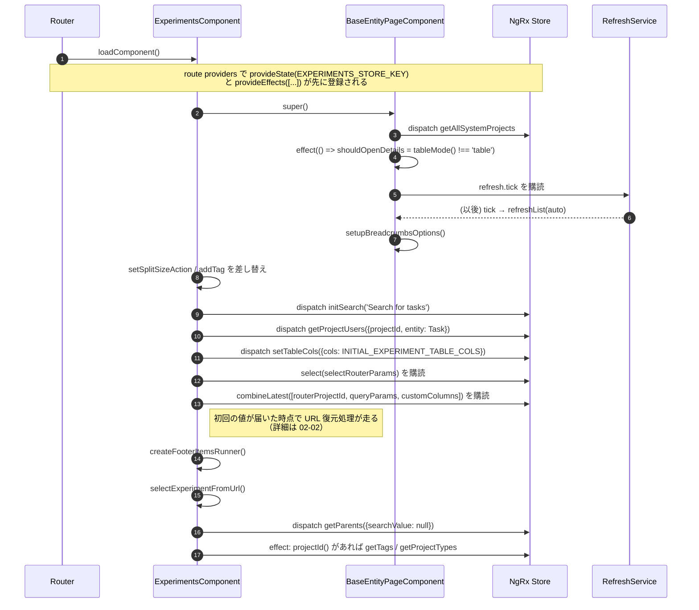
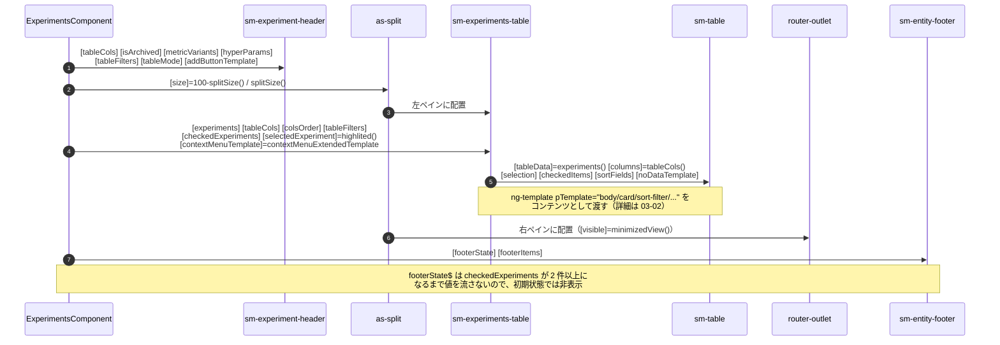

# 01-01 画面初期化とビュー構築

`/projects/:projectId/tasks` にルーティングされてから、子コンポーネントが立ち上がるまで。

`ExperimentsComponent` のコンストラクタは、購読の登録と Action の発行だけを行う。
データの取得は最後の `getExperiments()` を Effects が受け取ってから始まるため、
テンプレートは最初 `experiments$` が `null` の状態で描画される。

## 図1: プロバイダ登録からコンストラクタ完了まで

## 図2: テンプレート描画で子に流れる input

## 読みどころ

- コンストラクタ本体: [experiments.component.ts:261](/home/mtrysd/work_2026/000-learn-ClearML-pro/src/app/webapp-common/experiments/experiments.component.ts:261)
- 基底クラスのコンストラクタ: [base-entity-page.ts:119](/home/mtrysd/work_2026/000-learn-ClearML-pro/src/app/webapp-common/shared/entity-page/base-entity-page.ts:119)
- 自動更新の購読（`refresh.tick`）: [base-entity-page.ts:135](/home/mtrysd/work_2026/000-learn-ClearML-pro/src/app/webapp-common/shared/entity-page/base-entity-page.ts:135)
- ルート定義とプロバイダ: [experiment-routes.ts:27](/home/mtrysd/work_2026/000-learn-ClearML-pro/src/app/webapp-common/experiments/experiment-routes.ts:27)
- テンプレート: [experiments.component.html](/home/mtrysd/work_2026/000-learn-ClearML-pro/src/app/webapp-common/experiments/experiments.component.html)

`ExperimentsComponent` は `ChangeDetectionStrategy.OnPush` で、入力の多くは `| ngrxPush`（`@ngrx/component`）
または `store.selectSignal()` 経由で渡る。どちらも `async` パイプと違い、値が届いたときに
そのビューだけを明示的にマークするため、親コンポーネントの再評価を待たずに更新される。
