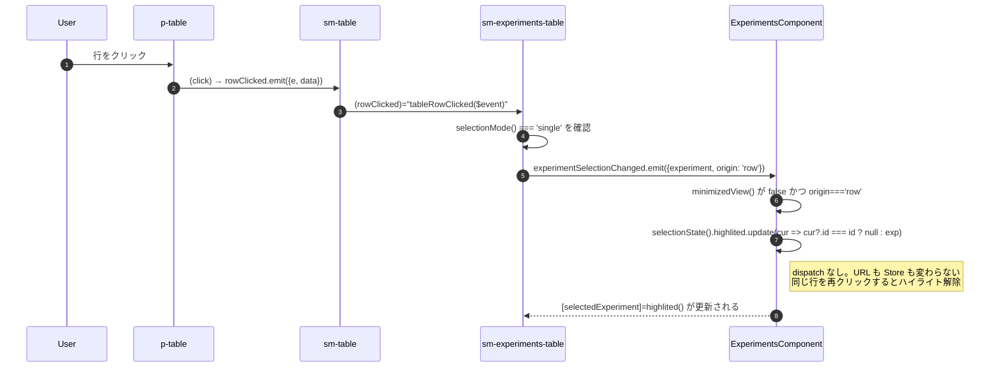
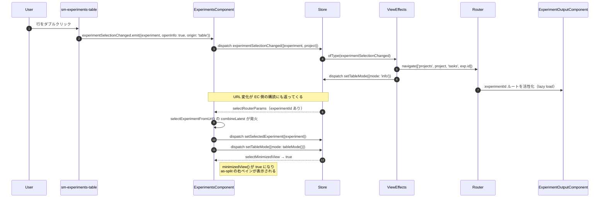

# 01-02 行クリックから Info パネル表示まで

一覧の行をクリックしたときと、ダブルクリック（またはカード表示での選択）したときで、
到達点が違う。前者はコンポーネント内の signal を書き換えるだけで URL は動かない。
後者は Action を発行し、Effects が `router.navigate()` してから右ペインが開く。

## 図1: シングルクリック（ハイライトのみ）

## 図2: ダブルクリック（Info パネルを開く）

## 読みどころ

- 行クリックの受け口: [experiments-table.component.ts:334](../../../src/app/webapp-common/experiments/dumb/experiments-table/experiments-table.component.ts:334)
- 親側の分岐: [experiments.component.ts:542](../../../src/app/webapp-common/experiments/experiments.component.ts:542)
- URL から選択を復元する購読: [experiments.component.ts:479](../../../src/app/webapp-common/experiments/experiments.component.ts:479)
- 遷移を行う Effect: [common-experiments-view.effects.ts:388](../../../src/app/webapp-common/experiments/effects/common-experiments-view.effects.ts:388)
- 実際に `router.navigate` する関数: [common-experiments-view.effects.ts:743](../../../src/app/webapp-common/experiments/effects/common-experiments-view.effects.ts:743)

`minimizedView` は Store のフラグではなく、ルートパラメータから導出される Selector である
（`experimentId` があるか、`ids` があれば true）。
パネルの開閉状態を別途保持していないため、URL を直接開いた場合も同じ見た目になる。

- 導出元: [projects.reducer.ts:106](../../../src/app/webapp-common/core/reducers/projects.reducer.ts:106)

詳細パネルが表示された後、中身のデータを取りに行く流れは
[04-04 詳細パネルの二段取得](../04_バックエンド経路/04-04_詳細パネルの二段取得.md) を参照。
