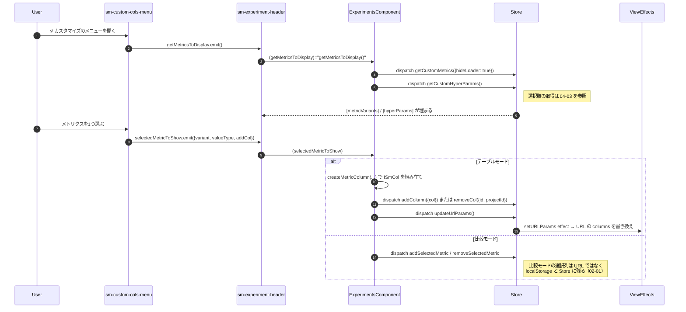
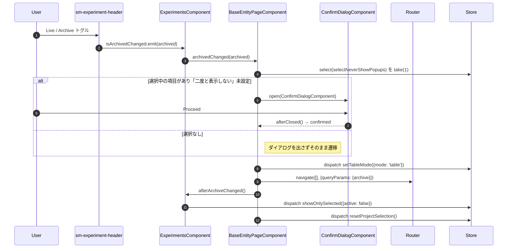
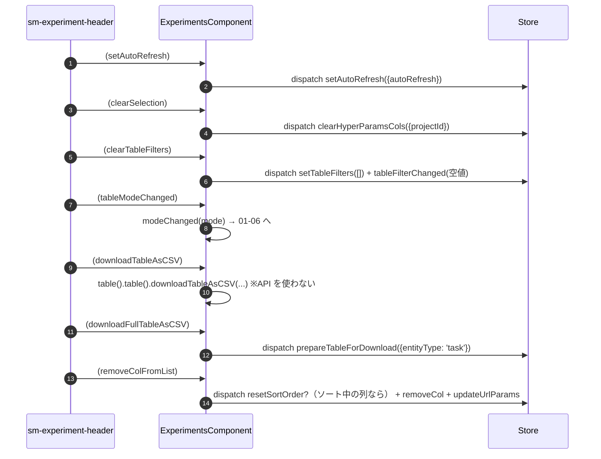

# 01-03 ヘッダー操作の伝播

`sm-experiment-header` は `dispatch` を一切行わず、20 個近い `output` を
すべて `ExperimentsComponent` に投げ返す。
Store から読むのは基底クラスの `selectMaxDownloadItems`（CSV の最大件数表示）だけである。
親側は同じハンドラの中で `getTableModeFromURL()` を見て、テーブルモードと比較モードで
発行する Action を切り替えている。

## 図1: カスタム列の追加（メトリクス列）

## 図2: アーカイブ切替（確認ダイアログを挟む）

## 図3: そのほかのヘッダー output と行き先

## 読みどころ

- ヘッダーのバインディング一覧: [experiments.component.html:2](/home/mtrysd/work_2026/000-learn-ClearML-pro/src/app/webapp-common/experiments/experiments.component.html:2)
- モードによる分岐が入るハンドラ: [experiments.component.ts:601](/home/mtrysd/work_2026/000-learn-ClearML-pro/src/app/webapp-common/experiments/experiments.component.ts:601)
- 列削除時のソート解除: [experiments.component.ts:664](/home/mtrysd/work_2026/000-learn-ClearML-pro/src/app/webapp-common/experiments/experiments.component.ts:664)
- アーカイブ切替: [base-entity-page.ts:267](/home/mtrysd/work_2026/000-learn-ClearML-pro/src/app/webapp-common/shared/entity-page/base-entity-page.ts:267)

`downloadTableAsCSV` だけは Store を経由しない。`viewChild` で取得した `sm-table` の
メソッドを直接呼び、画面に読み込み済みの行だけを CSV 化する。
全件ダウンロードはサーバ側で用意するため Action になる（04-05）。
