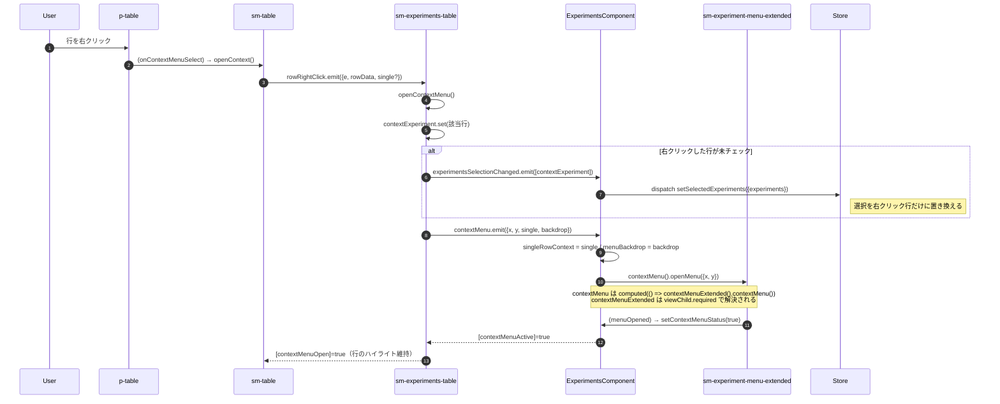

# 01-04 コンテキストメニューの起動

右クリックメニューは `ExperimentsComponent` のテンプレートで宣言されているが、
実体は `sm-experiments-table` の中に描画される。
親はその実体を `viewChild.required` で掴み、座標を渡して開く。

## 図: 行の右クリックからメニュー表示まで

## input の切り替え

`singleRowContext` の値で、メニューに渡す対象が変わる。

| | `singleRowContext === true`（単一行） | `false`（チェック済み複数行） |
| --- | --- | --- |
| `[selectedExperiments]` | `[selectedExperiment$ の値]` | `checkedExperiments` |
| `[numSelected]` | `1` | `checkedExperiments.length` |
| `[selectedDisableAvailable]` | `getSingleSelectedDisableAvailable(...)` をその場で計算 | Store の `selectSelectedExperimentsDisableAvailable` |
| `[useCurrentEntity]` | `true` | `false` |

単一行の場合だけ、メニュー項目の活性・非活性をコンポーネント側で同期計算している。
複数行の場合は `setSelectedExperiments` を受けた Effect が計算済みの値を Store に置いているため、
Selector から読むだけで済む。

## 読みどころ

- 右クリックの受け口とメニュー起動: [experiments.component.ts:735](../../../src/app/webapp-common/experiments/experiments.component.ts:735)
- 単一行用の活性判定: [experiments.component.ts:741](../../../src/app/webapp-common/experiments/experiments.component.ts:741)
- テーブル側の起点: [experiments-table.component.ts:349](../../../src/app/webapp-common/experiments/dumb/experiments-table/experiments-table.component.ts:349)
- 複数行用の活性判定 Effect: [common-experiments-view.effects.ts:835](../../../src/app/webapp-common/experiments/effects/common-experiments-view.effects.ts:835)
- テンプレート宣言: [experiments.component.html:140](../../../src/app/webapp-common/experiments/experiments.component.html:140)

`ng-template` の中で宣言したコンポーネントを親の `viewChild` が拾える理由は
[03-03 contextMenuTemplate の逆流](../03_テンプレート投影/03-03_contextMenuTemplateの逆流.md) にまとめた。
