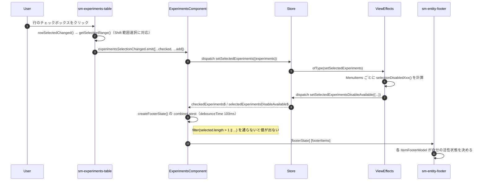
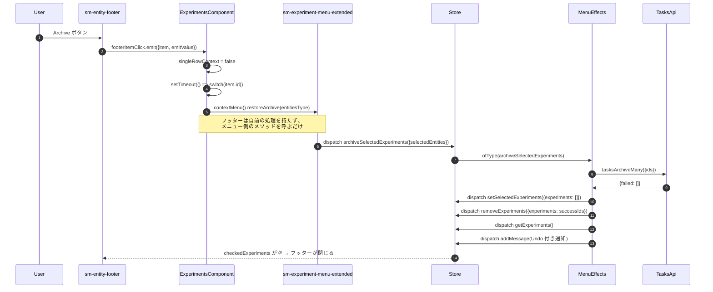

# 01-05 フッターからの一括操作

フッターは 2 件以上チェックされたときだけ現れる。
ボタンの押下は `ExperimentsComponent` を経由して、コンテキストメニューのコンポーネントの
メソッド呼び出しに変換される。つまりフッターとコンテキストメニューは同じ処理を共有している。

## 図1: チェックボックス選択からフッター表示まで

## 図2: 「Archive」押下からサーバ更新まで

## `item.id` とメニューメソッドの対応

| フッター項目 | 呼ばれるメソッド |
| --- | --- |
| `showAllItems` | `EC.showAllSelected(!emitValue)`（Store の `showOnlySelected`） |
| `compare` | `EC.compareExperiments()`（`compare-tasks` へ遷移） |
| `archive` | `contextMenu().restoreArchive(entitiesType)` |
| `reset` / `publish` / `retry` | `resetPopup()` / `publishPopup()` / `retryPopup()` |
| `enqueue` / `dequeue` | `enqueuePopup()` / `dequeuePopup()` |
| `delete` | `deleteExperimentPopup()` |
| `abort` / `abortAllChildren` | `stopPopup()` / `stopAllChildrenPopup()` |
| `moveTo` | `moveToProjectPopup()` |

## 読みどころ

- フッター項目の定義: [experiments.component.ts:364](/home/mtrysd/work_2026/000-learn-ClearML-pro/src/app/webapp-common/experiments/experiments.component.ts:364)
- 押下時の分岐: [experiments.component.ts:399](/home/mtrysd/work_2026/000-learn-ClearML-pro/src/app/webapp-common/experiments/experiments.component.ts:399)
- フッター状態の合成: [base-entity-page.ts:218](/home/mtrysd/work_2026/000-learn-ClearML-pro/src/app/webapp-common/shared/entity-page/base-entity-page.ts:218)
- 活性状態を作る Effect: [common-experiments-view.effects.ts:835](/home/mtrysd/work_2026/000-learn-ClearML-pro/src/app/webapp-common/experiments/effects/common-experiments-view.effects.ts:835)
- アーカイブの Effect: [common-experiments-menu.effects.ts:443](/home/mtrysd/work_2026/000-learn-ClearML-pro/src/app/webapp-common/experiments/effects/common-experiments-menu.effects.ts:443)

`onFooterHandler` の中身は `window.setTimeout` で 1 ティック遅らせて実行される。
呼び出す `xxxPopup()` 群が `MatDialog` や `matMenu` を開くため、
クリックイベントの伝播が終わってから開く必要があるものと読める。

なお、メニュー本体のメソッド定義は
[experiment-menu.component.ts:145](/home/mtrysd/work_2026/000-learn-ClearML-pro/src/app/webapp-common/experiments/shared/components/experiment-menu/experiment-menu.component.ts:145) 以降にある。
