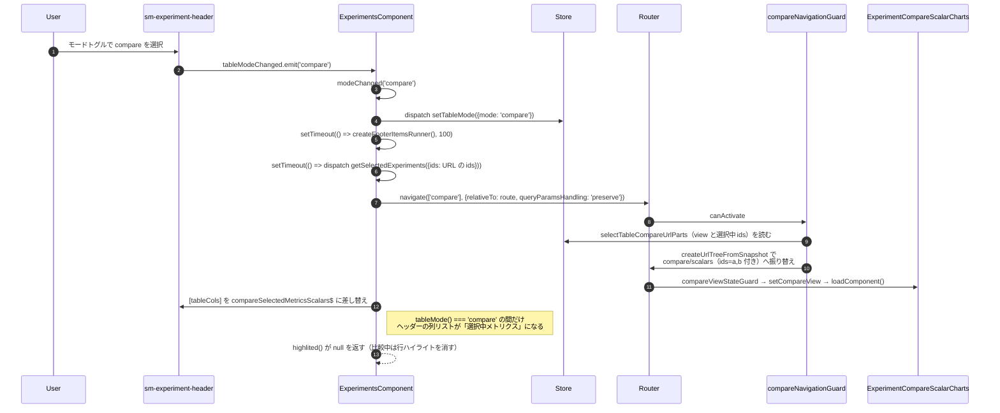
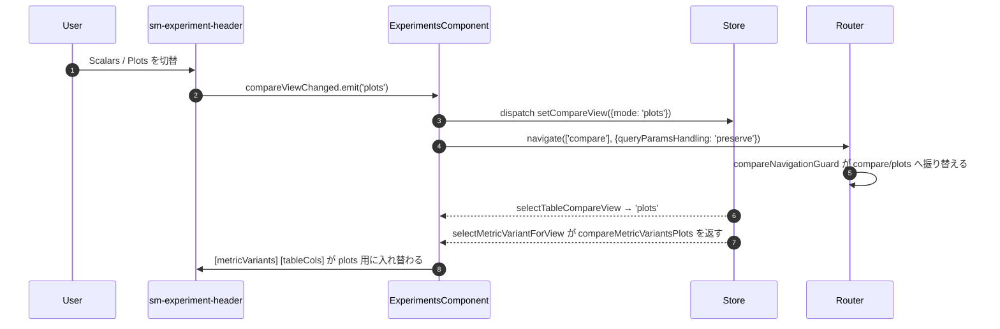
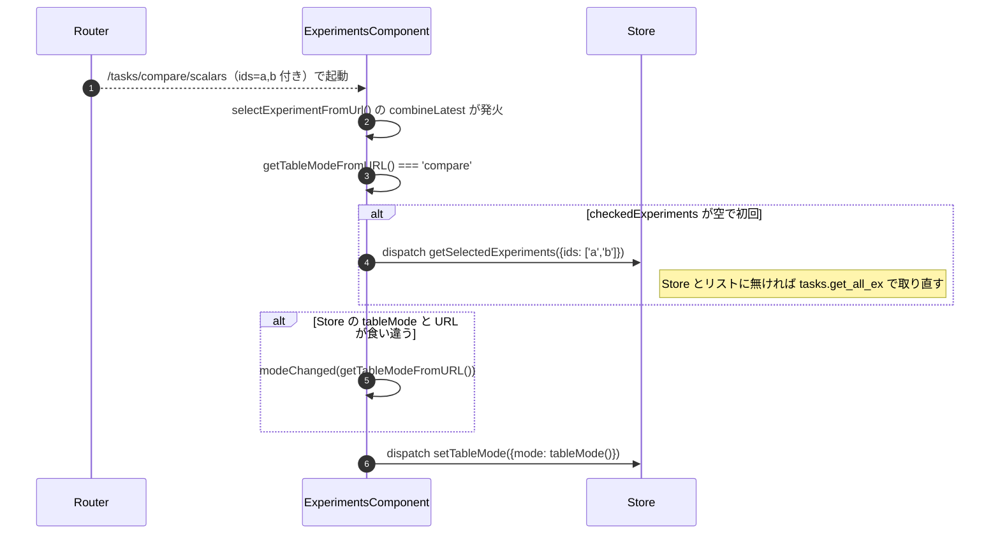

# 01-06 比較モードへの切替

テーブルモードは `table` / `info` / `compare` の 3 状態を取る。
Store の `tableMode` と URL の形は別々に管理されており、`getTableModeFromURL()` が
URL 側の「正解」を読み、`modeChanged()` が Store と URL の両方を合わせに行く。

## 図1: ヘッダーのトグルから比較ビュー表示まで

## 図2: scalars と plots の切替

## 図3: URL 直開きのときの整合

## 読みどころ

- モード切替の本体: [experiments.component.ts:759](/home/mtrysd/work_2026/000-learn-ClearML-pro/src/app/webapp-common/experiments/experiments.component.ts:759)
- URL からモードを読む: [experiments.component.ts:523](/home/mtrysd/work_2026/000-learn-ClearML-pro/src/app/webapp-common/experiments/experiments.component.ts:523)
- URL と Store の突き合わせ: [experiments.component.ts:479](/home/mtrysd/work_2026/000-learn-ClearML-pro/src/app/webapp-common/experiments/experiments.component.ts:479)
- 比較ビューの振り替え: [compare-navigation.guard.ts](/home/mtrysd/work_2026/000-learn-ClearML-pro/src/app/webapp-common/experiments/compare-navigation.guard.ts)
- 到達先で view を Store に戻す: [compare-view-state.guard.ts](/home/mtrysd/work_2026/000-learn-ClearML-pro/src/app/webapp-common/experiments/compare-view-state.guard.ts)
- 比較用ルート定義: [experiment-routes.ts:52](/home/mtrysd/work_2026/000-learn-ClearML-pro/src/app/webapp-common/experiments/experiment-routes.ts:52)

`table` へ戻すときは `modeChanged()` から `closePanel()` に落ち、
`setTableMode({mode:'table'})` を発行してから `router.navigate` で子ルートを外す。
