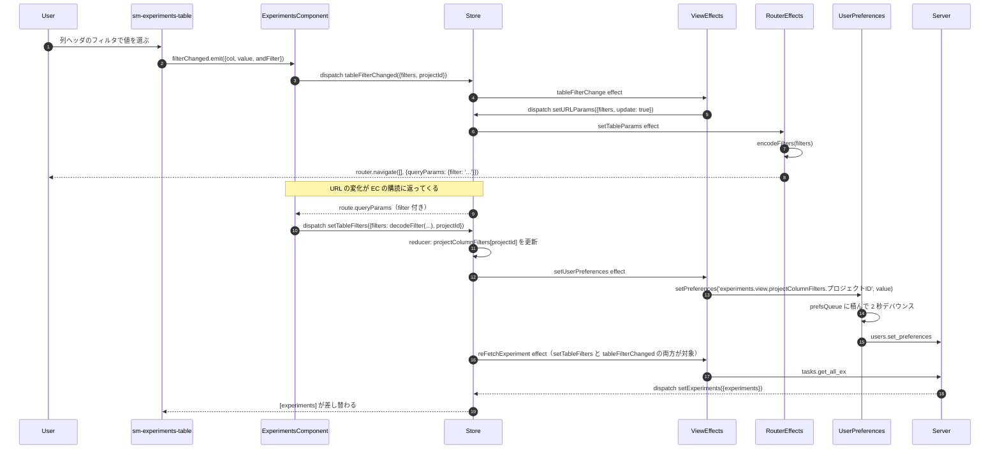

# 02-01 状態の五つの置き場所

この画面の「状態」は 1 か所にまとまっていない。値の種類ごとに原本の場所が違う。

| 置き場所 | 何が入るか | 生き残る範囲 |
| --- | --- | --- |
| URL クエリ | `columns` / `order` / `filter` / `archive` / `deep` / `q` | ブックマーク・リロード・共有 |
| NgRx Store（`experiments.view`） | 一覧データ、選択、スクロールID、列定義、フィルタ値 | 画面を離れるまで |
| ユーザープリファレンス（サーバ保存） | 列幅、列順、非表示列、ソート順、プロジェクト別フィルタ | アカウント単位で永続 |
| localStorage | `tableMode`、`tableCompareView`、比較で選択中のメトリクス | ブラウザ単位で永続 |
| コンポーネント内 signal / フィールド | `highlited`、`singleRowContext`、`menuBackdrop`、`infoDisabled` | コンポーネントの生存期間 |

同じ「フィルタ」でも、URL・Store・ユーザープリファレンスの三つに書かれる。
原本は URL 側で、Store はそこからの写しである。

## 図: 列フィルタを 1 回変えたときに動く全経路

## なぜ URL を経由するのか

`tableFilterChanged` は Store の状態を直接書き換えない。
Effect が `setURLParams` に変換し、URL を書き換えた結果がコンポーネントの購読に戻ってきて、
そこで初めて `setTableFilters` が発行される。

この往復により、次の 2 つが同じ経路に揃う。

- 画面で操作してフィルタを変えた場合
- フィルタ付き URL を直接開いた場合

どちらも「URL が変わる → `setTableFilters` → 再取得」に収束するため、復元処理を二重に書かずに済む。

## 読みどころ

- URL への変換: [common-experiments-view.effects.ts:164](/home/mtrysd/work_2026/000-learn-ClearML-pro/src/app/webapp-common/experiments/effects/common-experiments-view.effects.ts:164)
- URL 書き込み: [router.effects.ts:28](/home/mtrysd/work_2026/000-learn-ClearML-pro/src/app/webapp-common/core/effects/router.effects.ts:28)
- URL 読み取りと dispatch: [experiments.component.ts:284](/home/mtrysd/work_2026/000-learn-ClearML-pro/src/app/webapp-common/experiments/experiments.component.ts:284)
- 設定の永続化: [common-experiments-view.effects.ts:145](/home/mtrysd/work_2026/000-learn-ClearML-pro/src/app/webapp-common/experiments/effects/common-experiments-view.effects.ts:145)
- localStorage への保存（meta-reducer）: [experiments.providers.ts:28](/home/mtrysd/work_2026/000-learn-ClearML-pro/src/app/features/experiments/shared/experiments.providers.ts:28)
- Store の初期値: [experiments-view.reducer.ts](/home/mtrysd/work_2026/000-learn-ClearML-pro/src/app/webapp-common/experiments/reducers/experiments-view.reducer.ts)
