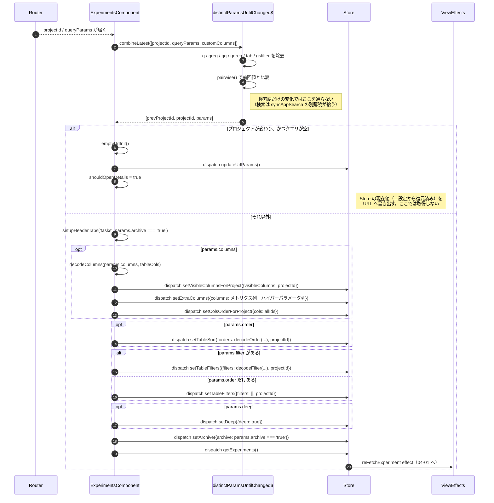
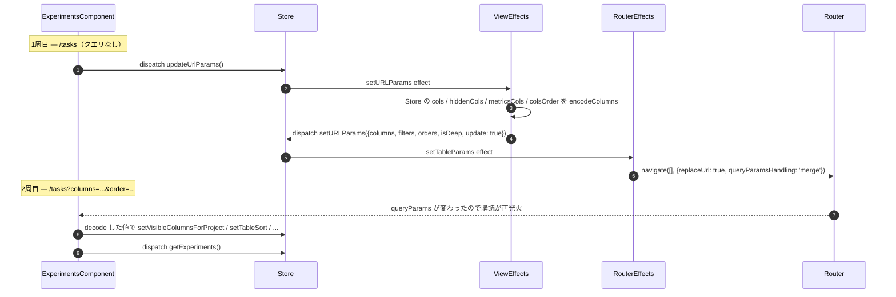

# 02-02 URL から Store への初期化

画面に入った直後と、URL のクエリが変わったときに走る復元処理。
`ExperimentsComponent` のコンストラクタで組んだ 1 本の購読がすべてを担当する。

監視対象は 3 つの合成で、`distinctParamsUntilChanged$` を通してから購読する。

- `selectRouterProjectId`（ルートの `:projectId`）
- `route.queryParams`
- `selectCustomColumns`（プロジェクト別のカスタム列）

## 図1: 復元の分岐

## 図2: 空 URL のときに 2 周する理由

`replaceUrl: true` は `queryParams.order` が未設定のときだけ付く。
初回の URL 補完で履歴を 1 つ消費しないための扱いで、ブラウザバックが
「クエリなしの URL」に戻らないようにしている。

## 読みどころ

- 購読本体: [experiments.component.ts:284](/home/mtrysd/work_2026/000-learn-ClearML-pro/src/app/webapp-common/experiments/experiments.component.ts:284)
- 空 URL の分岐: [experiments.component.ts:355](/home/mtrysd/work_2026/000-learn-ClearML-pro/src/app/webapp-common/experiments/experiments.component.ts:355)
- 比較用ユーティリティ: [common-projects.utils.ts:55](/home/mtrysd/work_2026/000-learn-ClearML-pro/src/app/webapp-common/projects/common-projects.utils.ts:55)
- デコード関数群: [tableParamEncode.ts](/home/mtrysd/work_2026/000-learn-ClearML-pro/src/app/webapp-common/shared/utils/tableParamEncode.ts)
- URL 書き込み: [router.effects.ts:28](/home/mtrysd/work_2026/000-learn-ClearML-pro/src/app/webapp-common/core/effects/router.effects.ts:28)

検索語（`q`）だけが別扱いになっているのは、
`syncAppSearch()` が `selectSearchQuery` を購読して `globalFilterChanged` を発行し、
そこから直接再取得に入るためである（[experiments.component.ts:467](/home/mtrysd/work_2026/000-learn-ClearML-pro/src/app/webapp-common/experiments/experiments.component.ts:467)）。
除外していないと、検索のたびに列・ソート・フィルタの復元処理まで走り直す。
