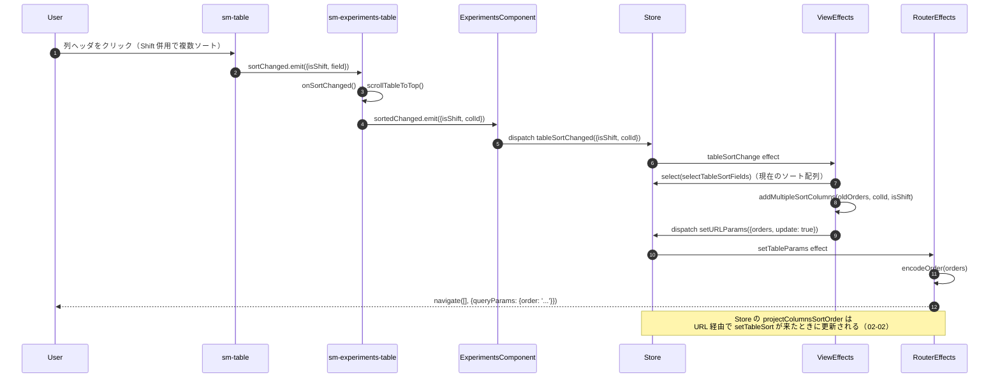
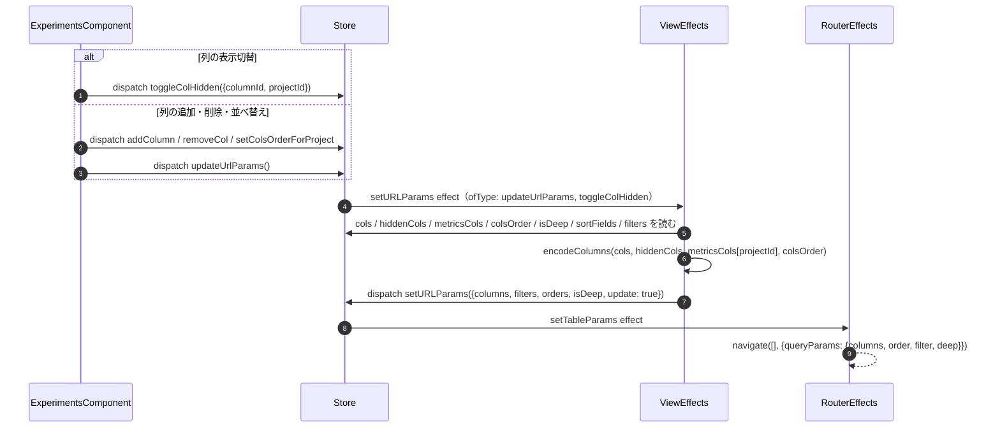
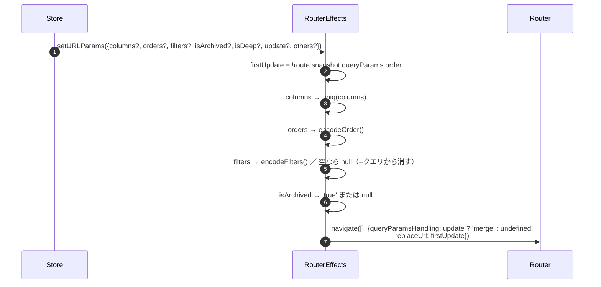

# 02-03 操作から URL への書き戻し

URL に載る値（列構成・ソート・フィルタ・アーカイブ・deep）は、
必ず `setURLParams` という共通の Action を経由して書き込まれる。
書き込む側は 3 通りあり、どれも最後は `RouterEffects.setTableParams` に合流する。

## 図1: ソート変更

## 図2: 列構成の変更

`toggleColHidden` だけは `updateUrlParams` を挟まず、直接 `setURLParams` effect の対象になっている。
一方 `addColumn` や `removeCol` は、呼び出し側が明示的に `updateUrlParams()` を続けて発行する必要がある。

## 図3: RouterEffects が組み立てるクエリ

`queryParamsHandling: 'merge'` なので、指定しなかったパラメータは消えずに残る。
値を消したいときは `undefined` ではなく `null` を入れる必要があり、
フィルタ全消し（`clearTableFiltersHandler`）や検索クリア（`others: {q: null}`）はこの形を使っている。

## 読みどころ

- ソートの Effect: [common-experiments-view.effects.ts:155](../../../src/app/webapp-common/experiments/effects/common-experiments-view.effects.ts:155)
- 列構成の Effect: [common-experiments-view.effects.ts:713](../../../src/app/webapp-common/experiments/effects/common-experiments-view.effects.ts:713)
- URL 書き込み: [router.effects.ts:28](../../../src/app/webapp-common/core/effects/router.effects.ts:28)
- Action 定義: [router.actions.ts:22](../../../src/app/webapp-common/core/actions/router.actions.ts:22)
- フィルタ全消し: [experiments.component.ts:721](../../../src/app/webapp-common/experiments/experiments.component.ts:721)
