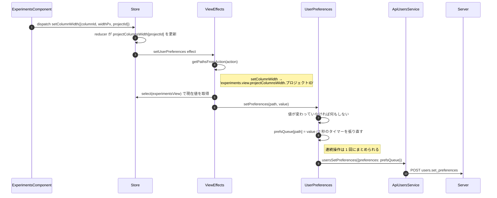
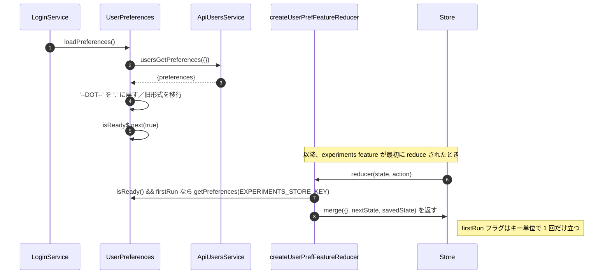
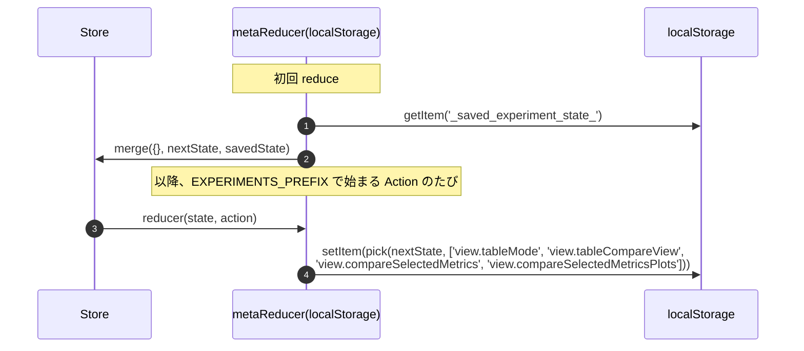

# 02-04 ユーザープリファレンスの永続化

列幅・列順・非表示列・ソート順・プロジェクト別フィルタは、アカウントに紐づけてサーバに保存される。
保存は Effect が、復元は meta-reducer が担当していて、経路が対称になっていない。

## 図1: 保存（Action → サーバ）

`getPathsFromAction` は Action ごとに保存先のパスを返す。1 つの Action が複数パスを返すこともある。

| Action | 保存されるパス（`experiments.view.` 配下） |
| --- | --- |
| `setTableSort` / `resetSortOrder` | `projectColumnsSortOrder.<projectId>` |
| `setExtraColumns` | `metricsCols.<projectId>` |
| `removeCol` | `projectColumnsSortOrder` / `metricsCols` / `projectColumnsWidth` / `colsOrder` |
| `addColumn` | `hiddenProjectTableCols` / `metricsCols` |
| `setTableFilters` | `projectColumnFilters.<projectId>` |
| `setColumnWidth` | `projectColumnsWidth.<projectId>` |
| `toggleColHidden` / `setVisibleColumnsForProject` | `hiddenProjectTableCols.<projectId>` |
| `setColsOrderForProject` | `colsOrder.<projectId>` |
| `clearHyperParamsCols` | `projectColumnsSortOrder` / `metricsCols` |

## 図2: 復元（ログイン時 → Store 初期値）

## 図3: localStorage 側（比較モードの状態）

比較モードで選んだメトリクスは URL にもサーバ設定にも入らず、localStorage だけに残る。
別のブラウザで同じ URL を開いても、比較のグラフ選択は引き継がれない。

## 読みどころ

- 保存する Effect とパス表: [common-experiments-view.effects.ts:105](../../../src/app/webapp-common/experiments/effects/common-experiments-view.effects.ts:105)
- デバウンスと送信: [user-preferences.ts:61](../../../src/app/webapp-common/user-preferences.ts:61)
- 読み込み: [user-preferences.ts:31](../../../src/app/webapp-common/user-preferences.ts:31)
- 復元の meta-reducer: [user-pref-reducer.ts:61](../../../src/app/webapp-common/core/meta-reducers/user-pref-reducer.ts:62)
- localStorage の meta-reducer: [experiments.providers.ts:28](../../../src/app/features/experiments/shared/experiments.providers.ts:28)

保存する値のオブジェクトキーに `.` が含まれる場合（`last_metrics.<hash>.<hash>.value` のような列 ID がキーになる）、
送信前に再帰的に `--DOT--` へ置換し、読み込み時に文字列全体を `.` へ戻している
（[user-preferences.ts:81](../../../src/app/webapp-common/user-preferences.ts:81)）。
`lodash` の `set` / `get` はパス中の `.` をネストの区切りとして扱うため、置換しないと階層が壊れる。
