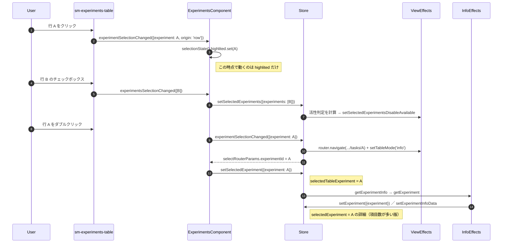
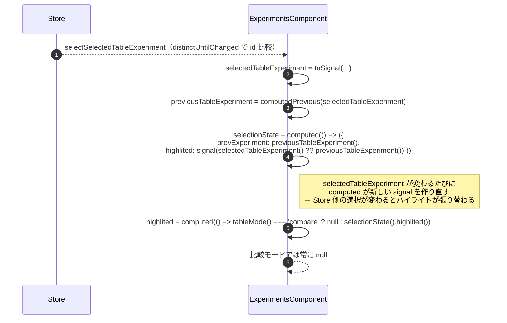
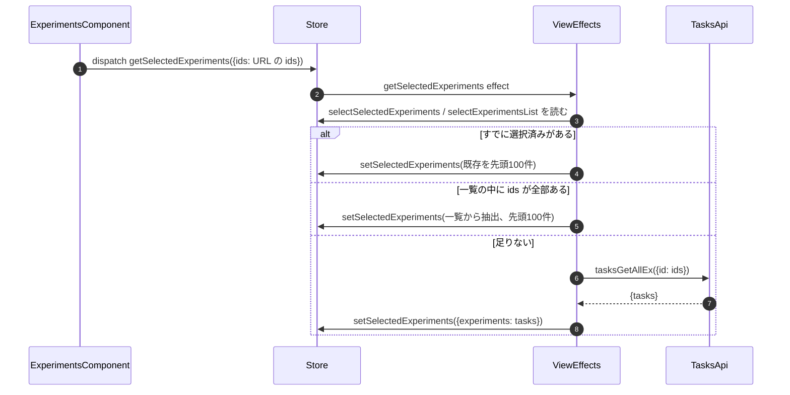

# 02-05 選択状態の四系統

「選択されている実験」を表す状態が 4 つ並存している。
役割が違い、更新するタイミングも保存先も異なる。

| 名前 | Selector / 実体 | 何を指すか | 更新のきっかけ |
| --- | --- | --- | --- |
| `selectedExperiment` | `selectSelectedExperiment`（info feature） | 右ペインに表示中の実験の詳細 | URL の `:experimentId` → `getExperiment` の応答 |
| `selectedTableExperiment` | `selectSelectedTableExperiment`（view feature） | 一覧行として選ばれている実験 | `setSelectedExperiment`（URL とリストの突き合わせ結果） |
| `selectedExperiments` | `selectSelectedExperiments` | チェックボックスで選んだ複数件 | `setSelectedExperiments` |
| `highlited` | コンポーネント内 `signal` | 行クリックの一時ハイライト | `experimentSelectionChanged`（`origin: 'row'`） |

## 図1: 4 つが同時に動く場面

## 図2: highlited が signal である理由

`highlited` はテーブル行の枠線表示にしか使われず、URL にも Store にも保存されない。
一方 `selectedTableExperiment` は Store にあり、自動更新のたびに
「詳細を取り直すべきか」の判断材料として使われる（04-04）。

## 図3: 比較モードでの選択の取り直し

## 読みどころ

- signal の組み立て: [experiments.component.ts:229](/home/mtrysd/work_2026/000-learn-ClearML-pro/src/app/webapp-common/experiments/experiments.component.ts:229)
- 行クリック時の分岐: [experiments.component.ts:542](/home/mtrysd/work_2026/000-learn-ClearML-pro/src/app/webapp-common/experiments/experiments.component.ts:542)
- 複数選択の Effect: [common-experiments-view.effects.ts:835](/home/mtrysd/work_2026/000-learn-ClearML-pro/src/app/webapp-common/experiments/effects/common-experiments-view.effects.ts:835)
- ids からの復元: [common-experiments-view.effects.ts:693](/home/mtrysd/work_2026/000-learn-ClearML-pro/src/app/webapp-common/experiments/effects/common-experiments-view.effects.ts:693)
- Selector 定義: [reducers/index.ts:27](/home/mtrysd/work_2026/000-learn-ClearML-pro/src/app/webapp-common/experiments/reducers/index.ts:27)
