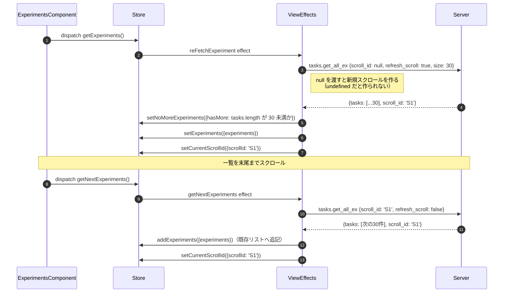
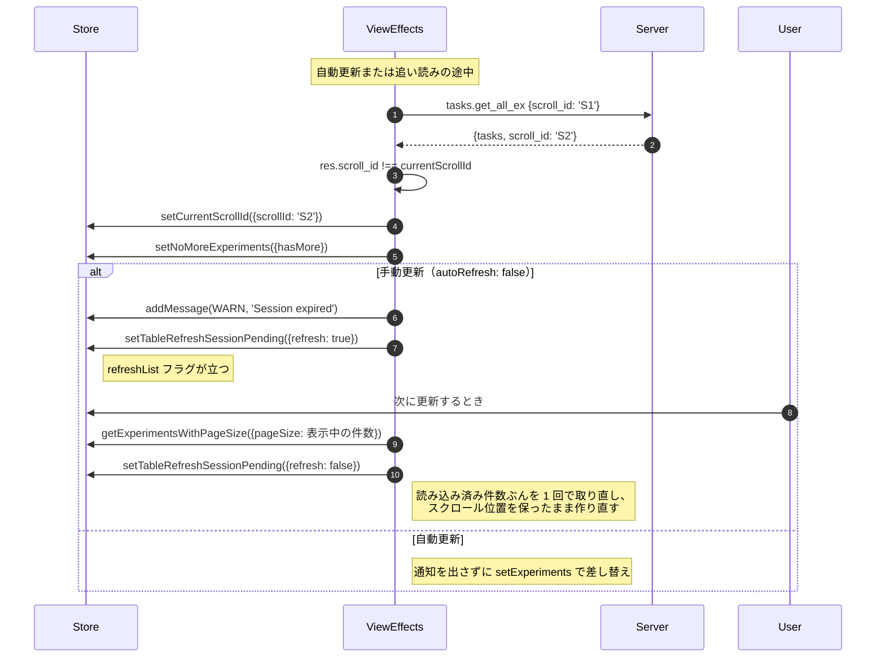
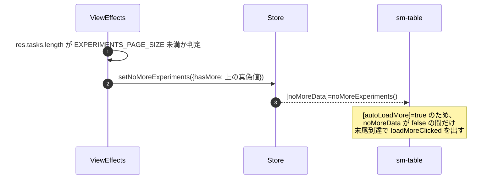

# 02-06 スクロール ID とページング

一覧は `tasks.get_all_ex` の `scroll_id` によるカーソル方式で読み進める。
`scroll_id` はサーバ側のセッションに紐づくため、
「同じ ID が返ってきたか」が状態遷移の分岐条件になっている。

Store に持つのは `scrollId`（`selectCurrentScrollId`）と
`refreshList`（`selectTableRefreshSessionList`、再取得が必要かのフラグ）の 2 つ。

## 図1: 初回取得 → 追い読み

## 図2: スクロールセッションが切れた場合

## 図3: 「もう無い」の判定

`setNoMoreExperiments` のプロパティ名は `hasMore` だが、渡している値は
`res.tasks.length < EXPERIMENTS_PAGE_SIZE`、つまり「もう無い」である。
reducer も `noMoreExperiment: action.hasMore` と、そのまま名前を反転して格納している
（[experiments-view.reducer.ts:175](/home/mtrysd/work_2026/000-learn-ClearML-pro/src/app/webapp-common/experiments/reducers/experiments-view.reducer.ts:175)）。
プロパティ名だけを見ると意味が逆になる。

## 読みどころ

- 初回・再取得: [common-experiments-view.effects.ts:240](/home/mtrysd/work_2026/000-learn-ClearML-pro/src/app/webapp-common/experiments/effects/common-experiments-view.effects.ts:240)
- 追い読み: [common-experiments-view.effects.ts:347](/home/mtrysd/work_2026/000-learn-ClearML-pro/src/app/webapp-common/experiments/effects/common-experiments-view.effects.ts:347)
- 自動更新とセッション切れ: [common-experiments-view.effects.ts:276](/home/mtrysd/work_2026/000-learn-ClearML-pro/src/app/webapp-common/experiments/effects/common-experiments-view.effects.ts:276)
- クエリ組み立て（`scroll_id` の扱い）: [common-experiments-view.effects.ts:964](/home/mtrysd/work_2026/000-learn-ClearML-pro/src/app/webapp-common/experiments/effects/common-experiments-view.effects.ts:964)
- Selector: [reducers/index.ts:28](/home/mtrysd/work_2026/000-learn-ClearML-pro/src/app/webapp-common/experiments/reducers/index.ts:28)
