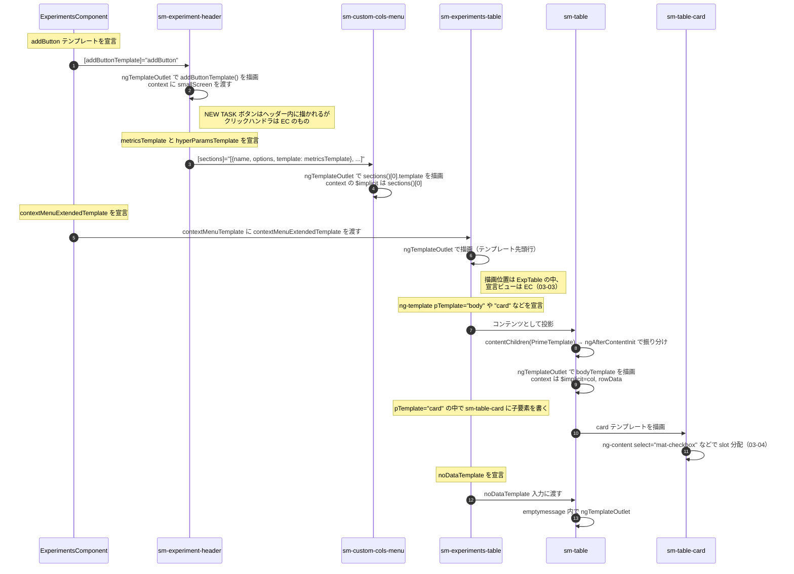

# 03-01 テンプレート受け渡しの全体像

この画面では `ng-template` が 3 つの方向に渡っている。

1. 親 → 子（`input` で `TemplateRef` を渡し、子が `ngTemplateOutlet` で描く）
2. 子 → 孫（`sm-experiments-table` が `sm-table` にコンテンツとして渡し、`contentChildren` で拾われる）
3. 兄弟間（ヘッダーが自分のテンプレートを設定オブジェクトに埋めて孫に渡す）

`ng-content` は `sm-table-card` の組み立てにだけ使われている。

## 図: どのテンプレートがどこで実体化するか

## 一覧

| テンプレート | 宣言元 | 渡し方 | 描画元 | context |
| --- | --- | --- | --- | --- |
| `#addButton` | `ExperimentsComponent` | `input` | `sm-experiment-header` | `{smallScreen}` |
| `#contextMenuExtendedTemplate` | `ExperimentsComponent` | `input` | `sm-experiments-table` | `{$implicit: contextExperiment()}` |
| `#metricsTemplate` / `#hyperParamsTemplate` | `sm-experiment-header` | `sections[].template` | `sm-custom-cols-menu` | `{$implicit: section}` |
| `pTemplate="body"` ほか 6 種 | `sm-experiments-table` | コンテンツ投影 | `sm-table` | 種類ごとに異なる |
| `#noDataTemplate` | `sm-experiments-table` | `input` | `sm-table` | `{noDataTop, minimizedView}` |
| `#tagList` / `#compactCol` | `sm-experiments-table`（card テンプレート内） | `input` | `sm-table-card` | なし |

## テンプレートを渡す利点

子コンポーネントは「どこに何を置くか」だけを決め、中身の描き方と依存は親に残る。
`sm-table` は `ExperimentsTableComponent` も `ModelsTableComponent` も同じ実装で扱えて、
セルの描画だけが呼び出し側で差し替わる。

一方で、バインディングの評価文脈は宣言元のコンポーネントのままである。
`#contextMenuExtendedTemplate` の中に書かれた `checkedExperiments` や `selectedExperiment$` は
`sm-experiments-table` ではなく `ExperimentsComponent` のプロパティを参照している。

## 読みどころ

- テンプレート宣言: [experiments.component.html:33](/home/mtrysd/work_2026/000-learn-ClearML-pro/src/app/webapp-common/experiments/experiments.component.html:33) / [experiments.component.html:140](/home/mtrysd/work_2026/000-learn-ClearML-pro/src/app/webapp-common/experiments/experiments.component.html:140)
- pTemplate 群: [experiments-table.component.html](/home/mtrysd/work_2026/000-learn-ClearML-pro/src/app/webapp-common/experiments/dumb/experiments-table/experiments-table.component.html)
- 振り分け先: [table.component.ts:334](/home/mtrysd/work_2026/000-learn-ClearML-pro/src/app/webapp-common/shared/ui-components/data/table/table.component.ts:334)
