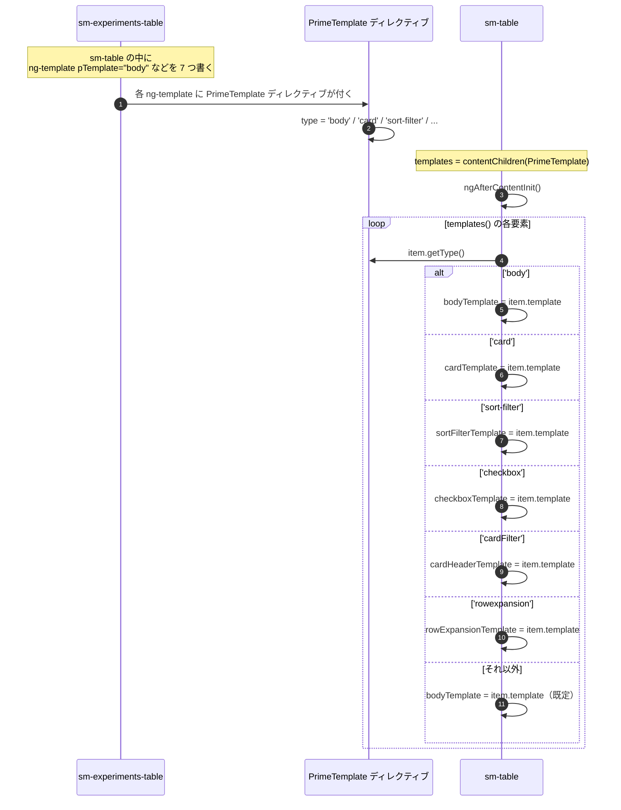
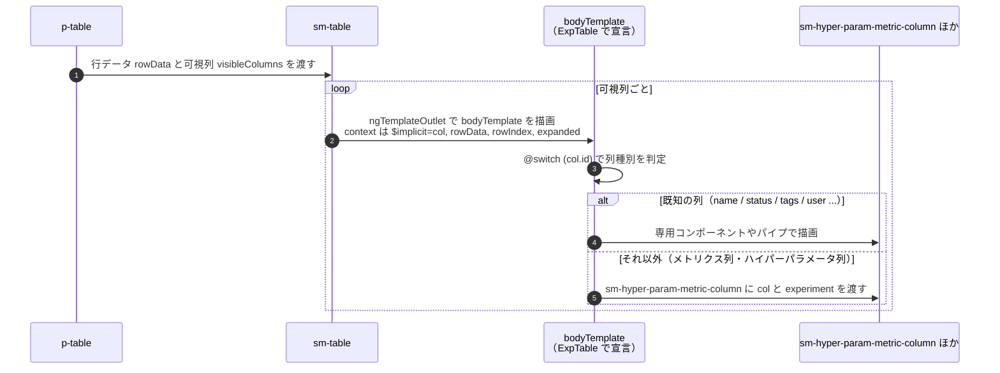
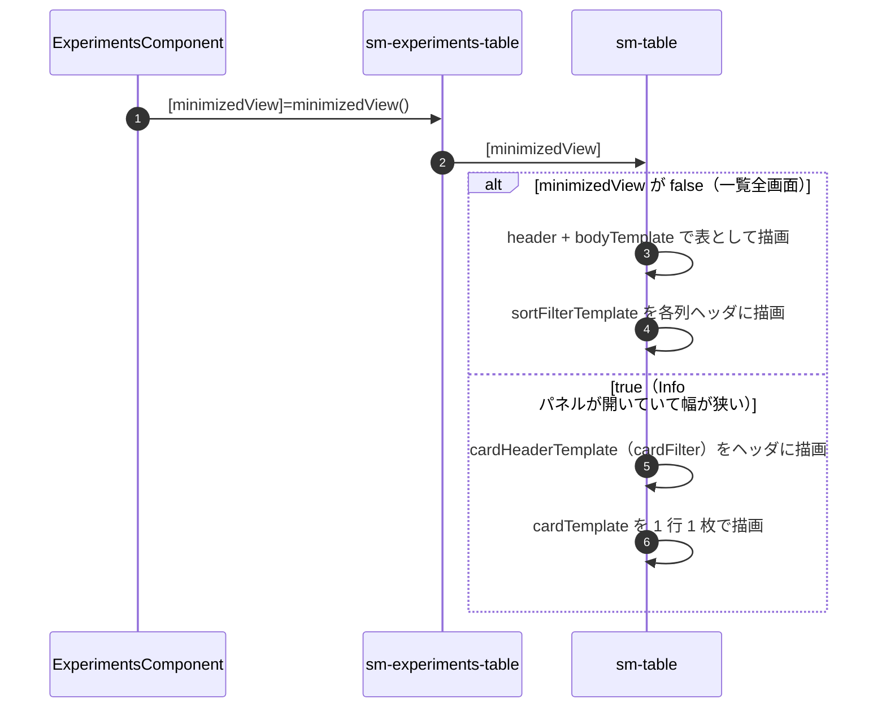

# 03-02 pTemplate と contentChildren

`sm-experiments-table` は `sm-table` の中に 7 種類の `ng-template` を書き込む。
`sm-table` はそれを `contentChildren(PrimeTemplate)` で集め、
`ngAfterContentInit` で種類ごとにフィールドへ振り分けてから `ngTemplateOutlet` で描く。

`pTemplate` は PrimeNG の `PrimeTemplate` ディレクティブで、
`ng-template` に「名前」を付けるためだけに使われている。

## 図1: 収集と振り分け

## 図2: 1 セルが描かれるまで

`@switch` の `@default` がメトリクス列とハイパーパラメータ列を受け持つ。
これらは実行時に URL から復元されて増える列なので、固定の `@case` を書けない。

## 図3: テーブル表示とカード表示の切り替え

同じ `sm-table` に対して、表用のテンプレートとカード用のテンプレートを
両方渡しておき、描画時にどちらを使うかだけ切り替えている。
`sm-experiments-table` 側は両方を常に宣言している。

## 読みどころ

- 収集と振り分け: [table.component.ts:334](/home/mtrysd/work_2026/000-learn-ClearML-pro/src/app/webapp-common/shared/ui-components/data/table/table.component.ts:334)
- 受け皿のフィールド定義: [table.component.ts:85](/home/mtrysd/work_2026/000-learn-ClearML-pro/src/app/webapp-common/shared/ui-components/data/table/table.component.ts:85)
- `contentChildren`: [table.component.ts:104](/home/mtrysd/work_2026/000-learn-ClearML-pro/src/app/webapp-common/shared/ui-components/data/table/table.component.ts:104)
- 描画側の `ngTemplateOutlet`: [table.component.html:154](/home/mtrysd/work_2026/000-learn-ClearML-pro/src/app/webapp-common/shared/ui-components/data/table/table.component.html:154)
- テンプレート宣言側: [experiments-table.component.html:37](/home/mtrysd/work_2026/000-learn-ClearML-pro/src/app/webapp-common/experiments/dumb/experiments-table/experiments-table.component.html:38)

`templates` は `contentChildren`（signal ベースのクエリ）で宣言されているが、
読み出しは `ngAfterContentInit` で 1 回だけ行い、以後はフィールドに保持した
`TemplateRef` を使い続ける。

そのため、`@if` で囲われたテンプレートは初期評価の結果しか反映されない。
実際に `pTemplate="checkbox"` は `@if (enableMultiSelect())` の中にある
（[experiments-table.component.html:56](/home/mtrysd/work_2026/000-learn-ClearML-pro/src/app/webapp-common/experiments/dumb/experiments-table/experiments-table.component.html:56)）。
`enableMultiSelect` は `input(true)` の既定値のまま使われるか、呼び出し側で固定値を渡すだけなので、
現状の使い方では問題にならない。
