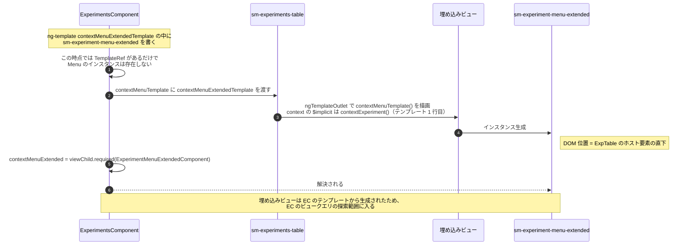
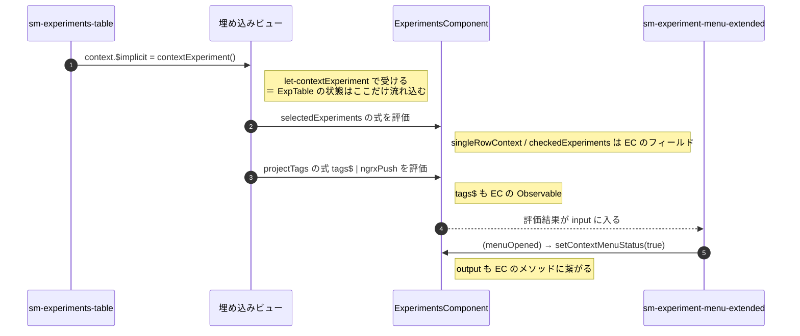

# 03-03 contextMenuTemplate の逆流

`sm-experiment-menu-extended` は `ExperimentsComponent` のテンプレート末尾で宣言されているのに、
DOM 上は `sm-experiments-table` の中に現れる。
そして `ExperimentsComponent` の `viewChild.required` はそれを取得できる。

DOM の位置（挿入ビュー）と、クエリやバインディングの基準（宣言ビュー）が食い違う例である。

## 図1: 渡されて実体化するまで

## 図2: バインディングの評価者

テンプレート内の式はすべて `ExperimentsComponent` のインスタンスを `this` として評価される。
`sm-experiments-table` から届くのは `let-contextExperiment` で受け取った 1 個の値だけである。

## なぜこの形になっているか

コンテキストメニューの実体を `sm-experiments-table` の中に入れておくと、
右クリックした行の近くにメニューを重ねられる。
一方でメニューが必要とする値（チェック済み一覧、タグ一覧、活性判定）は
`ExperimentsComponent` 側にある。

テンプレートだけを渡す形にすると、
`sm-experiments-table` に「メニューの入力を中継するための `input`」を足さずに済む。
`sm-experiments-table` が知っているのは `contextMenuTemplate` という `TemplateRef` 1 つだけで、
中身が何であるかを知らない。

## 読みどころ

- テンプレート宣言: [experiments.component.html:140](../../../src/app/webapp-common/experiments/experiments.component.html:140)
- 受け渡し: [experiments.component.html:94](../../../src/app/webapp-common/experiments/experiments.component.html:94)
- 描画位置: [experiments-table.component.html:1](../../../src/app/webapp-common/experiments/dumb/experiments-table/experiments-table.component.html:1)
- `input` 定義: [experiments-table.component.ts:119](../../../src/app/webapp-common/experiments/dumb/experiments-table/experiments-table.component.ts:119)
- `viewChild.required`: [experiments.component.ts:240](../../../src/app/webapp-common/experiments/experiments.component.ts:240)
- メニューを開く側: [experiments.component.ts:735](../../../src/app/webapp-common/experiments/experiments.component.ts:735)

`viewChild.required` は解決できないと実行時に例外を投げる。
ここで `required` を使えているのは、`contextMenuTemplate` が
`sm-experiments-table` のテンプレート 1 行目で `@if` なしに常に描画されるためである。
