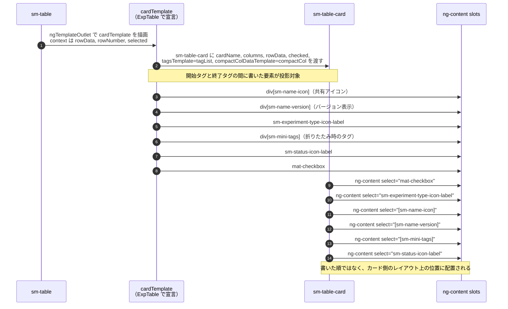

# 03-04 ng-content によるカード組み立て

`ng-content` を使っているのは `sm-table-card` である。
`sm-experiments-table` が `pTemplate="card"` の中に `<sm-table-card>` を書き、
その子要素をカード側が `select` 属性で slot に振り分ける。

カード表示は Info パネルが開いていて一覧の幅が狭いとき（`minimizedView()` が true）に使われる。

## 図: 投影が起きる順序

## 投影とテンプレート渡しの併用

同じ `sm-table-card` に対して、2 つの方式が同時に使われている。

| 渡すもの | 方式 | 理由 |
| --- | --- | --- |
| アイコン、ステータス、チェックボックス | `ng-content`（slot 分配） | 常に 1 個ずつ、位置が固定 |
| タグ一覧（`#tagList`） | `input` + `ngTemplateOutlet` | カード側が `@if(tagsTemplate())` で有無を判定して描く |
| 補足列（`#compactCol`） | `input` + `ngTemplateOutlet` | 同上 |

`ng-content` の投影は、渡されたかどうかをカード側で判定しづらい。
`TemplateRef` を `input` で受け取る形なら `@if(tagsTemplate())` で分岐でき、
渡されなかった場合のラッパー要素ごと省略できる
（[table-card.component.html:30](../../../src/app/webapp-common/shared/ui-components/data/table-card/table-card.component.html:30)）。
カードのタグ行・補足行は他の画面では使わないため、この形になっている。

## 評価文脈

`ng-content` で投影した `<mat-checkbox (click)="rowSelectedChanged(...)">` の
`rowSelectedChanged` は `sm-experiments-table` のメソッドである。
投影しても評価文脈は移らない。

## 読みどころ

- 投影元（カードテンプレート）: [experiments-table.component.html:215](../../../src/app/webapp-common/experiments/dumb/experiments-table/experiments-table.component.html:215)
- slot 定義: [table-card.component.html:10](../../../src/app/webapp-common/shared/ui-components/data/table-card/table-card.component.html:10)
- テンプレート渡しの 2 つ: [experiments-table.component.html:269](../../../src/app/webapp-common/experiments/dumb/experiments-table/experiments-table.component.html:269)
- カード描画の呼び出し元: [table.component.html:165](../../../src/app/webapp-common/shared/ui-components/data/table/table.component.html:165)
