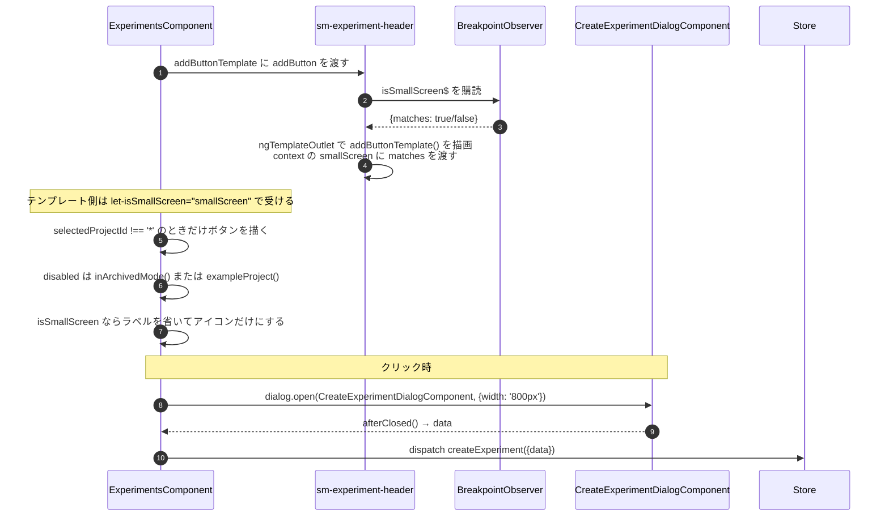
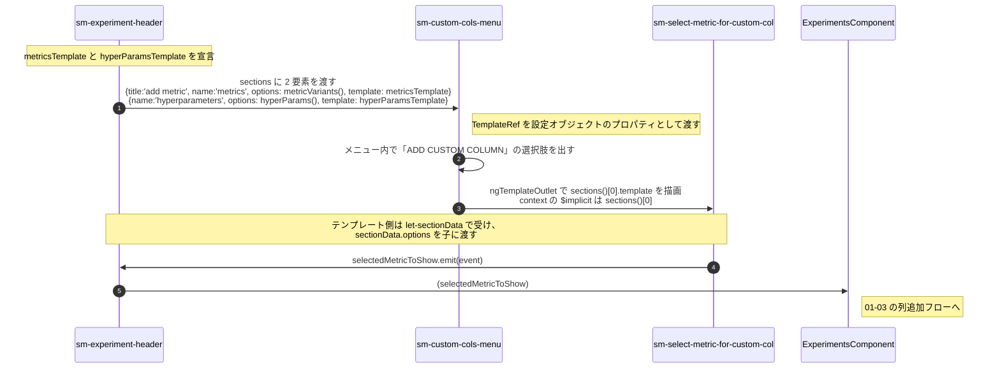

# 03-05 ヘッダーへのテンプレート注入

ヘッダーには 2 種類のテンプレート注入がある。
`ExperimentsComponent` から降りてくるもの（NEW TASK ボタン）と、
ヘッダー自身が孫コンポーネントへ渡すもの（カスタム列メニューの中身）である。

## 図1: NEW TASK ボタン（親 → 子）

ヘッダーは画面幅だけを提供し、ボタンを出すかどうか・押されたら何をするかは
`ExperimentsComponent` が持つ。ヘッダーに `newExperiment` の `output` を足さずに済んでいる。

## 図2: カスタム列メニュー（子 → 孫）

比較モードのときは `sections` が 1 要素だけになり、
ハイパーパラメータのセクションが消える。
`sm-custom-cols-menu` 側は配列の長さを見てタブ表示を切り替えるだけで、
どのコンポーネントが入るかは知らない。

## 読みどころ

- `addButton` の宣言: [experiments.component.html:33](/home/mtrysd/work_2026/000-learn-ClearML-pro/src/app/webapp-common/experiments/experiments.component.html:33)
- 受け取り側: [experiment-header.component.ts:71](/home/mtrysd/work_2026/000-learn-ClearML-pro/src/app/webapp-common/experiments/dumb/experiment-header/experiment-header.component.ts:71)
- 画面幅の判定（基底クラス）: [base-entity-header.component.ts:20](/home/mtrysd/work_2026/000-learn-ClearML-pro/src/app/webapp-common/shared/entity-page/base-entity-header/base-entity-header.component.ts:20)
- 描画: [experiment-header.component.html:4](/home/mtrysd/work_2026/000-learn-ClearML-pro/src/app/webapp-common/experiments/dumb/experiment-header/experiment-header.component.html:4)
- `sections` の組み立て: [experiment-header.component.html:66](/home/mtrysd/work_2026/000-learn-ClearML-pro/src/app/webapp-common/experiments/dumb/experiment-header/experiment-header.component.html:66)
- `sections[].template` の描画: [experiment-custom-cols-menu.component.html:52](/home/mtrysd/work_2026/000-learn-ClearML-pro/src/app/webapp-common/experiments/dumb/experiment-custom-cols-menu/experiment-custom-cols-menu.component.html:52)
- 新規作成ダイアログ: [experiments.component.ts:781](/home/mtrysd/work_2026/000-learn-ClearML-pro/src/app/webapp-common/experiments/experiments.component.ts:781)
