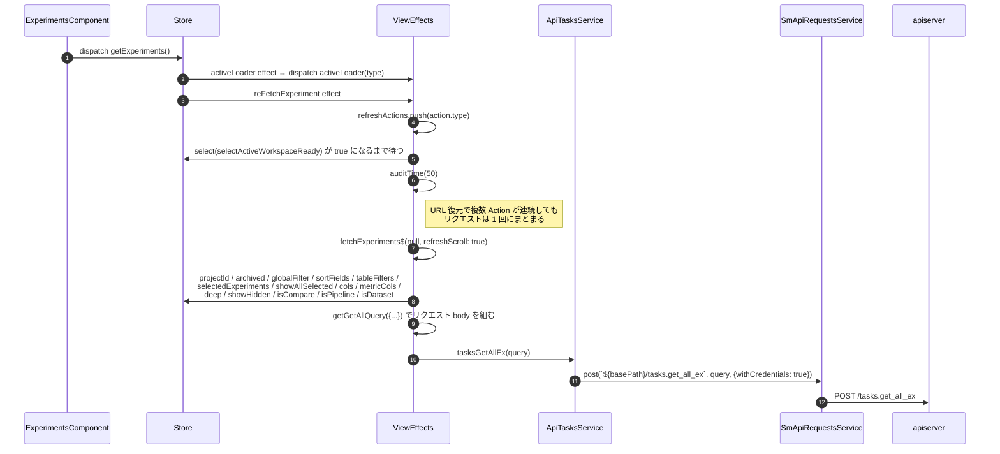
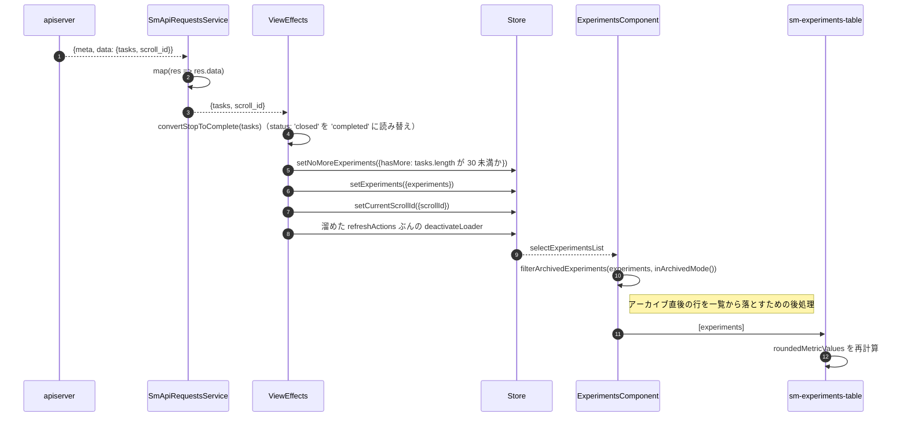
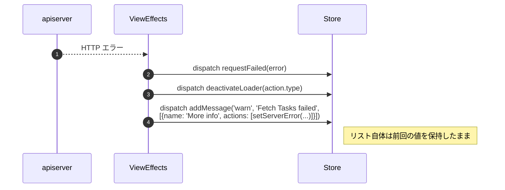

# 04-01 一覧取得の全経路

一覧データは `tasks.get_all_ex` 1 本で取る。
`ExperimentsComponent` は `getExperiments()` を発行するだけで、
クエリの組み立てに必要な 14 個の状態は Effect 側が Store から集める。

## 図1: Action から HTTP まで

## 図2: 応答から画面反映まで

## エラー経路

## クエリ組み立ての要点

`getGetAllQuery` が Store の状態をリクエスト body に変換する。

- `only_fields`: 表示中の列の `getter`（または `id`）だけを集める。列を増やすとリクエストのフィールドも増える
- `system_tags`: アーカイブ表示かどうか、pipeline / dataset / reports を除外するかをここで表現する
- `project`: `'*'`（全プロジェクト）のときは `undefined` にして絞り込みを外す
- `include_subprojects`: deep モードかつプロジェクトフィルタなしのときだけ true
- `id`: 「選択中のみ表示」が有効なら選択済み ID を入れる
- `type`: pipeline なら `Controller`、dataset なら `DataProcessing` に固定

## 読みどころ

- 取得の Effect: [common-experiments-view.effects.ts:240](/home/mtrysd/work_2026/000-learn-ClearML-pro/src/app/webapp-common/experiments/effects/common-experiments-view.effects.ts:240)
- 状態の収集: [common-experiments-view.effects.ts:761](/home/mtrysd/work_2026/000-learn-ClearML-pro/src/app/webapp-common/experiments/effects/common-experiments-view.effects.ts:761)
- クエリ組み立て: [common-experiments-view.effects.ts:964](/home/mtrysd/work_2026/000-learn-ClearML-pro/src/app/webapp-common/experiments/effects/common-experiments-view.effects.ts:964)
- API サービス: [tasks.service.ts:126](/home/mtrysd/work_2026/000-learn-ClearML-pro/src/app/business-logic/api-services/tasks.service.ts:126)
- HTTP 層: [api-requests.service.ts:26](/home/mtrysd/work_2026/000-learn-ClearML-pro/src/app/business-logic/api-services/api-requests.service.ts:28)
- 一覧の後処理: [experiments.component.ts:207](/home/mtrysd/work_2026/000-learn-ClearML-pro/src/app/webapp-common/experiments/experiments.component.ts:207)

ClearML の API は全エンドポイントが POST で、レスポンスは `{meta, data}` の形で返る。
`SmApiRequestsService.post` が `data` だけを取り出すため、
Effect からは `{tasks, scroll_id}` が直接見える。認証は `withCredentials: true` の Cookie による。
