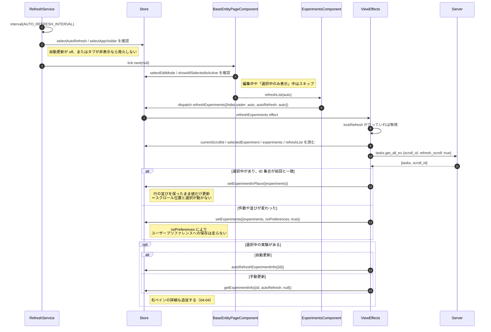
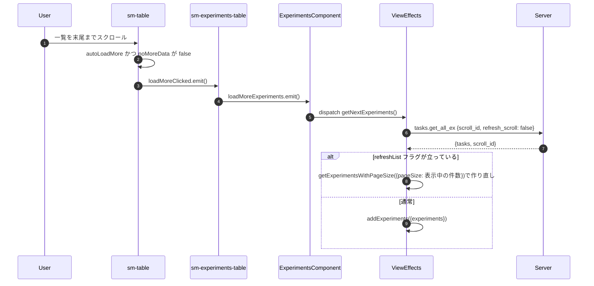

# 04-02 自動更新と追い読み

一覧を更新する経路は 3 つある。どれも同じ `fetchExperiments$` を通るが、
渡す `scroll_id` と結果の扱いが違う。

| 経路 | 起点 | `scroll_id` | 結果の反映 |
| --- | --- | --- | --- |
| 初回・条件変更 | `getExperiments` ほか | `null`（新規作成） | `setExperiments`（全差し替え） |
| 自動更新・手動更新 | `refreshExperiments` | 現在の ID・`refresh_scroll: true` | `setExperimentInPlace` または `setExperiments` |
| 追い読み | `getNextExperiments` | 現在の ID・`refresh_scroll: false` | `addExperiments`（追記） |

## 図1: 自動更新のタイマーから反映まで

## 図2: 末尾スクロールでの追い読み

## `lockRefresh` の役割

`refreshExperiments` の Effect はインスタンス変数 `lockRefresh` を持つ。
手動更新（`autoRefresh: false`）が始まると true になり、応答が返るかエラーになるまで
後続の `refreshExperiments` を弾く。

自動更新のタイマーは止まらないため、手動更新の最中にタイマーが発火して
2 重にリクエストが飛ぶのを防いでいる。

## 読みどころ

- タイマー: [refresh.service.ts:9](/home/mtrysd/work_2026/000-learn-ClearML-pro/src/app/webapp-common/core/services/refresh.service.ts:9)
- tick の購読: [base-entity-page.ts:135](/home/mtrysd/work_2026/000-learn-ClearML-pro/src/app/webapp-common/shared/entity-page/base-entity-page.ts:135)
- 更新の Effect: [common-experiments-view.effects.ts:276](/home/mtrysd/work_2026/000-learn-ClearML-pro/src/app/webapp-common/experiments/effects/common-experiments-view.effects.ts:276)
- 追い読みの Effect: [common-experiments-view.effects.ts:347](/home/mtrysd/work_2026/000-learn-ClearML-pro/src/app/webapp-common/experiments/effects/common-experiments-view.effects.ts:347)
- 発行元: [experiments.component.ts:684](/home/mtrysd/work_2026/000-learn-ClearML-pro/src/app/webapp-common/experiments/experiments.component.ts:684)

`activeLoader` effect の `ofType` には `refreshExperiments` が入っていないため、
更新系ではローディングのオーバーレイが出ない。値だけが差し替わる。

同 effect には `filter(action => !action.hideLoader)` が付いていて、
`getMetricsToDisplay()` から出る `getCustomMetrics({hideLoader: true})` などがここで落ちる
（[common-experiments-view.effects.ts:97](/home/mtrysd/work_2026/000-learn-ClearML-pro/src/app/webapp-common/experiments/effects/common-experiments-view.effects.ts:97)）。
