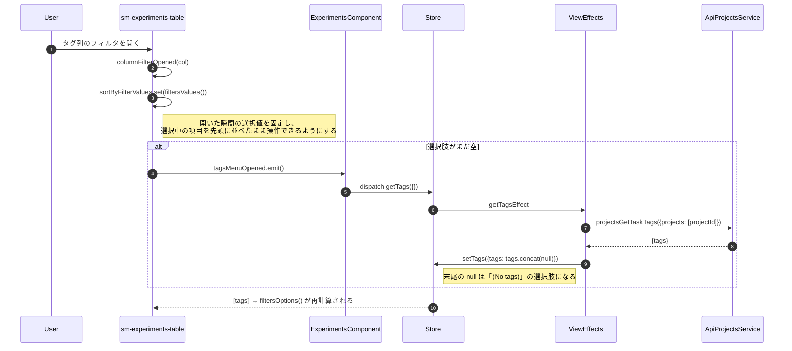
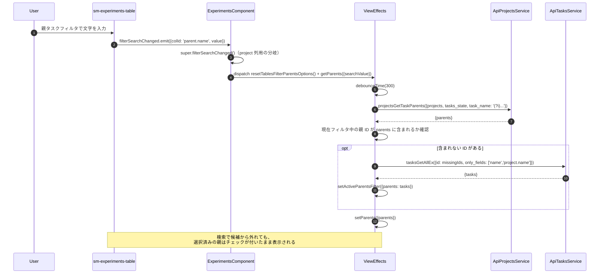
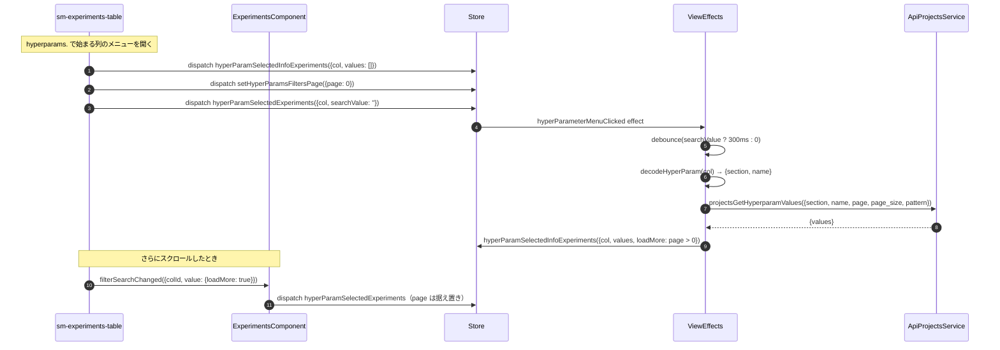

# 04-03 フィルタ選択肢の取得

列ヘッダのフィルタに出す選択肢は、一覧データとは別のエンドポイントから取る。
一覧に読み込まれている 30 件からではなく、プロジェクト全体から集める必要があるためである。

| 選択肢 | Action | エンドポイント | 取得のきっかけ |
| --- | --- | --- | --- |
| タグ | `getTags` | `projects.get_task_tags` | 起動時／タグメニューを開いたとき |
| タイプ | `getProjectTypes` | `tasks.get_types` | 起動時／タイプメニューを開いたとき |
| 親タスク | `getParents` | `projects.get_task_parents` | 起動時／検索文字列の入力時 |
| プロジェクト | `getTablesFilterProjectsOptions` | `projects.get_all_ex` | プロジェクト列のメニューを開いたとき |
| ユーザー | `getProjectUsers` | `projects.get_user_names` | 起動時（`ProjectsEffects` が担当） |
| カスタム列（メトリクス） | `getCustomMetrics` | `projects.get_unique_metric_variants` | 列カスタマイズメニューを開いたとき |
| カスタム列（ハイパーパラメータ名） | `getCustomHyperParams` | `projects.get_hyper_parameters` | 同上 |
| ハイパーパラメータの値 | `hyperParamSelectedExperiments` | `projects.get_hyperparam_values` | 該当列のフィルタメニューを開いたとき |

## 図1: メニューを開いた時点で取りに行くもの

## 図2: 親タスクの絞り込み検索

## 図3: ハイパーパラメータ値のページング

ハイパーパラメータの値だけはサーバ側ページングがある。
一方、親タスクの候補にはページングが無く、`loadMore` が来たときは
`setParents({parents: [...this.parents]})` と同じ配列を入れ直して
「これ以上は無い」と判定させている。

## 読みどころ

- タグ: [common-experiments-view.effects.ts:814](../../../src/app/webapp-common/experiments/effects/common-experiments-view.effects.ts:814)
- タイプ: [common-experiments-view.effects.ts:425](../../../src/app/webapp-common/experiments/effects/common-experiments-view.effects.ts:425)
- 親タスク: [common-experiments-view.effects.ts:483](../../../src/app/webapp-common/experiments/effects/common-experiments-view.effects.ts:483)
- カスタム列: [common-experiments-view.effects.ts:520](../../../src/app/webapp-common/experiments/effects/common-experiments-view.effects.ts:520)
- ハイパーパラメータ値: [common-experiments-view.effects.ts:613](../../../src/app/webapp-common/experiments/effects/common-experiments-view.effects.ts:613)
- メニューを開いたときの分岐: [experiments-table.component.ts:377](../../../src/app/webapp-common/experiments/dumb/experiments-table/experiments-table.component.ts:377)
- 検索入力の分岐: [experiments.component.ts:840](../../../src/app/webapp-common/experiments/experiments.component.ts:841)
- 選択肢の合成: [experiments-table.component.ts:227](../../../src/app/webapp-common/experiments/dumb/experiments-table/experiments-table.component.ts:224)

タイプの取得だけは、応答を受けてから追加の処理がある。
現在のフィルタに、サーバが返したタイプ一覧に無い値が残っていた場合、
その値を除いた `tableFilterChanged` を発行してフィルタを整理する。
