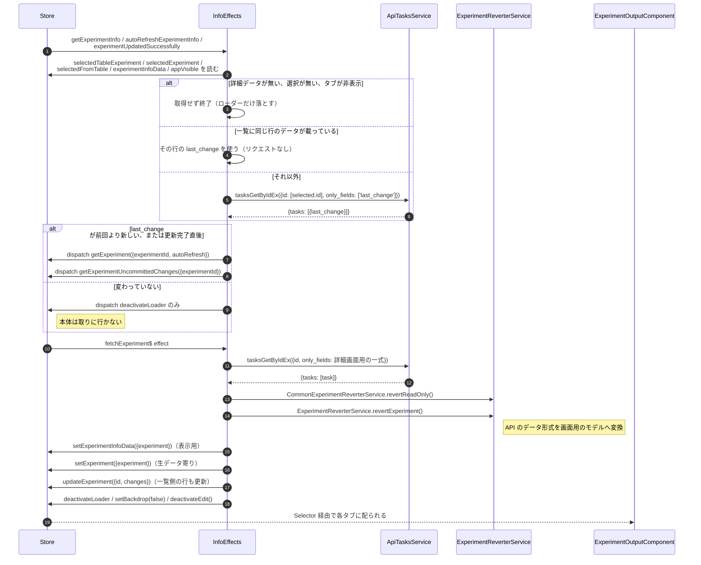
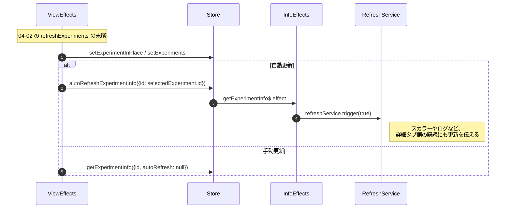
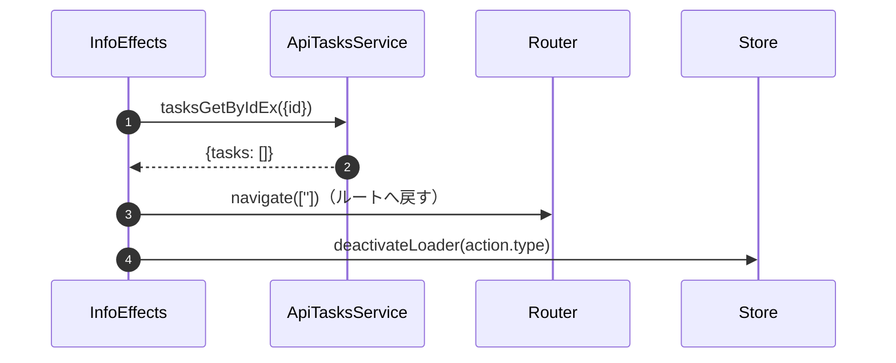

# 04-04 詳細パネルの二段取得

右ペインの詳細は、`tasks.get_by_id_ex` を 2 回呼ぶ。
1 回目は `last_change` だけを取り、2 回目で本体を取る。
自動更新のたびに本体を取り直さないための作りである。

## 図1: 差分確認 → 本体取得

## 図2: 一覧更新から詳細更新への連鎖

一覧の `setExperiments` は詳細取得より先に発行される。
`getExperimentInfo$` が `selectSelectedTableExperiment` を読んで
`last_change` の比較に使うため、順序が入れ替わると古い値で比較してしまう。
Effect のコメントにも `SetExperiments must be before GetExperimentInfo!` と書かれている。

## 図3: 実験が見つからない場合

## 読みどころ

- 差分確認: [common-experiments-info.effects.ts:243](../../../src/app/webapp-common/experiments/effects/common-experiments-info.effects.ts:243)
- 本体取得: [common-experiments-info.effects.ts:300](../../../src/app/webapp-common/experiments/effects/common-experiments-info.effects.ts:300)
- 一覧側からの呼び出し: [common-experiments-view.effects.ts:276](../../../src/app/webapp-common/experiments/effects/common-experiments-view.effects.ts:276)
- 詳細タブのルート定義: [experiment-routes.ts:76](../../../src/app/webapp-common/experiments/experiment-routes.ts:75)

`selectAppVisible` を条件に入れているため、ブラウザタブが裏にある間は
詳細の取得が止まる。タブに戻ったときの次の更新でまとめて追いつく。
