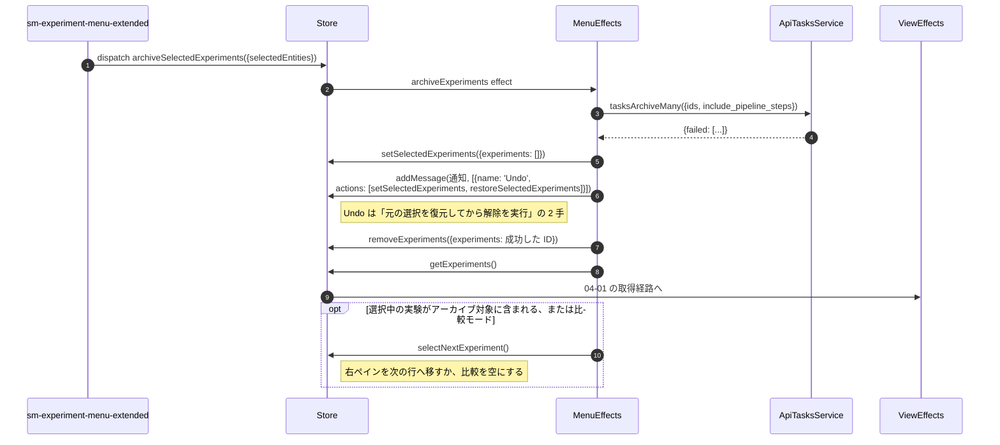
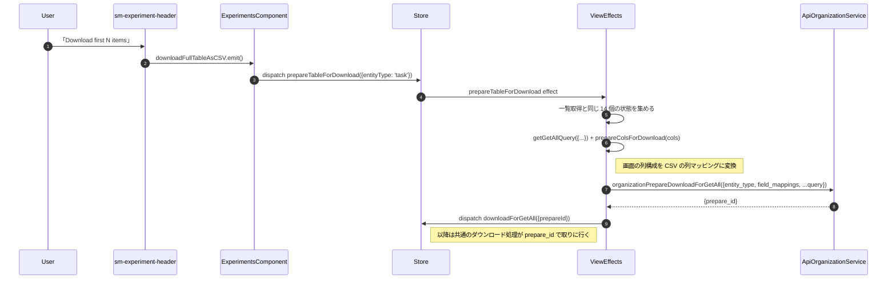
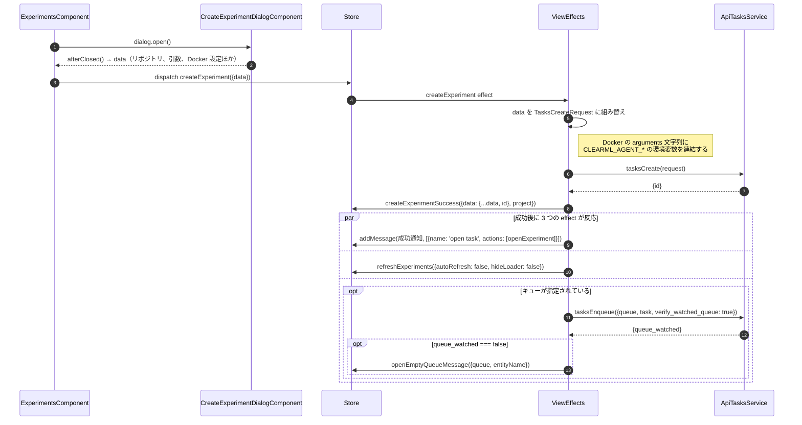

# 04-05 一括操作と CSV 出力

一覧画面から出る、取得以外のリクエストをまとめる。
どれもフッターまたはコンテキストメニューが起点で、
成功したら一覧を取り直す形で画面を合わせる。

| 操作 | エンドポイント | 成功後 |
| --- | --- | --- |
| アーカイブ | `tasks.archive_many` | `removeExperiments` + `getExperiments` + Undo 付き通知 |
| アーカイブ解除 | `tasks.unarchive_many` | 同上 |
| 削除 | `tasks.delete_many` | 一覧から除去して取り直し |
| リセット | `tasks.reset_many` | 一覧を取り直し |
| Enqueue / Dequeue | `tasks.enqueue_many` / `tasks.dequeue_many` | 一覧を取り直し |
| 停止 | `tasks.stop_many` | 一覧を取り直し |
| 公開 | `tasks.publish_many` | 一覧を取り直し |
| プロジェクト移動 | `tasks.move` | 一覧を取り直し |
| タグ追加・削除 | `tasks.update_tags` | Store の該当行を更新 |
| クローン | `tasks.clone` | 複製されたタスクへ遷移 |

削除とリセットだけは `CommonExperimentsMenuEffects` ではなく、
確認ダイアログ側の Effect（[base-delete-dialog.effects.ts:100](/home/mtrysd/work_2026/000-learn-ClearML-pro/src/app/webapp-common/shared/entity-page/entity-delete/base-delete-dialog.effects.ts:100)）が呼ぶ。
どちらも同じダイアログを使い、`resetMode` フラグでエンドポイントを切り替えている。
| 新規作成 | `tasks.create` | 成功通知 + `refreshExperiments`（キュー指定時は `tasks.enqueue`） |
| 全件 CSV | `organization.prepare_download_for_get_all` | `downloadForGetAll` でダウンロード開始 |
| 表示中 CSV | なし（クライアント側で生成） | - |

## 図1: アーカイブと Undo

`removeExperiments` で先に画面から消してから `getExperiments()` を出している。
サーバの応答を待たずに一覧が更新されるため、操作直後の見た目が遅れない。

## 図2: 全件 CSV ダウンロード

表示中の行だけの CSV は API を使わない。
`ExperimentsComponent` が `viewChild` で掴んだ `sm-table` の
`downloadTableAsCSV()` を直接呼び、読み込み済みの行から生成する。

## 図3: 新規タスク作成

## 読みどころ

- アーカイブ: [common-experiments-menu.effects.ts:443](/home/mtrysd/work_2026/000-learn-ClearML-pro/src/app/webapp-common/experiments/effects/common-experiments-menu.effects.ts:443)
- アーカイブ解除: [common-experiments-menu.effects.ts:505](/home/mtrysd/work_2026/000-learn-ClearML-pro/src/app/webapp-common/experiments/effects/common-experiments-menu.effects.ts:505)
- CSV 準備: [common-experiments-view.effects.ts:184](/home/mtrysd/work_2026/000-learn-ClearML-pro/src/app/webapp-common/experiments/effects/common-experiments-view.effects.ts:184)
- 新規作成: [common-experiments-view.effects.ts:868](/home/mtrysd/work_2026/000-learn-ClearML-pro/src/app/webapp-common/experiments/effects/common-experiments-view.effects.ts:868)
- 発行元（フッター）: [experiments.component.ts:399](/home/mtrysd/work_2026/000-learn-ClearML-pro/src/app/webapp-common/experiments/experiments.component.ts:399)
- 表示中 CSV: [experiments.component.ts:790](/home/mtrysd/work_2026/000-learn-ClearML-pro/src/app/webapp-common/experiments/experiments.component.ts:790)
