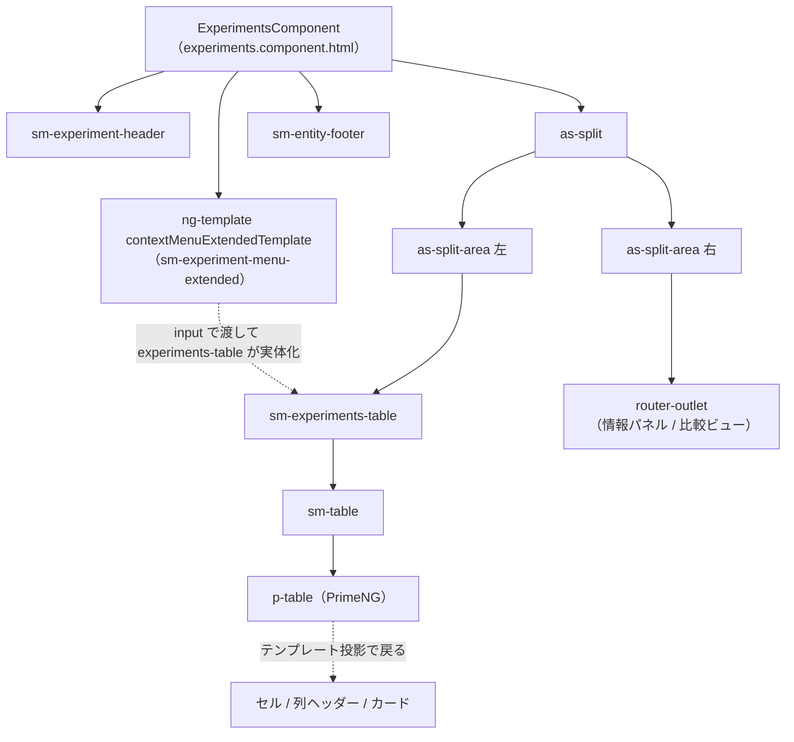

# 05-00 部品マップと読み方

この系統（05）は「画面のある部品まで、どのコンポーネントを経由して辿り着くか」だけを追う。
01 が操作の伝播を追うのに対し、こちらは**部品の住所**を追う資料。

## 部品の住所一覧

| 部品 | セレクタ | 誰の中にいるか | 図 |
| --- | --- | --- | --- |
| ヘッダー（検索・表示切替・列追加） | `sm-experiment-header` | EC のテンプレート直下 | [05-01](./05-01_ヘッダーまでの経路.md) |
| テーブル本体 | `sm-experiments-table` → `sm-table` → `p-table` | 左ペイン（`as-split-area`） | [05-02](./05-02_テーブル本体までの経路.md) |
| セル | `pTemplate="body"` の中身 | p-table の `td` に投影される | [05-03](./05-03_セルまでの経路.md) |
| 列ヘッダー（ソート・フィルタ） | `sm-table-filter-sort` | p-table の `th` に投影される | [05-04](./05-04_列ヘッダーまでの経路.md) |
| カード（縮小表示） | `sm-table-card` | p-table の `td` に投影される | [05-05](./05-05_カードビューまでの経路.md) |
| 情報パネル | `router-outlet` の中身 | 右ペイン（`as-split-area`） | [05-06](./05-06_情報パネルまでの経路.md) |
| フッター（一括操作バー） | `sm-entity-footer` | EC のテンプレート直下 | [05-07](./05-07_フッターまでの経路.md) |
| コンテキストメニュー | `sm-experiment-menu-extended` | 宣言は EC、実体化は experiments-table | [05-08](./05-08_コンテキストメニューまでの経路.md) |

## 部品の位置関係

矢印が一方向でないのが、この画面を読みにくくしている原因。
**セル・列ヘッダー・カードは p-table が描くが、中身を書いているのは experiments-table** で、
**コンテキストメニューは EC が書いているが、実体化するのは experiments-table**。
この2つの「逆流」を押さえると全体が繋がる。

## 状態の受け取り方（凡例）

05 の図では、値がどこから来るかを次の4種類だけで書く。細かい流れは 02 系統を参照。

| 表記 | 意味 | 例 |
| --- | --- | --- |
| Store | NgRx Store。`store.select()` + `ngrxPush`、または `store.selectSignal()` | `experiments$`、`tableMode()` |
| URL | クエリパラメータ。原本は URL で、Store は写し | `order`、`filter`、`columns`、`archive` |
| signal | コンポーネント内のローカル signal（Store に出ない） | `highlited()`、`contextExperiment()` |
| field | ただのプロパティ。変更検知は「イベントが来たついで」に走る | `searchValues`、`contextMenuActive` |

押さえる原則は2つ。

1. **サーバから来るデータは必ず Store 経由**。部品は `input()` で受け取るだけで、自分で取りに行かない。
2. **並び順・フィルタ・表示列は URL が原本**。操作 → Action → URL 書き換え → URL 監視 → 再取得、と一周する（詳細は [05-13](./05-13_列ソート.md) / [05-14](./05-14_列フィルタ.md)）。

## テーブル操作の索引

テーブルは操作ごとに経路が違うので、操作単位で分けた。一覧は [05-10](./05-10_テーブル操作の一覧.md) にある。

- [05-11 行クリックとダブルクリック](./05-11_行クリックとダブルクリック.md)
- [05-12 チェックボックス選択と全選択](./05-12_チェックボックス選択と全選択.md)
- [05-13 列ソート](./05-13_列ソート.md)
- [05-14 列フィルタ](./05-14_列フィルタ.md)
- [05-15 列の並べ替えと幅変更](./05-15_列の並べ替えと幅変更.md)
- [05-16 追い読み](./05-16_追い読み.md)
- [05-17 右クリックメニュー](./05-17_右クリックメニュー.md)
- [05-18 キーボード操作とフォーカス](./05-18_キーボード操作とフォーカス.md)
- [05-19 カードビューの操作](./05-19_カードビューの操作.md)
- [05-20 CSVダウンロード](./05-20_CSVダウンロード.md)

## 略称

01〜04 と同じ略称を使う。05 で追加したものだけ挙げる。

| 略称 | 実体 |
| --- | --- |
| PTable | PrimeNG の `p-table`（`Table` クラス） |
| BaseTable | `BaseTableView`（experiments-table の基底ディレクティブ） |
| FilterSort | `sm-table-filter-sort`（列ヘッダーのソート＋フィルタ） |
| CardFilter | `sm-table-card-filter`（カード表示時のフィルタメニュー） |
| Card | `sm-table-card` |
