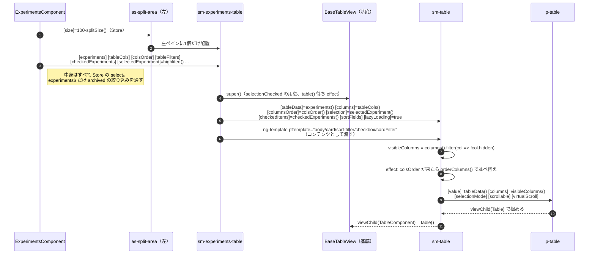
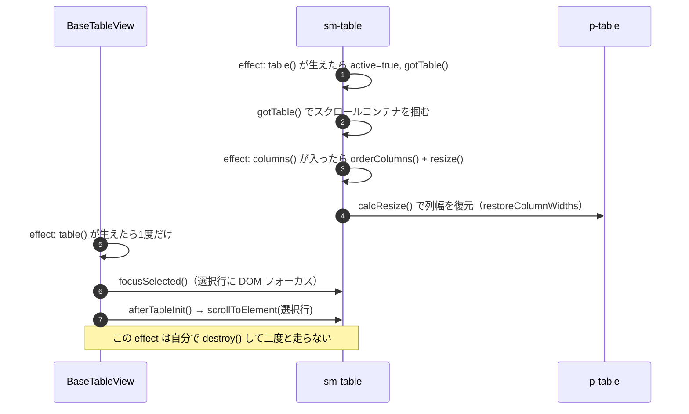

# 05-02 テーブル本体までの経路

行が並ぶ本体まで。ここは3枚重ねになっていて、それぞれ役割が違う。

| 層 | 役割 |
| --- | --- |
| `sm-experiments-table` | Task 固有の知識（列 ID、フィルタ選択肢、選択ロジック）。基底は `BaseTableView` |
| `sm-table` | PrimeNG のラッパ。列幅・スクロール・テンプレート振り分け・キーボード操作 |
| `p-table` | 実際の table 要素を描く PrimeNG 本体 |

**Task という言葉を知っているのは一番上の層だけ**。下2層は `{id: string}` を持つ何かとしてしか扱わない。
だから同じ `sm-table` がモデル一覧や比較画面でも使われている。

## 図1: 3層の生成と input の流れ

`sm-table` が `p-table` に渡す `[columns]` は `visibleColumns()`。
`hidden: true` の列は**そもそも描かれない**。表示/非表示の切替はヘッダーのメニューから
`toggleColHidden` で Store と URL を書き換え、ここまで降りてくる。

## 図2: テーブルが立ち上がった後の初期処理

列幅の復元は `p-table` の内部 API（`columnWidthsState` / `restoreColumnWidths`）を
直接叩いている。PrimeNG の localStorage 保存機能は使わず、**幅の原本はサーバ側の
ユーザープリファレンス**にある（05-15）。

## 読みどころ

- テーブル呼び出し: [experiments.component.html:69](/home/mtrysd/work_2026/000-learn-ClearML-pro/src/app/webapp-common/experiments/experiments.component.html#L69)
- sm-table 呼び出し: [experiments-table.component.html:3](/home/mtrysd/work_2026/000-learn-ClearML-pro/src/app/webapp-common/experiments/dumb/experiments-table/experiments-table.component.html#L3)
- 3層目の p-table: [table.component.html:2](/home/mtrysd/work_2026/000-learn-ClearML-pro/src/app/webapp-common/shared/ui-components/data/table/table.component.html#L2)
- 初期化 effect 群: [table.component.ts:189](/home/mtrysd/work_2026/000-learn-ClearML-pro/src/app/webapp-common/shared/ui-components/data/table/table.component.ts#L189)
- 1回だけ走る effect: [base-table-view.ts:74](/home/mtrysd/work_2026/000-learn-ClearML-pro/src/app/webapp-common/shared/ui-components/data/table/base-table-view.ts#L74)
