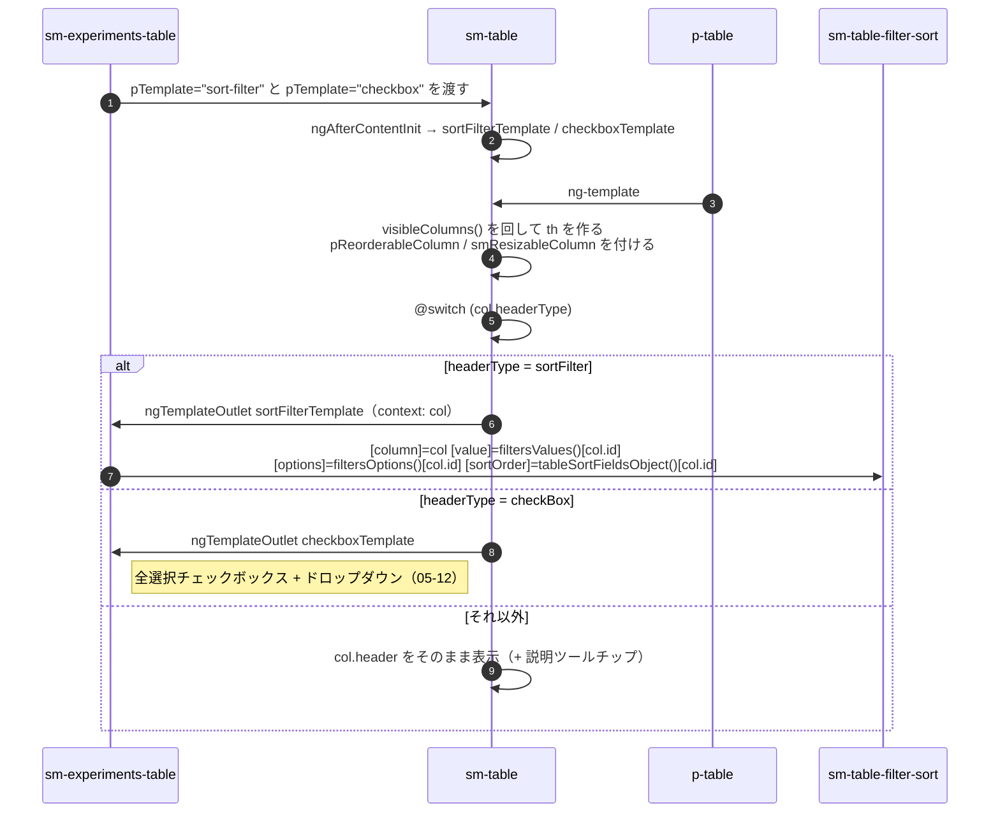
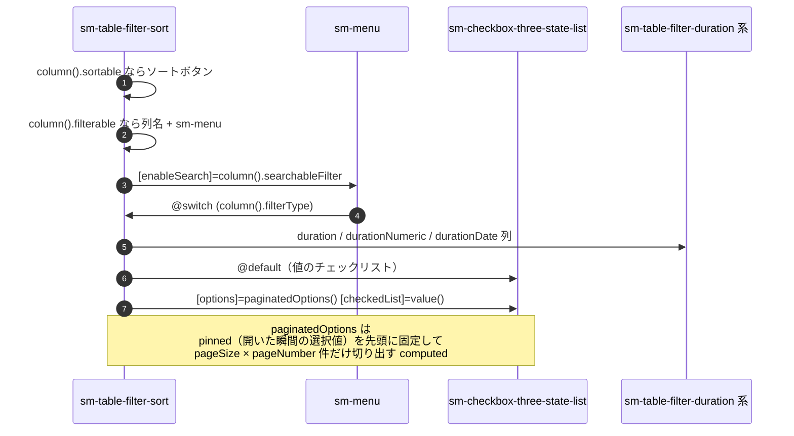

# 05-04 列ヘッダーまでの経路

列名・ソート矢印・フィルタ漏斗が並ぶ `th` の中身まで。

セル（05-03）と同じ「渡して、呼び戻される」形だが、**`th` は列の種類で3通りに分岐する**。

## 図1: th の中身が決まるまで

`th` に付く2つのディレクティブが、並べ替えと幅変更の入口になる（05-15）。
`col.disableDrag` の列（チェックボックス列など）は両方とも無効化される。

## 図2: sm-table-filter-sort の中

この部品は**選択肢のページングと検索の状態を自分の signal で持つ**唯一のテーブル部品。
`pageNumber` `loading` `searching` `pinnedValues` `lengthBeforeLoad` はすべてローカル。
Store に出すのは「値が確定したフィルタ」と「サーバ検索が必要な語」だけ（05-14）。

## 状態の要点

- 列定義 `tableCols` は Store（サーバのユーザープリファレンス + URL の `columns`）が原本。
- ソート状態は Store の `tableSortFields`（原本は URL の `order`）を
  `tableSortFieldsObject()` で `{列ID: {index, order}}` に変換して1列ぶんだけ渡す。
- フィルタの選択値は Store の `tableFilters`（原本は URL の `filter`）を
  `filtersValues()` で列 ID 別にほどいて渡す。
- 選択肢（`filtersOptions()`）はユーザー一覧・タグ・親タスクなど別々の Store 断片を
  1つの `computed` で組み立てている。

## 読みどころ

- th の分岐: [table.component.html:57](/home/mtrysd/work_2026/000-learn-ClearML-pro/src/app/webapp-common/shared/ui-components/data/table/table.component.html#L57)
- sort-filter テンプレート: [experiments-table.component.html:86](/home/mtrysd/work_2026/000-learn-ClearML-pro/src/app/webapp-common/experiments/dumb/experiments-table/experiments-table.component.html#L86)
- 選択肢の組み立て: [experiments-table.component.ts:224](/home/mtrysd/work_2026/000-learn-ClearML-pro/src/app/webapp-common/experiments/dumb/experiments-table/experiments-table.component.ts#L224)
- ページング computed: [table-filter-sort.component.ts:108](/home/mtrysd/work_2026/000-learn-ClearML-pro/src/app/webapp-common/shared/ui-components/data/table/table-filter-sort/table-filter-sort.component.ts#L108)
