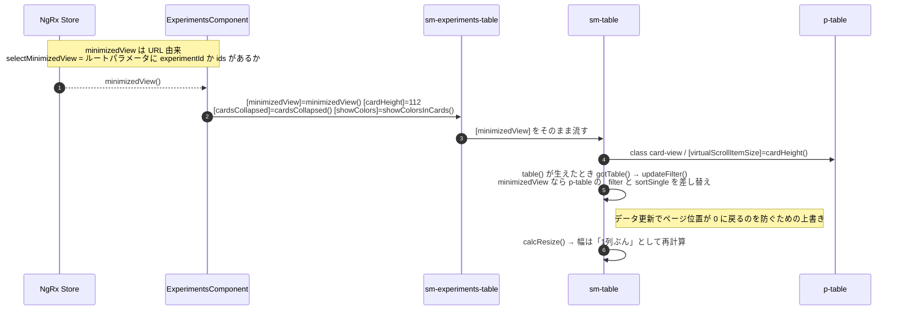
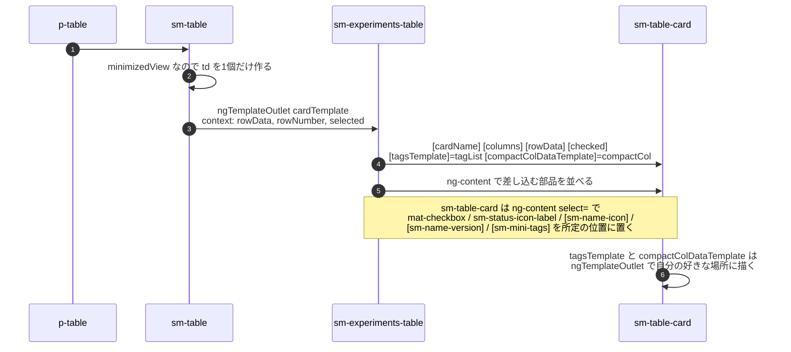
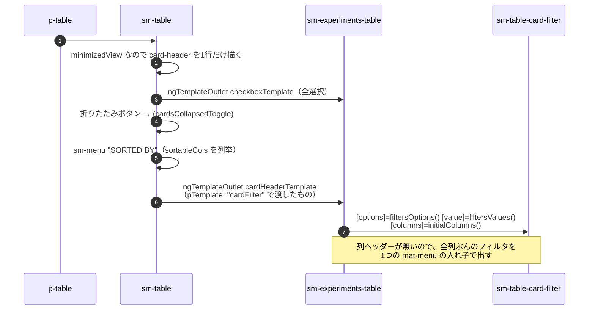

# 05-05 カードビューまでの経路

情報パネルを開くとテーブルが左に縮み、行がカードに変わる。その切り替わりと、カードの中身まで。

同じ `p-table` を使い続けていて、**`minimizedView` という1つの入力で
列の羅列（td × 列数）を1枚のカード（td × 1）に差し替えている**。

## 図1: 縮小表示に切り替わるまで

`minimizedView` が URL 由来なのが重要。**情報パネルを開く＝URL に experimentId が載る＝
テーブルが縮む**、という一本道になっていて、パネルの開閉状態をどこかに別途持っていない。

## 図2: カード1枚の中身

カードは「input で渡す」「ng-content で差し込む」「ng-template を渡す」の**3方式が同時に使われている**
珍しい例。細かい使い分けは 03-04 を参照。

## 図3: カード表示時のヘッダー

縮小表示では列ヘッダーが1本の帯になり、そこにフィルタとソートが集まる。

## 読みどころ

- minimizedView の定義: [projects.reducer.ts:106](/home/mtrysd/work_2026/000-learn-ClearML-pro/src/app/webapp-common/core/reducers/projects.reducer.ts#L106)
- td 1個に差し替える分岐: [table.component.html:160](/home/mtrysd/work_2026/000-learn-ClearML-pro/src/app/webapp-common/shared/ui-components/data/table/table.component.html#L160)
- card テンプレート: [experiments-table.component.html:215](/home/mtrysd/work_2026/000-learn-ClearML-pro/src/app/webapp-common/experiments/dumb/experiments-table/experiments-table.component.html#L215)
- カードヘッダー: [table.component.html:95](/home/mtrysd/work_2026/000-learn-ClearML-pro/src/app/webapp-common/shared/ui-components/data/table/table.component.html#L95)
- PrimeNG 関数の上書き: [overrideFilterFunc.ts](/home/mtrysd/work_2026/000-learn-ClearML-pro/src/app/webapp-common/shared/ui-components/data/table/overrideFilterFunc.ts)
