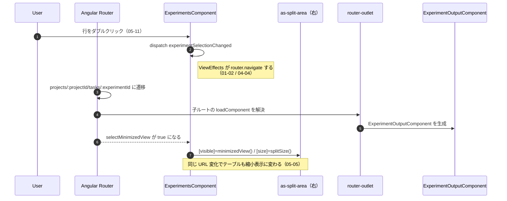
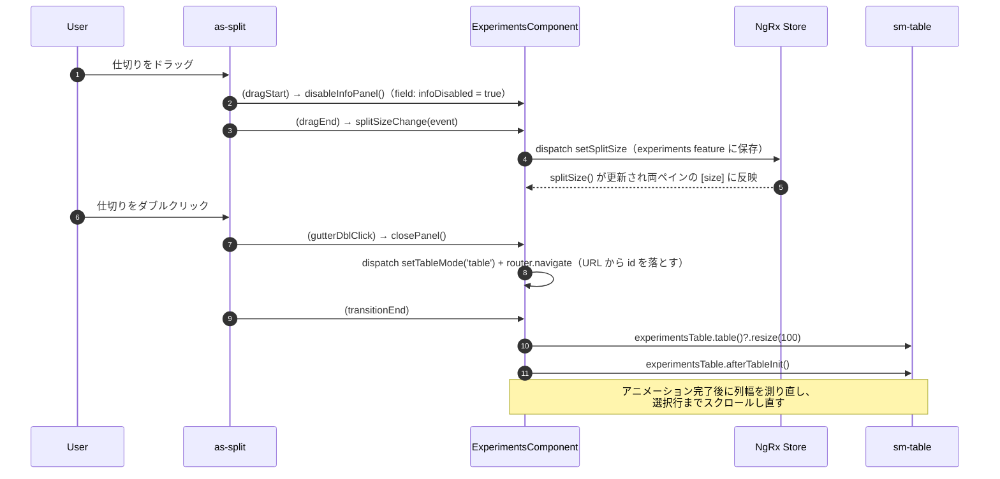

# 05-06 情報パネルまでの経路

右ペインに出るタスク詳細（および比較ビュー）まで。

この部品だけは **EC が生成しない**。EC のテンプレートにあるのは `router-outlet` だけで、
何が入るかは URL が決める。

## 図1: URL から右ペインの中身が決まるまで

子ルートは `experiment-routes.ts` に定義されていて、

- `compare` → 比較ナビゲーションのガードのみ（描画なし）
- `compare/scalars` / `compare/plots` → 比較チャート
- `:experimentId` → タスク詳細（さらに子タブを持つ）

の3系統。`getTableModeFromURL()` はこの形を見て `table` / `info` / `compare` を返す。

## 図2: パネルの幅とドラッグ

`transitionEnd` の行は、**テンプレートから孫の公開メソッドを直接呼んでいる**例。
`#experimentsTable` というテンプレート参照 → `table()`（viewChild） → `resize()` と2段辿っている。
幅の計算に実 DOM のサイズが必要で、アニメーション中に測ると間違うため。

## 状態の要点

- 何を表示するか: **URL が原本**（`:experimentId` / `compare`）。
- パネルの幅: Store（`experiments.view.splitSize`）。
- ドラッグ中フラグ `infoDisabled`: EC のただのプロパティ。CSS クラスにしか使わない。
- 詳細データ: 情報パネル側が自分で `getExperimentInfo` を投げる（04-04）。EC は渡さない。

## 読みどころ

- 右ペイン: [experiments.component.html:120](/home/mtrysd/work_2026/000-learn-ClearML-pro/src/app/webapp-common/experiments/experiments.component.html#L120)
- 子ルート定義: [experiment-routes.ts:44](/home/mtrysd/work_2026/000-learn-ClearML-pro/src/app/webapp-common/experiments/experiment-routes.ts#L44)
- モード判定: [experiments.component.ts:523](/home/mtrysd/work_2026/000-learn-ClearML-pro/src/app/webapp-common/experiments/experiments.component.ts#L523)
- パネルを閉じる: [base-entity-page.ts:155](/home/mtrysd/work_2026/000-learn-ClearML-pro/src/app/webapp-common/shared/entity-page/base-entity-page.ts#L155)
