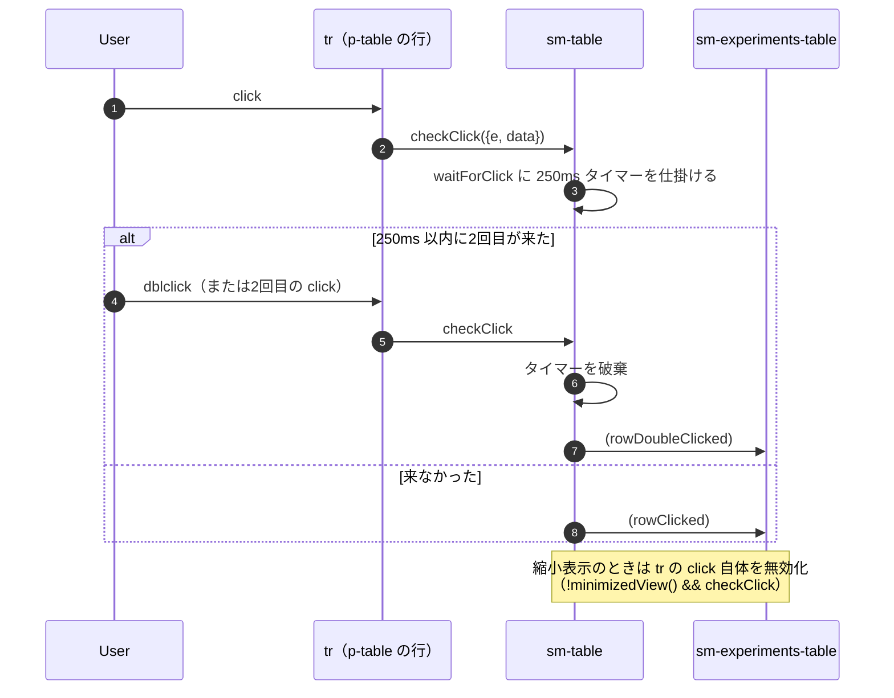
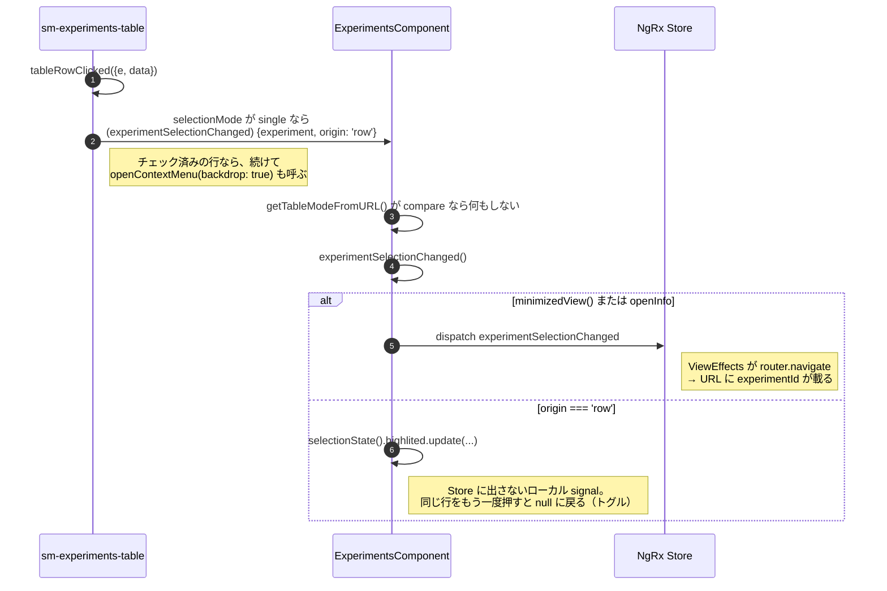
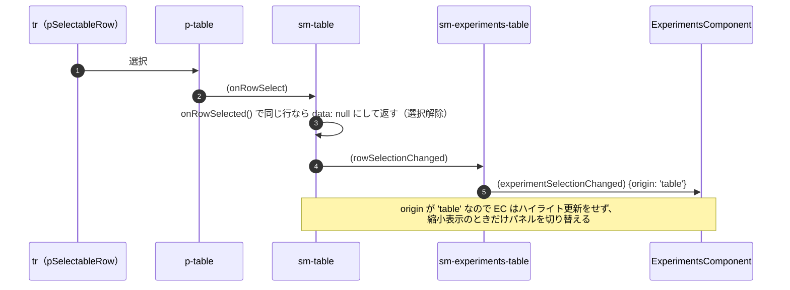

# 05-11 行クリックとダブルクリック

同じ「行を押す」操作が、表示モードで3通りに分かれる。

| 状況 | 結果 | 状態の行き先 |
| --- | --- | --- |
| テーブル表示（広い状態）で1回クリック | 行がハイライトされるだけ | EC のローカル signal |
| 縮小表示（情報パネルが開いている）でクリック | 選択が切り替わりパネルが更新 | URL |
| ダブルクリック | 情報パネルが開く | URL |
| チェック済みの行をクリック | コンテキストメニューが開く（05-17） | - |

## 図1: シングルとダブルの判定



シングルクリックが必ず 250ms 遅れる。**ハイライトの反応が一瞬遅いのは仕様**で、
ダブルクリックのときにパネルを開く前に一度ハイライトさせないための作り。

## 図2: rowClicked のあと



`highlited` は `computed` の中で `signal()` を作るという珍しい書き方をしている。

```
selectionState = computed(() => ({
  prevExperiment: this.previousTableExperiment(),
  highlited: signal(this.selectedTableExperiment() ?? this.previousTableExperiment())
}));
highlited = computed(() => this.tableMode() === 'compare' ? null : this.selectionState().highlited());
```

`selectedTableExperiment`（Store 由来）が変わるたびに **signal ごと作り直される**ので、
「Store から来た選択を初期値にして、以降はローカルで上書きできる値」になる。
比較モードではハイライトを出さないので `null` を返す。

## 図3: p-table 自身の選択（rowSelectionChanged）

行には `pSelectableRow` も付いているので、PrimeNG 側の選択イベントも同時に流れる。



`origin` が `'row'`（人が行をクリック）と `'table'`（p-table の選択機構やキーボード操作）を
区別しているのがポイント。同じ output を2つの経路が共有しているため、EC 側で振り分けている。

## 読みどころ

- クリック判定: [table.component.ts:566](/home/mtrysd/work_2026/000-learn-ClearML-pro/src/app/webapp-common/shared/ui-components/data/table/table.component.ts#L566)
- tr のイベント: [table.component.html:124](/home/mtrysd/work_2026/000-learn-ClearML-pro/src/app/webapp-common/shared/ui-components/data/table/table.component.html#L124)
- tableRowClicked: [experiments-table.component.ts:336](/home/mtrysd/work_2026/000-learn-ClearML-pro/src/app/webapp-common/experiments/dumb/experiments-table/experiments-table.component.ts#L336)
- EC の振り分け: [experiments.component.ts:542](/home/mtrysd/work_2026/000-learn-ClearML-pro/src/app/webapp-common/experiments/experiments.component.ts#L542)
- highlited の定義: [experiments.component.ts:232](/home/mtrysd/work_2026/000-learn-ClearML-pro/src/app/webapp-common/experiments/experiments.component.ts#L232)
