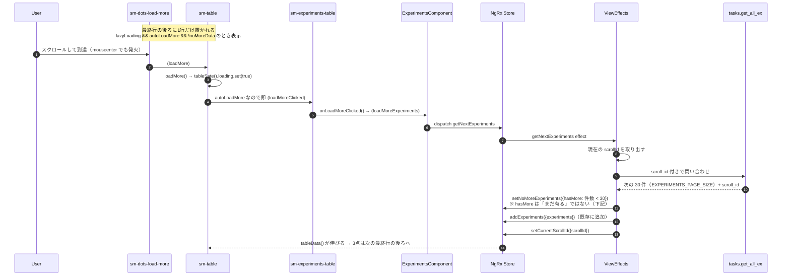
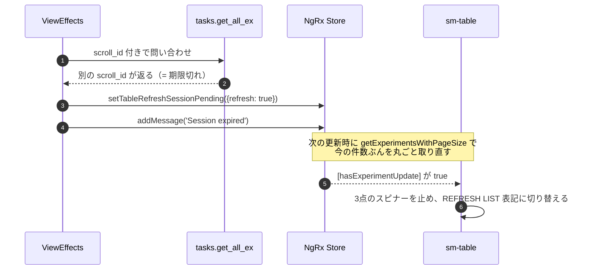
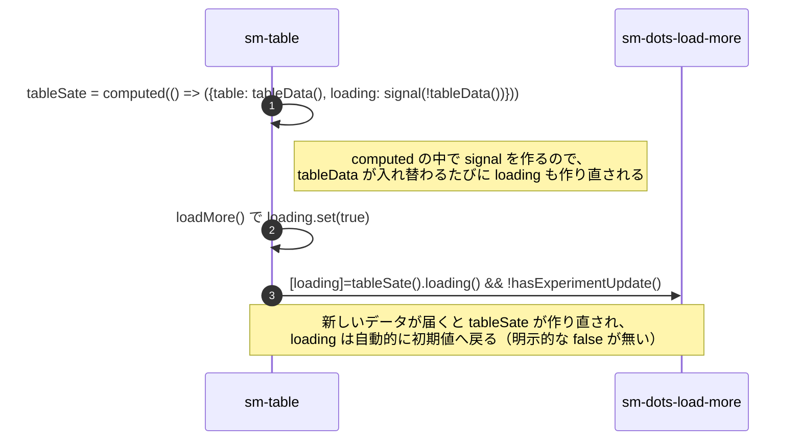

# 05-16 追い読み

一覧は最初の 1 ページ分しか持っていない。下端まで来たら続きを読む。

ページ番号ではなく **サーバが返す `scroll_id` を持ち回る方式**。
そのため「何ページ目」という状態は存在せず、「次」しか要求できない。

## 図1: 下端の3点まで到達して追い読みするまで

`(mouseenter)` でも読み込むのが実装上のポイント。3 点の上にカーソルが乗るだけで
読み始めるので、スクロール位置の計算をしていない。

`setNoMoreExperiments({hasMore})` の引数名は**意味が逆**なので注意。
reducer は `noMoreExperiment: action.hasMore` と入れているだけで、渡ってくる値は
`res.tasks.length < 30`、つまり「ページが埋まらなかった＝もう無い」。
これが `noMoreExperiments()` → sm-table の `[noMoreData]` まで素通しで届く。
**`hasMore` が true のとき 3 点は消える**。

`autoLoadMore` が false の経路（他画面のテーブル）では `throttleTime(1500)` の
Subject を通すので、連打しても 1.5 秒に 1 回しか飛ばない。

## 図2: セッション切れ

`scroll_id` はサーバ側で期限切れになる。

## 図3: 読み込み中の表示

「読み込み終わったら loading を false にする」コードがどこにも無いのが最初は不気味だが、
**`computed` ごと作り直されることが解除の合図**になっている。

## 読みどころ

- 3点の行: [table.component.html:183](/home/mtrysd/work_2026/000-learn-ClearML-pro/src/app/webapp-common/shared/ui-components/data/table/table.component.html#L183)
- loadMore: [table.component.ts:471](/home/mtrysd/work_2026/000-learn-ClearML-pro/src/app/webapp-common/shared/ui-components/data/table/table.component.ts#L471)
- tableSate: [table.component.ts:184](/home/mtrysd/work_2026/000-learn-ClearML-pro/src/app/webapp-common/shared/ui-components/data/table/table.component.ts#L184)
- effect: [common-experiments-view.effects.ts:347](/home/mtrysd/work_2026/000-learn-ClearML-pro/src/app/webapp-common/experiments/effects/common-experiments-view.effects.ts#L347)
- 詳細は [04-02 自動更新と追い読み](../04_バックエンド経路/04-02_自動更新と追い読み.md)
