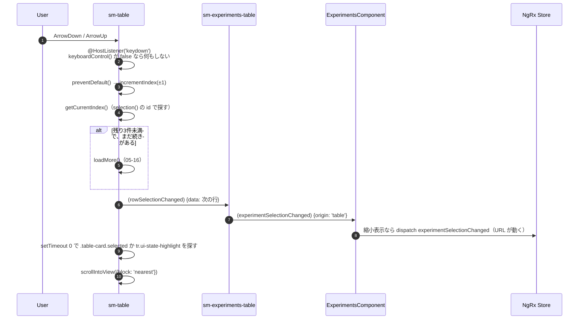
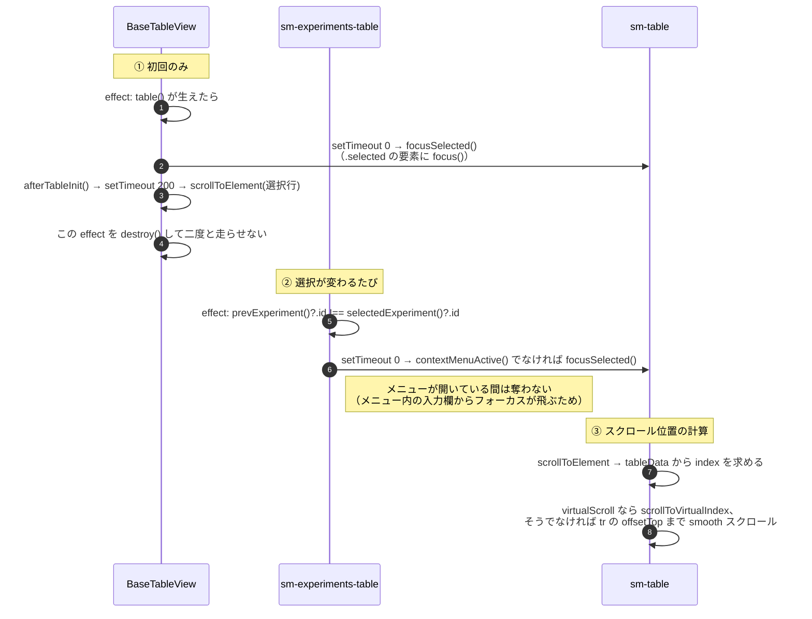
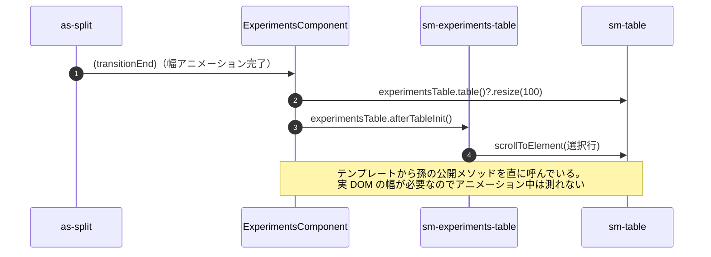

# 05-18 キーボード操作とフォーカス

上下キーでの行移動と、選択行を見える位置に保つ処理。
**この2つは同じ「フォーカス」という仕組みに乗っている**ので一緒に扱う。

## 図1: 上下キーで行を移動

キー操作は **`sm-table` のホスト要素が受ける**ので、テーブル内のどこかに DOM フォーカスが
無いと反応しない。そのためのフォーカス当てが図2。

`incrementIndex` の中で「残り3件を切ったら追い読み」を判断しているので、
キーを押し続けるだけで無限スクロールが進む。

## 図2: 選択行にフォーカスとスクロールを合わせる

`computedPrevious(this.selectedExperiment)` で「1つ前の値」を作り、id が変わったときだけ
フォーカスし直している。同じタスクのデータが更新されただけではフォーカスを動かさない。

## 図3: パネル開閉のあとの再計算

## 読みどころ

- キーハンドラ: [table.component.ts:311](/home/mtrysd/work_2026/000-learn-ClearML-pro/src/app/webapp-common/shared/ui-components/data/table/table.component.ts#L311)
- incrementIndex: [table.component.ts:449](/home/mtrysd/work_2026/000-learn-ClearML-pro/src/app/webapp-common/shared/ui-components/data/table/table.component.ts#L449)
- focusSelected: [table.component.ts:512](/home/mtrysd/work_2026/000-learn-ClearML-pro/src/app/webapp-common/shared/ui-components/data/table/table.component.ts#L512)
- 初回の effect: [base-table-view.ts:74](/home/mtrysd/work_2026/000-learn-ClearML-pro/src/app/webapp-common/shared/ui-components/data/table/base-table-view.ts#L74)
- 選択変更時の effect: [experiments-table.component.ts:290](/home/mtrysd/work_2026/000-learn-ClearML-pro/src/app/webapp-common/experiments/dumb/experiments-table/experiments-table.component.ts#L290)
- transitionEnd: [experiments.component.html:60](/home/mtrysd/work_2026/000-learn-ClearML-pro/src/app/webapp-common/experiments/experiments.component.html#L60)
