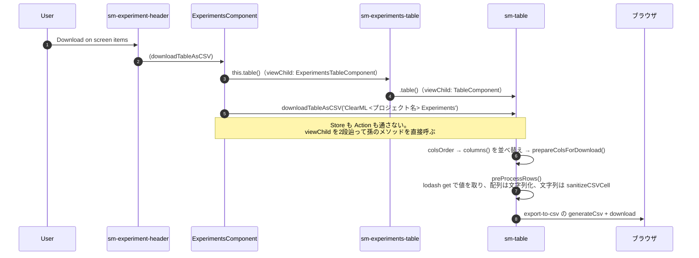
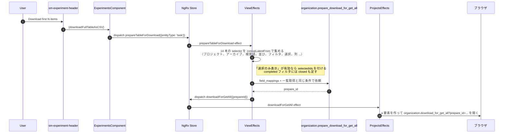

# 05-20 CSVダウンロード

ヘッダーのダウンロードメニューには2項目あり、**経路が全く別**。

| 項目 | 範囲 | 作る場所 |
| --- | --- | --- |
| Download on screen items | 今テーブルに読み込んである行だけ | ブラウザ（JS で文字列を組む） |
| Download first N items | サーバ側の全件（上限あり） | サーバ |

## 図1: 画面上の行だけ（ブラウザで生成）

`sanitizeCSVCell` は `= + - @ \r \t` のいずれかで始まるセルの**先頭に `'` を足す**処理。
表計算ソフトが数式として解釈するのを防ぐ（CSV インジェクション対策）。セル内の改行は別途除去している。

なぜ Store を通らないかというと、**出力対象が「今 p-table が持っている列と順序」であって
アプリの状態ではない**から。列の並びは `columnsOrder` と `columns()` を突き合わせて
その場で組み立てている。

## 図2: 全件（サーバで生成）

**画面に出ている条件をそのままサーバに渡し直している**のがこの経路の要点。
一覧取得と同じ `getGetAllQuery()` を使うので、フィルタとソートが一致する。

件数上限はヘッダーのラベルに出ている `maxDownloadItems$`（サーバの設定値）。

## 読みどころ

- ヘッダーのメニュー: [experiment-header.component.html:32](/home/mtrysd/work_2026/000-learn-ClearML-pro/src/app/webapp-common/experiments/dumb/experiment-header/experiment-header.component.html#L32)
- EC の2段辿り: [experiments.component.ts:790](/home/mtrysd/work_2026/000-learn-ClearML-pro/src/app/webapp-common/experiments/experiments.component.ts#L790)
- ブラウザ側の生成: [table.component.ts:608](/home/mtrysd/work_2026/000-learn-ClearML-pro/src/app/webapp-common/shared/ui-components/data/table/table.component.ts#L608)
- サーバ依頼の effect: [common-experiments-view.effects.ts:184](/home/mtrysd/work_2026/000-learn-ClearML-pro/src/app/webapp-common/experiments/effects/common-experiments-view.effects.ts#L184)
- ダウンロードを開く: [projects.effects.ts:440](/home/mtrysd/work_2026/000-learn-ClearML-pro/src/app/webapp-common/core/effects/projects.effects.ts#L440)
- 一括操作側の詳細は [04-05 一括操作とCSV出力](../04_バックエンド経路/04-05_一括操作とCSV出力.md)
