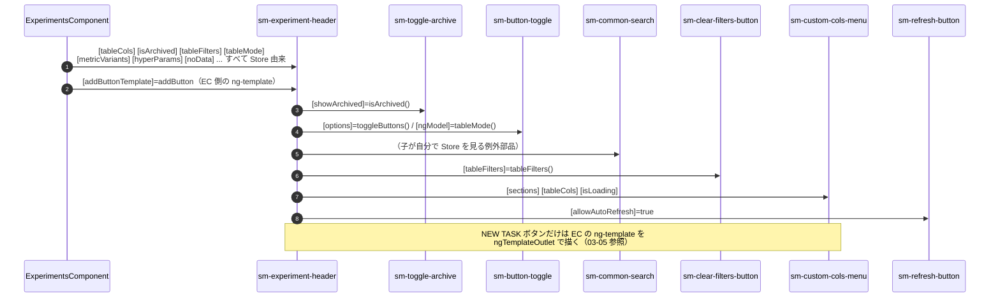
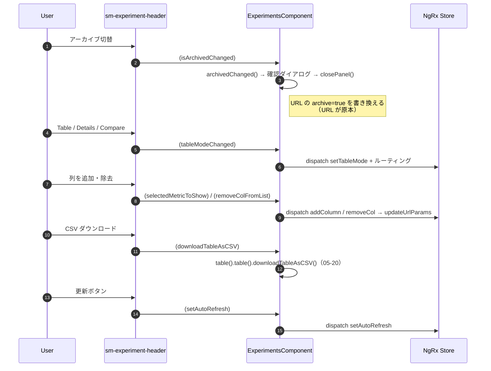

# 05-01 ヘッダーまでの経路

画面上端の帯（アーカイブ切替、Table/Details/Compare 切替、検索、CSV、列追加、更新）まで。

`sm-experiment-header` は EC のテンプレート直下にいる、ただの表示部品。
Store を一切見ず、**全部 input で受け取り、全部 output で返す**。
例外はカスタム列メニューの開閉状態（`customColumnMode`）だけで、これはヘッダー内のローカル状態。

## 図1: ヘッダー本体と中の部品

## 図2: ヘッダーの操作が EC へ戻るまで

ヘッダーは状態を持たないので、押されたら即 output で親に投げる。

`tableMode` の判定だけは注意が必要。テンプレート側で `getTableModeFromURL()` を呼んで
**Store ではなく URL を直接見ている**箇所がある（比較モードとテーブルモードで同じ output の
処理先を振り分けるため）。Store の `tableMode()` は遷移途中で古い値のことがある。

## 読みどころ

- ヘッダー呼び出し: [experiments.component.html:2](../../../../src/app/webapp-common/experiments/experiments.component.html#L2)
- NEW TASK テンプレート: [experiments.component.html:33](../../../../src/app/webapp-common/experiments/experiments.component.html#L33)
- ヘッダーのテンプレート: [experiment-header.component.html](../../../../src/app/webapp-common/experiments/dumb/experiment-header/experiment-header.component.html)
- URL を直接読む判定: [experiments.component.ts:523](../../../../src/app/webapp-common/experiments/experiments.component.ts#L523)
