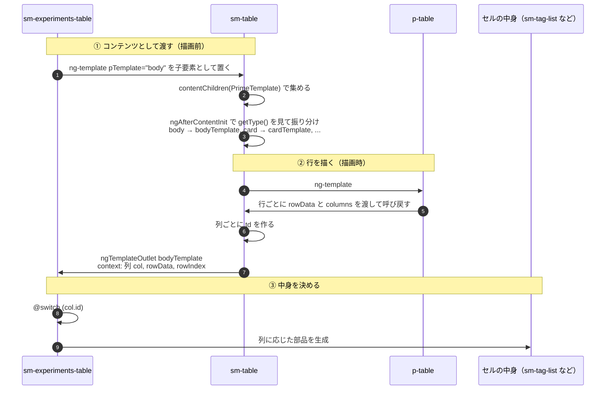
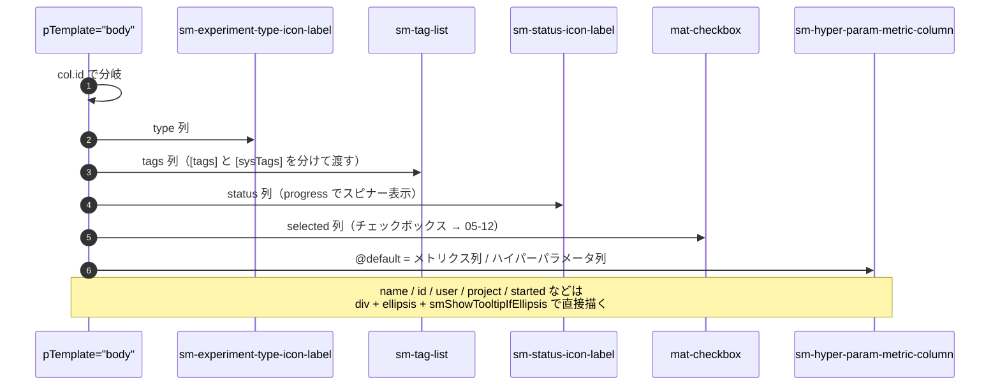

# 05-03 セルまでの経路

1個のセル（「名前」「状態」「タグ」など）の中身まで。

経路が素直でないのはここ。**セルを描く指示を出すのは `p-table` だが、中身を書いているのは
`sm-experiments-table`**。間の `sm-table` はテンプレートを受け取って仕分けるだけ。

## 図1: テンプレートが下に渡り、描画で戻ってくる

`bodyTemplate` が無い場合は `{{ getBodyData(rowData, col) }}`（lodash の `get`）で
素のテキストを出すフォールバックがある。experiments-table は必ず渡すのでここは通らない。

## 図2: 列 ID ごとの行き先

`@default` に落ちるのがユーザーが後から足した列（`last_metrics.*` と `hyperparams.*`）。
列 ID が固定でないので `switch` に書けず、値の取り出しは `col.getter` に任せている。

## 状態の要点

- 行データ `experiments` は Store → EC → experiments-table の input signal → p-table の `[value]`。
  **セルは値を受け取るだけで、Store を見ない**。
- メトリクス値の丸め判定（`roundedMetricValues`）は experiments-table の `computed`。
  行×列を全部なめるので、experiments か tableCols が変わったときだけ再計算される。
- チェック状態は `checkedExperiments() | isRowSelected:experiment` というパイプ。
  配列を毎回なめるが、パイプなので参照が変わらない限り再評価されない。

## 読みどころ

- 仕分け処理: [table.component.ts:334](../../../../src/app/webapp-common/shared/ui-components/data/table/table.component.ts#L334)
- td と ngTemplateOutlet: [table.component.html:141](../../../../src/app/webapp-common/shared/ui-components/data/table/table.component.html#L141)
- body テンプレート本体: [experiments-table.component.html:107](../../../../src/app/webapp-common/experiments/dumb/experiments-table/experiments-table.component.html#L107)
- 丸め判定の computed: [experiments-table.component.ts:185](../../../../src/app/webapp-common/experiments/dumb/experiments-table/experiments-table.component.ts#L185)
