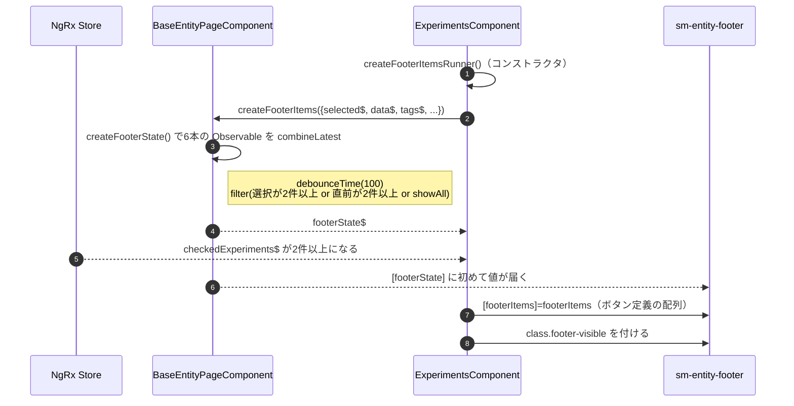
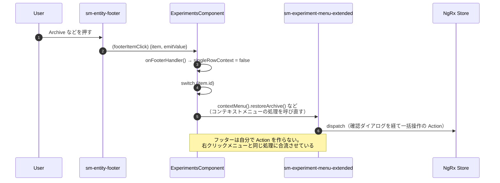

# 05-07 フッターまでの経路

2件以上チェックしたときに下から出てくる一括操作バーまで。

`sm-entity-footer` は常にテンプレートに存在する。出入りしているのは CSS クラスだけで、
**`footerState$` が値を流し始めるかどうかが実質のスイッチ**になっている。

## 図1: フッターが現れるまで

`footerItems` は `ShowItemsFooterSelected` / `ArchiveFooterItem` などのクラスの配列で、
**EC のコンストラクタで一度組み立てるだけ**（Store には入れない）。
どのボタンを押せるかは `footerState.data`（Store の `selectedExperimentsDisableAvailable`）が決める。

## 図2: フッターのボタンが押されたとき

同じ操作を「右クリック」と「フッター」の2箇所から起動できるため、**処理の実体は
コンテキストメニュー側に1つだけ置き、フッターはそれを呼ぶ**という作りになっている。
`singleRowContext` フラグが「1行だけが対象か、チェックした全件が対象か」を切り替える。

タグ追加だけは例外で、フッターから直接 `tagSelected` → `BaseEntityPageComponent.tagSelected()` →
`addTag` を dispatch する。

## 状態の要点

- 表示条件: `checkedExperiments`（Store）が2件以上、または「選択のみ表示」が有効。
- ボタン定義: EC のプロパティ（`footerItems`）。モード切替時に `modeChanged()` から作り直す。
- 各ボタンの活性: Store の `selectedExperimentsDisableAvailable`。
  これは `setSelectedExperiments` の effect が選択内容から毎回計算して Store に戻している。

## 読みどころ

- フッター呼び出し: [experiments.component.html:131](../../../../src/app/webapp-common/experiments/experiments.component.html#L131)
- footerState の組み立て: [base-entity-page.ts:218](../../../../src/app/webapp-common/shared/entity-page/base-entity-page.ts#L218)
- ボタン定義の配列: [experiments.component.ts:375](../../../../src/app/webapp-common/experiments/experiments.component.ts#L375)
- クリックの振り分け: [experiments.component.ts:399](../../../../src/app/webapp-common/experiments/experiments.component.ts#L399)
- 活性計算の effect: [common-experiments-view.effects.ts:835](../../../../src/app/webapp-common/experiments/effects/common-experiments-view.effects.ts#L835)
