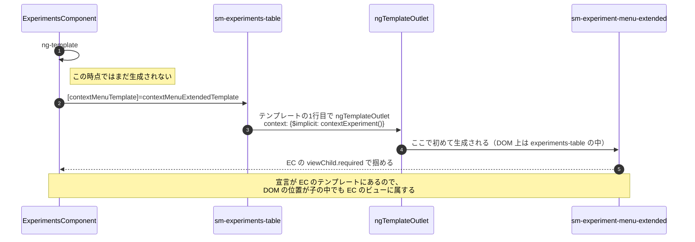
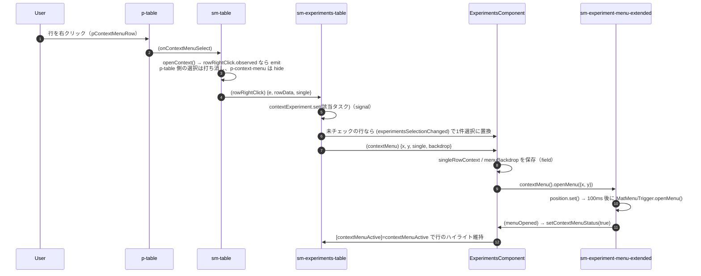

# 05-08 コンテキストメニューまでの経路

行を右クリックしたときのメニュー本体まで。

この画面でいちばん経路がねじれている部品。
**メニューを書いているのは EC、置き場所を決めているのは experiments-table、
掴んで操作するのは EC** という三角形になっている。

## 図1: 宣言と実体化が別の場所で起きる

`viewChild.required(ExperimentMenuExtendedComponent)` が成立するのがこの仕組みの帰結。
テンプレートの宣言場所がビューの所有者を決めるので、**実際の DOM 位置は関係ない**。

さらに EC 側は `contextMenu = computed(() => this.contextMenuExtended().contextMenu())` で
メニューコンポーネント自身を取り出し、フッター（05-07）からも同じ実体を呼んでいる。

## 図2: 開くとき

`contextExperiment` が signal なので、`set()` した時点で図1の `ngTemplateOutlet` の
context が更新され、メニューの `[experiment]` が差し替わる。
**「どの行のメニューか」は experiments-table のローカル signal が持っていて、Store には出ない**。

起動元は3つあり、いずれも同じ `openContextMenu()` に合流する。

| 起動元 | single | 効果 |
| --- | --- | --- |
| 行の右クリック | `undefined` | 未チェックなら選択を1件に置換 |
| 行末の3点ボタン | `true` | 選択を変えず、その行だけを対象にする |
| チェック済み行の左クリック / カードのクリック | `undefined` | backdrop 付きで開く（05-17 / 05-19） |

判定は `if (!data?.single)` なので、`undefined` と `false` は同じ扱い。
明示的に `false` を渡している箇所は無く、3点ボタンだけが `true` を立てる。

## 読みどころ

- テンプレート宣言: [experiments.component.html:140](../../../../src/app/webapp-common/experiments/experiments.component.html#L140)
- 実体化する1行: [experiments-table.component.html:1](../../../../src/app/webapp-common/experiments/dumb/experiments-table/experiments-table.component.html#L1)
- viewChild と computed: [experiments.component.ts:240](../../../../src/app/webapp-common/experiments/experiments.component.ts#L240)
- 開く処理: [experiments-table.component.ts:349](../../../../src/app/webapp-common/experiments/dumb/experiments-table/experiments-table.component.ts#L349)
- メニュー基底の openMenu: [base-context-menu.component.ts:48](../../../../src/app/webapp-common/shared/components/base-context-menu/base-context-menu.component.ts#L48)
