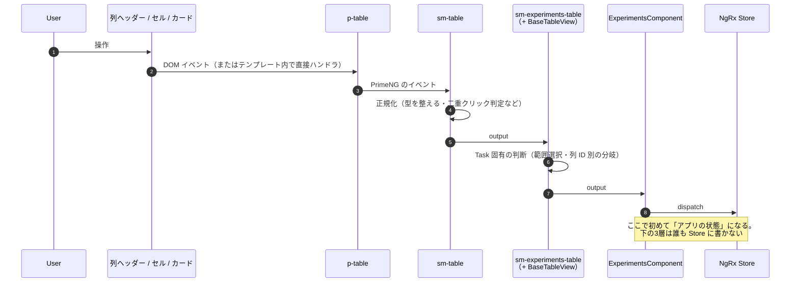
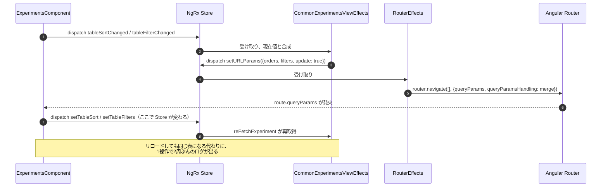

# 05-10 テーブル操作の一覧

ここから 05-20 まではテーブルの操作単位。まず全体の形と一覧を置く。

## 操作の共通形

ほとんどの操作が次の形をとる。**3層を下から上に登り、EC で初めて Action になる**。

例外が3つある。覚えておくと迷わない。

| 例外 | 何が違うか |
| --- | --- |
| 全選択メニュー（05-12） | experiments-table が自分で `store.dispatch()` する |
| フィルタメニューを開く（05-14） | 同じく experiments-table が dispatch する |
| ハイライト行（05-11） | EC がローカル signal に持ち、Store に出さない |

前2つは `BaseTableView` が `inject(Store)` を持っているため。表示部品としては例外的だが、
「メニューを開いた瞬間に選択肢を取りに行く」だけの用途に限られている。

## 操作別の一覧

| 操作 | 入口 | 経由 | 最終的な置き場所 | 図 |
| --- | --- | --- | --- | --- |
| 行を1回クリック（テーブル表示） | `tr (click)` | checkClick → rowClicked | EC のローカル signal `highlited` | [05-11](./05-11_行クリックとダブルクリック.md) |
| 行を1回クリック（縮小表示） | 同上 | 同上 | URL（`:experimentId`） | [05-11](./05-11_行クリックとダブルクリック.md) |
| 行をダブルクリック | `tr (dblclick)` | checkClick → rowDoubleClicked | URL（`:experimentId`） | [05-11](./05-11_行クリックとダブルクリック.md) |
| 行のチェックボックス | `mat-checkbox (click)` | rowSelectedChanged | Store `selectedExperiments` | [05-12](./05-12_チェックボックス選択と全選択.md) |
| Shift + チェック | 同上 | getSelectionRange | Store `selectedExperiments` | [05-12](./05-12_チェックボックス選択と全選択.md) |
| ヘッダーのチェックボックス | FormControl | headerCheckboxClicked | Store `selectedExperiments` | [05-12](./05-12_チェックボックス選択と全選択.md) |
| All / All matching filter | mat-menu | **table が直接 dispatch** | Store（サーバから全件取得） | [05-12](./05-12_チェックボックス選択と全選択.md) |
| 列のソート | ソートボタン | onSortChanged | **URL の `order`** | [05-13](./05-13_列ソート.md) |
| 列のフィルタ | チェックリスト | tableFilterChanged | **URL の `filter`** | [05-14](./05-14_列フィルタ.md) |
| フィルタの選択肢検索 | メニュー内の検索欄 | filterSearchChanged | Store（選択肢のみ） | [05-14](./05-14_列フィルタ.md) |
| 列のドラッグ移動 | `pReorderableColumn` | onColReorder | **URL の `columns`** + サーバ設定 | [05-15](./05-15_列の並べ替えと幅変更.md) |
| 列幅の変更 | `smResizableColumn` | colResize | サーバ設定のみ（URL に出ない） | [05-15](./05-15_列の並べ替えと幅変更.md) |
| 下端までスクロール | `sm-dots-load-more` | loadMore | Store（scrollId で追い読み） | [05-16](./05-16_追い読み.md) |
| 行の右クリック | `pContextMenuRow` | openContext | experiments-table の signal | [05-17](./05-17_右クリックメニュー.md) |
| 上下キー | `@HostListener keydown` | incrementIndex | 行クリックと同じ経路 | [05-18](./05-18_キーボード操作とフォーカス.md) |
| カードのクリック | `sm-table-card (click)` | cardClicked（250ms 判定） | メニュー or パネル閉じる | [05-19](./05-19_カードビューの操作.md) |
| CSV（画面上の分） | ヘッダーのメニュー | **viewChild を2段辿って直接呼ぶ** | ブラウザのダウンロード | [05-20](./05-20_CSVダウンロード.md) |
| CSV（全件） | ヘッダーのメニュー | dispatch | サーバ側で生成 | [05-20](./05-20_CSVダウンロード.md) |

## URL を経由する操作に注意

ソート・フィルタ・列構成は **Store を直接書き換えない**。
`dispatch` → effect が `setURLParams` → Router がクエリパラメータを書き換え →
EC がそれを購読して改めて `setTableSort` などを dispatch、という一周をする。

この一周があるので、**Store の値を直接書き換えるデバッグは効かない**。URL を見るのが早い。
EC 側の受け口は [experiments.component.ts:284](../../../../src/app/webapp-common/experiments/experiments.component.ts#L284) の `distinctParamsUntilChanged$` の購読。
