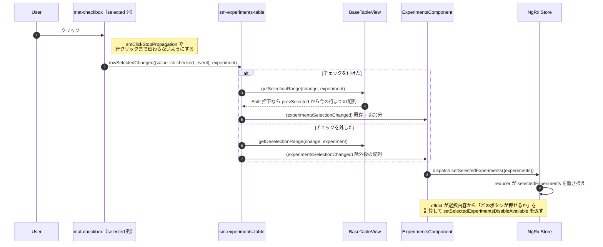
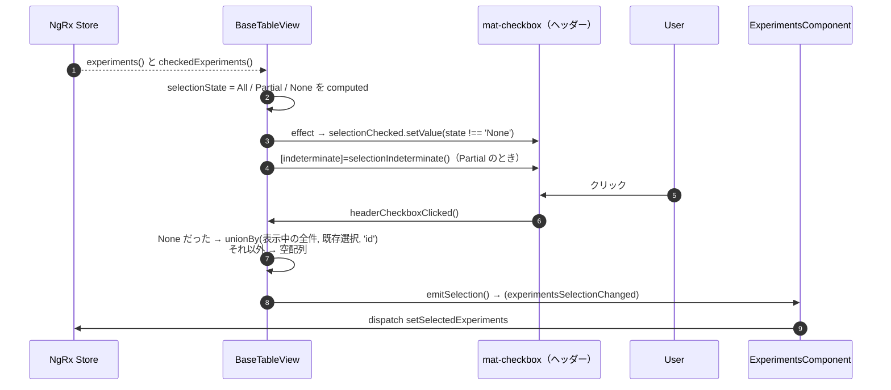
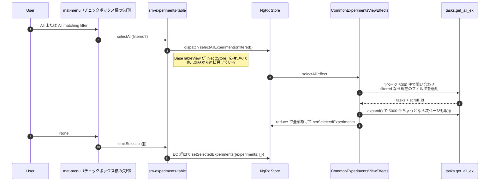

# 05-12 チェックボックス選択と全選択

一括操作の対象（`checkedExperiments`）を決める操作。ハイライト（05-11）とは別系統で、
**こちらは Store に入る**。

## 図1: 行のチェックボックス



`cb.checked` を読んでいるのは `(click)` で拾っているため。`(change)` ではなく `(click)` なのは
`event.shiftKey` が必要だから。**Shift 範囲選択のために、チェックボックスの標準イベントを使っていない**。

範囲の起点 `prevSelected` / `prevDeselect` は `BaseTableView` のただのプロパティ。
再描画や再取得で消えるが、Shift 選択の起点としてはそれで十分という判断。

## 図2: ヘッダーのチェックボックス



`selectionState` が `this[this.entitiesKey]()` という文字列アクセスで書かれている。
`BaseTableView` は Task を知らないので、派生クラスが

```
override entitiesKey = 'experiments';
override selectedEntitiesKey = 'checkedExperiments';
```

と名前を教える。**基底クラスが input signal をキー名で引く**ため型が効かない箇所で、
読むときは必ずこの2行を先に見る。

## 図3: ドロップダウンの All / None / All matching filter

ここだけ EC を経由しない。



`only_fields` を name / parent / status / type などに絞って投げている。
一括操作の可否判定に必要な項目だけなので、**画面に出ていない行も選択できる**。

選択上限は `selectionReachedLimit` input（`getSelectedExperiments` effect 側では 100 件に
スライスしている箇所もある）。上限に達すると未チェックの行のチェックボックスが disabled になる。

## 読みどころ

- 行のチェックボックス: [experiments-table.component.html:166](../../../../src/app/webapp-common/experiments/dumb/experiments-table/experiments-table.component.html#L166)
- 範囲選択: [base-table-view.ts:104](../../../../src/app/webapp-common/shared/ui-components/data/table/base-table-view.ts#L104)
- ヘッダーの状態計算: [base-table-view.ts:64](../../../../src/app/webapp-common/shared/ui-components/data/table/base-table-view.ts#L64)
- 全選択メニュー: [experiments-table.component.html:73](../../../../src/app/webapp-common/experiments/dumb/experiments-table/experiments-table.component.html#L73)
- 全選択の effect: [common-experiments-view.effects.ts:642](../../../../src/app/webapp-common/experiments/effects/common-experiments-view.effects.ts#L642)
