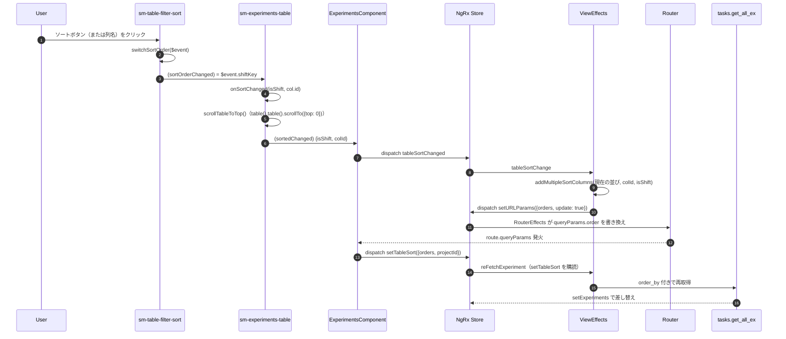
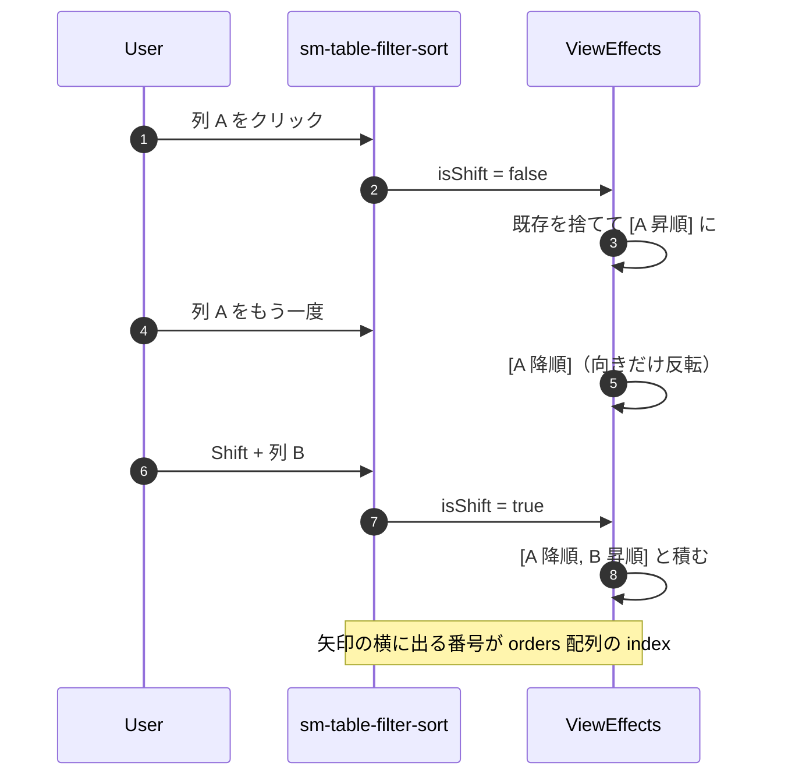
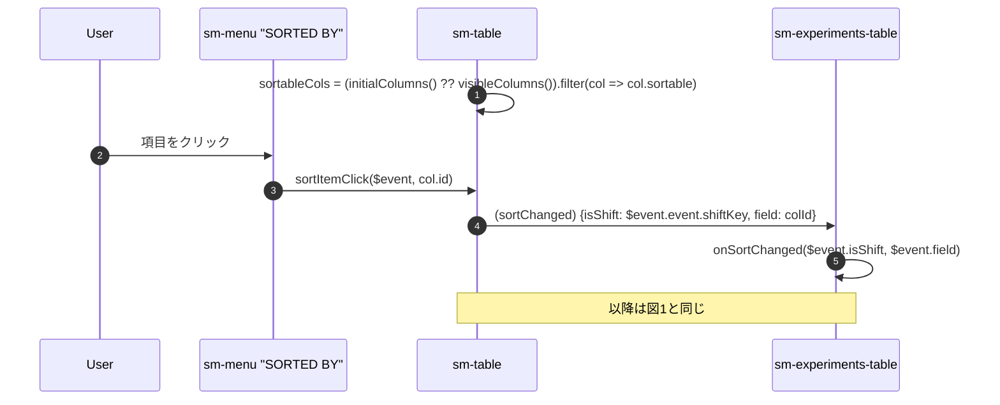

# 05-13 列ソート

列名の左の矢印を押したときの流れ。

**PrimeNG のソート機能は使っていない**。並べ替えはサーバ側で行い、
クライアントは「どの列をどの向きで」を URL に書くだけ。

## 図1: 列ヘッダーから一周して再取得まで

ソート矢印の見た目は Store の `tableSortFields` から `tableSortFieldsObject()` で
列 ID 別に引いた値。**押した瞬間には変わらず、URL が書き換わって Store に戻ってきてから変わる**。

## 図2: Shift クリックの多段ソート

判定は全部 `addMultipleSortColumns` の中。コンポーネント側は `shiftKey` の真偽を
そのまま渡すだけで、何列目かの管理はしていない。

## 図3: カード表示のソート

縮小表示では列ヘッダーが無いので、ヘッダー帯のメニューから同じ経路に入る。

`sortableCols` が `initialColumns()` から作られている点に注意。
**表示中の列ではなく列定義の全部**なので、隠している列でもソートできる。
`initialColumns` を渡していないテーブルだけ `visibleColumns()` に落ちる（experiments-table は渡すので落ちない）。

## 状態の要点

- 原本は URL の `order`（`encodeOrder` でエンコード）。リロードしても復元される。
- Store の `tableSortFields` は URL の写し。初期値は `INITIAL_EXPERIMENT_COLS_ORDER`。
- サーバ設定にも保存される（`setUserPreferences` effect が `setTableSort` を購読）ので、
  次回この画面を URL 無しで開くと前回の並びが復元される。

## 読みどころ

- ソートボタン: [table-filter-sort.component.html:3](../../../../src/app/webapp-common/shared/ui-components/data/table/table-filter-sort/table-filter-sort.component.html#L3)
- onSortChanged: [experiments-table.component.ts:320](../../../../src/app/webapp-common/experiments/dumb/experiments-table/experiments-table.component.ts#L320)
- effect: [common-experiments-view.effects.ts:155](../../../../src/app/webapp-common/experiments/effects/common-experiments-view.effects.ts#L155)
- URL 書き換え: [router.effects.ts:28](../../../../src/app/webapp-common/core/effects/router.effects.ts#L28)
- カード表示のソート: [table.component.html:106](../../../../src/app/webapp-common/shared/ui-components/data/table/table.component.html#L106)
