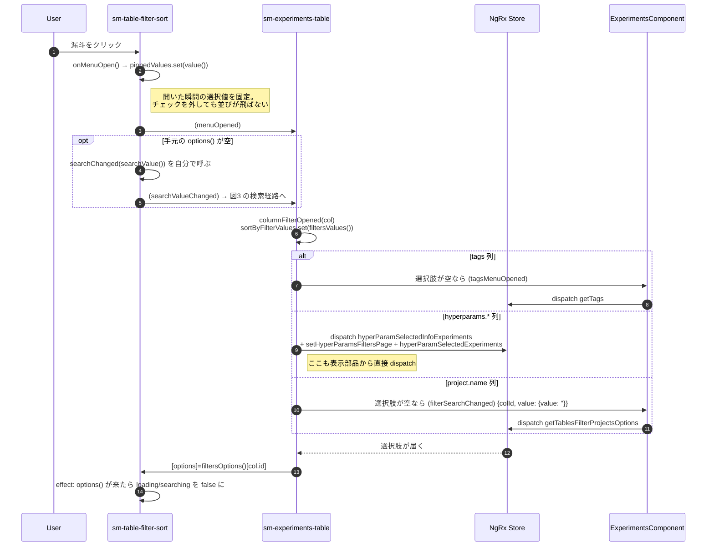
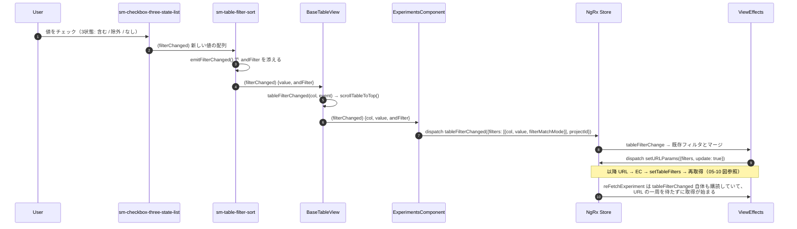
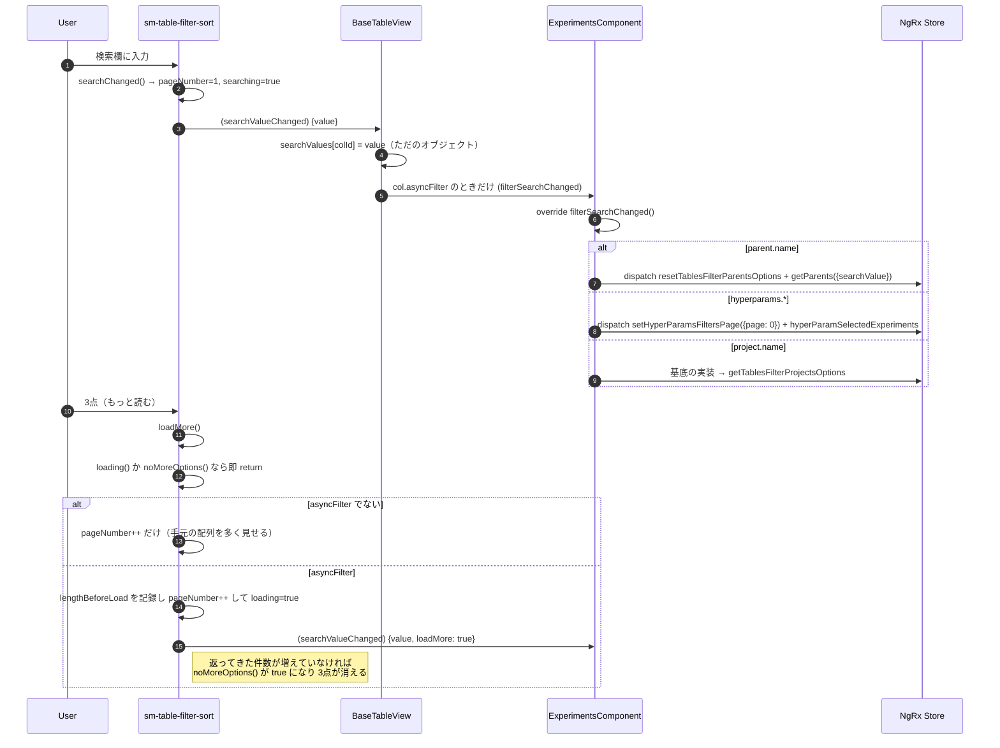
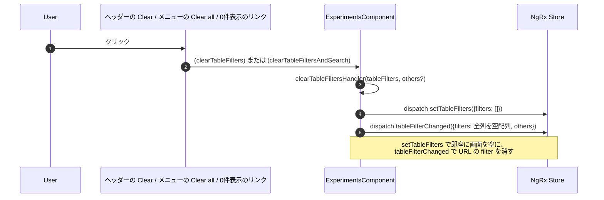

# 05-14 列フィルタ

漏斗アイコンのメニュー。ソート（05-13）と同じく URL を一周するが、
**「選択肢を取ってくる」という別の流れが手前にある**のが違い。

## 図1: メニューを開く（選択肢の用意）

status / type のように選択肢が固定の列は何も取りに行かない。
`filtersOptions()` は固定リストと Store 由来のリストを混ぜた 1 個の `computed`。

選択肢を取りに行く入口が2つある点に注意。experiments-table の `columnFilterOpened()` と、
FilterSort 自身の `onMenuOpen()`（手元が空のときだけ）で、**列によっては両方走る**。

## 図2: 値をチェックして絞り込むまで

タグ列の Any / All 切替（`andFilter`）は `model()` なので、押した瞬間にコンポーネント内の値が
変わり、同時に `filterChanged` も飛ぶ。`filterMatchMode: 'AND'` として Store に載る。

## 図3: 選択肢の検索とページング

選択肢が多い列（親タスク、プロジェクト、ハイパーパラメータ値）はサーバ検索になる。

`searchValues` が signal ではなく素の `Record<string, string>` である点が引っかかりやすい。
OnPush でも動くのは、**値を書き換えるのが必ずイベントハンドラの中**で、
その場でそのビューの変更検知が走るため。

## 図4: フィルタを消す

0 件のときに出る「Clear filters」は `#noDataTemplate` の中のリンク。
このテンプレートは experiments-table が宣言し、`[noDataTemplate]` として sm-table に渡され、
p-table の `#emptymessage` から呼び戻される（セルと同じ投影の形）。
検索語も一緒に消すのが `clearTableFiltersAndSearch`（`others: {q: null}`）。

## 読みどころ

- メニューを開いたとき: [experiments-table.component.ts:377](../../../../src/app/webapp-common/experiments/dumb/experiments-table/experiments-table.component.ts#L377)
- 値の受け渡し: [base-table-view.ts:140](../../../../src/app/webapp-common/shared/ui-components/data/table/base-table-view.ts#L140)
- 検索の分岐: [experiments.component.ts:841](../../../../src/app/webapp-common/experiments/experiments.component.ts#L841)
- effect: [common-experiments-view.effects.ts:164](../../../../src/app/webapp-common/experiments/effects/common-experiments-view.effects.ts#L164)
- 0件テンプレート: [experiments-table.component.html:298](../../../../src/app/webapp-common/experiments/dumb/experiments-table/experiments-table.component.html#L298)
