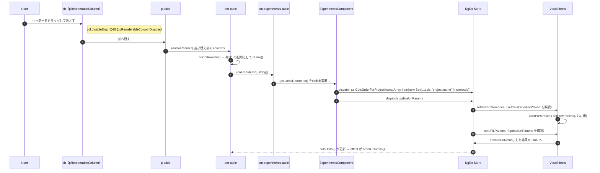
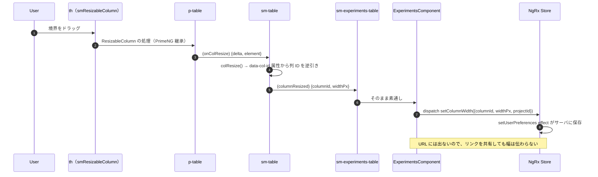
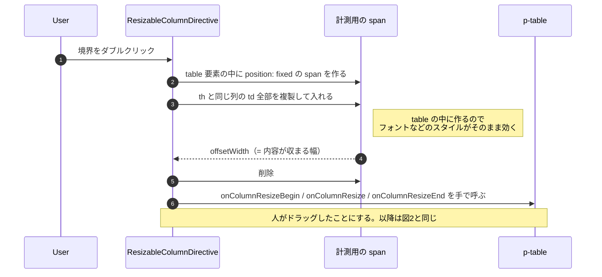
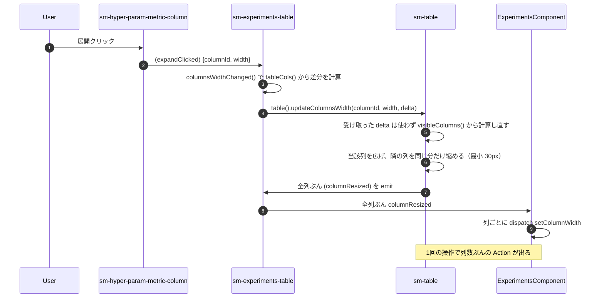

# 05-15 列の並べ替えと幅変更

`th` に付いた2つのディレクティブが入口。**似た操作だが保存先が違う**。

| 操作 | 保存先 |
| --- | --- |
| 列の移動 | URL の `columns` ＋ サーバのユーザープリファレンス |
| 列幅の変更 | サーバのユーザープリファレンスのみ（URL に出ない） |

## 図1: 列をドラッグして移動

`'project.name'` を必ず末尾に足しているのは、プロジェクト列が条件次第で表示/非表示に
なるため（全プロジェクト表示や deep モードのときだけ出る）。
並び順の配列に居ないと、出てきたときに位置が決まらない。
`new Set` を噛ませているのは、すでに並びに居るときに二重登録しないため。

`orderColumns()` は `visibleColumns()` の配列を `sort()` で**破壊的に並べ替えている**。
`computed` の戻り値を直接ソートしているので、ここは素直な書き方ではない。

## 図2: 列幅をドラッグして変える

列 ID を DOM の `data-col-id` 属性から引いているのは、PrimeNG が渡してくるのが
`HTMLElement` だけだから。**列オブジェクトを辿れないので DOM に埋めた ID を読む**、という回避。

## 図3: 境界のダブルクリックで自動幅

## 図4: メトリクス列の展開ボタン

メトリクスのセルにある展開アイコンは、幅を「押し広げる」独自経路を通る。

`updateColumnsWidth` は先頭で `delta = width - parseInt(columns[colIndex].style?.width, 10)` と
**引数の delta を上書きする**。呼び出し側が計算した値は捨てられるので、
`columnsWidthChanged()` の差分計算を追っても幅の結果は説明できない。見るなら `updateColumnsWidth` の中。

## 読みどころ

- th のディレクティブ: [table.component.html:57](../../../../src/app/webapp-common/shared/ui-components/data/table/table.component.html#L57)
- onColReorder: [table.component.ts:480](../../../../src/app/webapp-common/shared/ui-components/data/table/table.component.ts#L480)
- colResize: [table.component.ts:516](../../../../src/app/webapp-common/shared/ui-components/data/table/table.component.ts#L516)
- updateColumnsWidth: [table.component.ts:530](../../../../src/app/webapp-common/shared/ui-components/data/table/table.component.ts#L530)
- 自動幅の計測: [resizable-column.directive.ts:12](../../../../src/app/webapp-common/shared/ui-components/data/table/resizable-column.directive.ts#L12)
- 設定の保存: [common-experiments-view.effects.ts:145](../../../../src/app/webapp-common/experiments/effects/common-experiments-view.effects.ts#L145)
