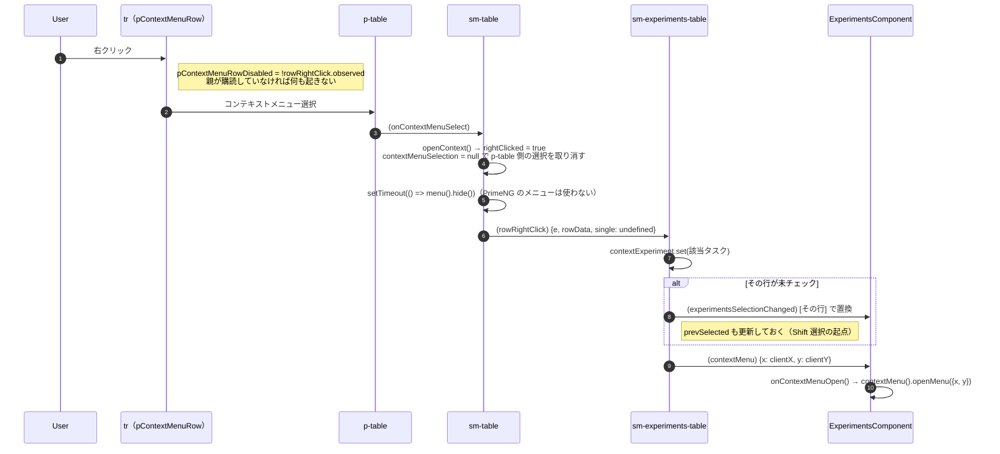
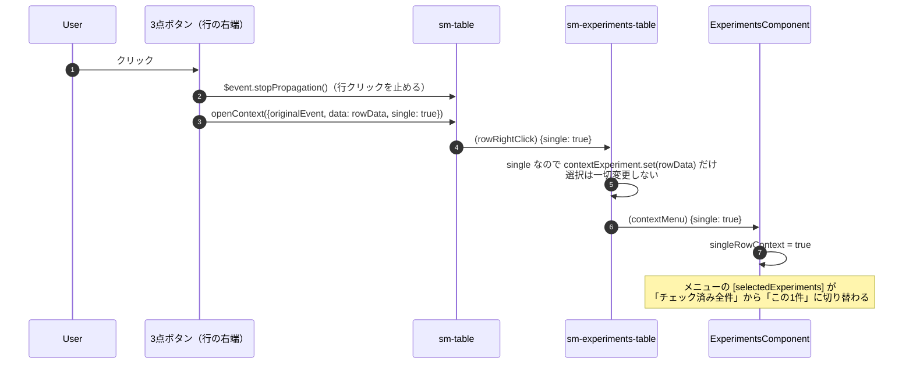
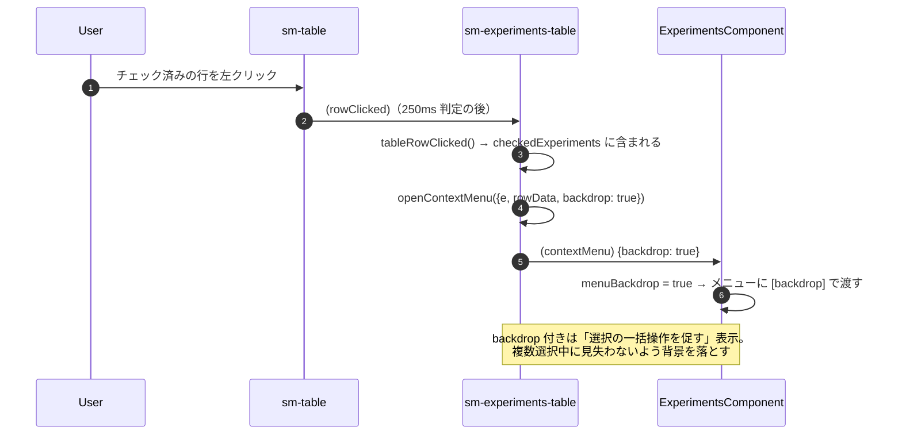
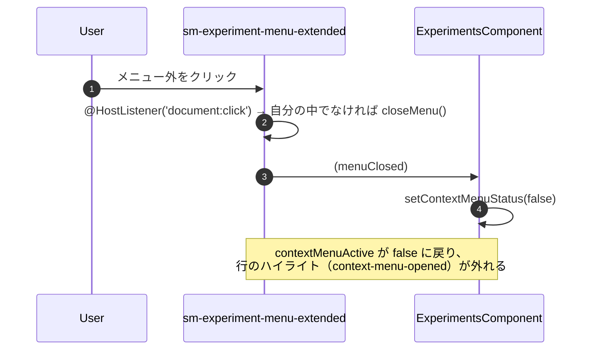

# 05-17 右クリックメニュー

メニュー部品そのものの住所は 05-08。ここでは**開き方が3通りある**ことと、その違いを追う。

## 図1: 行を右クリック

`p-context-menu` は DOM 上に置いてあるが `class="d-none"` で、開いても即 `hide()` される。
**PrimeNG のメニューは座標取得のためだけに使い、実際の描画は Angular Material の
`MatMenuTrigger`**（`sm-experiment-menu-extended` 側）が行う。

## 図2: 行末の3点ボタン

`single` の違いがメニューの対象範囲を決める。

EC 側は `single` をそのまま `singleRowContext` に入れ、メニューの input を切り替える。

| `singleRowContext` | selectedExperiments | numSelected | useCurrentEntity |
| --- | --- | --- | --- |
| `true`（3点ボタン） | 選択中の1件（または無し） | 1 | true |
| falsy（右クリック / 左クリック） | `checkedExperiments` 全件 | 件数 | false |

## 図3: チェック済みの行を左クリック

すでにチェックが入っている行を普通にクリックしたときも開く。

## 閉じるとき

## 読みどころ

- tr の属性: [table.component.html:124](../../../../src/app/webapp-common/shared/ui-components/data/table/table.component.html#L124)
- 3点ボタン: [table.component.html:170](../../../../src/app/webapp-common/shared/ui-components/data/table/table.component.html#L170)
- openContext: [table.component.ts:421](../../../../src/app/webapp-common/shared/ui-components/data/table/table.component.ts#L421)
- openContextMenu: [experiments-table.component.ts:349](../../../../src/app/webapp-common/experiments/dumb/experiments-table/experiments-table.component.ts#L349)
- EC 側の受け口: [experiments.component.ts:735](../../../../src/app/webapp-common/experiments/experiments.component.ts#L735)
