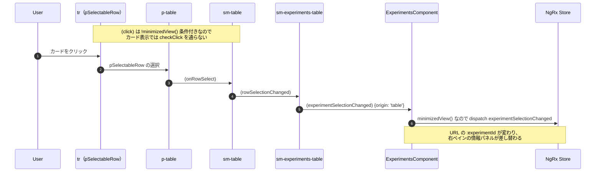
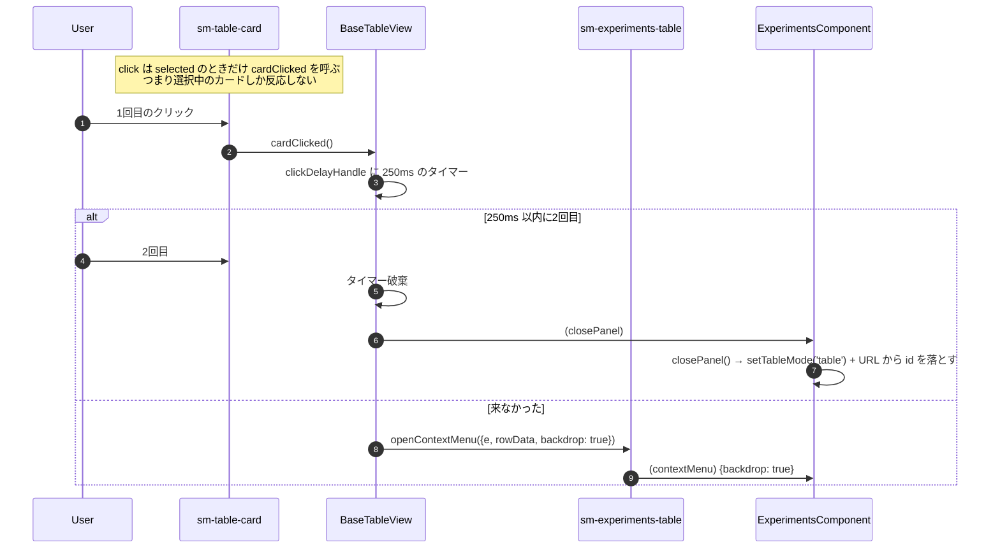
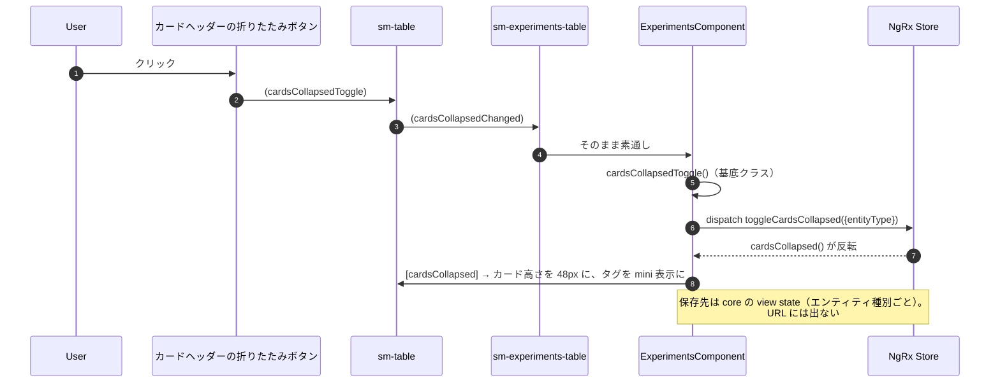
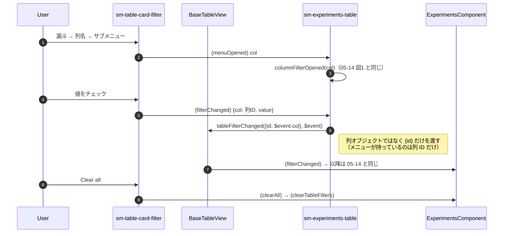

# 05-19 カードビューの操作

縮小表示（カード）では、テーブル表示と同じ操作でも経路が変わる。到達経路は 05-05、ここは操作。

## 図1: カードを選ぶ

テーブル表示と違い、`tr` の click は塞がれている。

選択解除の向きも p-table 経由。カード表示では `onRowDeselected` が `data: null` を返すので、
同じカードを押し直すと選択が外れる。

## 図2: 選択中のカードをもう一度押す

「選択中のカードをシングルクリック → メニュー」「ダブルクリック → パネルを閉じる」という
割り当てになっている。テーブル表示の 250ms 判定（05-11）とは別実装で、
`BaseTableView.cardClicked()` 側に置かれている。

## 図3: 折りたたみ

## 図4: カード表示のフィルタ

列ヘッダーが無いので、1つのメニューに全列のフィルタが入れ子で入る。

タグのシステムタグだけは別扱いで、`(subFilterChanged)` から
`tableFilterChanged({id: 'system_tags'}, ...)` として投げられる。

## 読みどころ

- カードの click: [experiments-table.component.html:216](../../../../src/app/webapp-common/experiments/dumb/experiments-table/experiments-table.component.html#L216)
- cardClicked: [base-table-view.ts:178](../../../../src/app/webapp-common/shared/ui-components/data/table/base-table-view.ts#L178)
- onRowDeselected: [table.component.ts:384](../../../../src/app/webapp-common/shared/ui-components/data/table/table.component.ts#L384)
- 折りたたみ: [base-entity-page.ts:326](../../../../src/app/webapp-common/shared/entity-page/base-entity-page.ts#L326)
- カードフィルタ: [experiments-table.component.html:38](../../../../src/app/webapp-common/experiments/dumb/experiments-table/experiments-table.component.html#L38)
