# InlineEditComponent の参照元（madge 逆依存）

起点: `src/app/webapp-common/shared/ui-components/inputs/inline-edit/inline-edit.component.ts`（オレンジの太枠）  
矢印: import する側 → される側。`*.spec.ts` は除外  
ノードのクリック: VSCode で宣言行を開く（ブラウザ表示時のみ。VSCode のプレビューでは下のファイル一覧を使う）

```mermaid
flowchart LR
  n0["inline-edit.component"]
  n1["profile-name.component"]
  n2["open-dataset-card.component"]
  n3["experiment-info-header.component"]
  n4["model-general-info.component"]
  n5["model-info-header.component"]
  n6["nested-card.component"]
  n7["pipeline-card.component"]
  n8["report-card.component"]
  n9["settings.routes"]
  n10["open-datasets.component"]
  n11["experiment-output.component"]
  n12["model-info-general.component"]
  n13["model-info.component"]
  n14["nested-project-view-page.component"]
  n15["pipelines-page.component"]
  n16["dashboard-reports.component"]
  n17["reports-list.component"]
  n18["app.routes"]
  n19["datasets.routes"]
  n20["experiment-routes"]
  n21["models.routes"]
  n22["nested-datasets-page.component"]
  n23["nested-open-datasets-page.component"]
  n24["nested-pipeline-page.component"]
  n25["nested-reports-page.component"]
  n26["pipelines.routes"]
  n27["dashboard.component"]
  n28["reports-page.component"]
  n29["app.config"]
  n30["reports.routes"]
  n31["dashboard.routes"]
  n1 --> n0
  n2 --> n0
  n3 --> n0
  n4 --> n0
  n5 --> n0
  n6 --> n0
  n7 --> n0
  n8 --> n0
  n9 --> n1
  n10 --> n2
  n11 --> n3
  n12 --> n4
  n13 --> n5
  n14 --> n6
  n2 --> n7
  n15 --> n7
  n16 --> n8
  n17 --> n8
  n18 --> n9
  n19 --> n10
  n20 --> n11
  n21 --> n12
  n21 --> n13
  n22 --> n14
  n23 --> n14
  n6 --> n14
  n24 --> n14
  n15 --> n14
  n25 --> n14
  n10 --> n15
  n24 --> n15
  n26 --> n15
  n27 --> n16
  n28 --> n17
  n29 --> n18
  n18 --> n19
  n18 --> n20
  n18 --> n21
  n19 --> n23
  n18 --> n24
  n30 --> n25
  n18 --> n26
  n31 --> n27
  n25 --> n28
  n30 --> n28
  n18 --> n30
  n18 --> n31
  click n0 href "vscode://vscode-remote/wsl+Ubuntu-22.04/home/mtrysd/work_2026/000-learn-ClearML-pro/src/app/webapp-common/shared/ui-components/inputs/inline-edit/inline-edit.component.ts:38" "src/app/webapp-common/shared/ui-components/inputs/inline-edit/inline-edit.component.ts"
  click n1 href "vscode://vscode-remote/wsl+Ubuntu-22.04/home/mtrysd/work_2026/000-learn-ClearML-pro/src/app/features/settings/containers/admin/profile-name/profile-name.component.ts:22" "src/app/features/settings/containers/admin/profile-name/profile-name.component.ts"
  click n2 href "vscode://vscode-remote/wsl+Ubuntu-22.04/home/mtrysd/work_2026/000-learn-ClearML-pro/src/app/webapp-common/datasets/open-dataset-card/open-dataset-card.component.ts:42" "src/app/webapp-common/datasets/open-dataset-card/open-dataset-card.component.ts"
  click n3 href "vscode://vscode-remote/wsl+Ubuntu-22.04/home/mtrysd/work_2026/000-learn-ClearML-pro/src/app/webapp-common/experiments/dumb/experiment-info-header/experiment-info-header.component.ts:75" "src/app/webapp-common/experiments/dumb/experiment-info-header/experiment-info-header.component.ts"
  click n4 href "vscode://vscode-remote/wsl+Ubuntu-22.04/home/mtrysd/work_2026/000-learn-ClearML-pro/src/app/webapp-common/models/dumbs/model-general-info/model-general-info.component.ts:48" "src/app/webapp-common/models/dumbs/model-general-info/model-general-info.component.ts"
  click n5 href "vscode://vscode-remote/wsl+Ubuntu-22.04/home/mtrysd/work_2026/000-learn-ClearML-pro/src/app/webapp-common/models/dumbs/model-info-header/model-info-header.component.ts:59" "src/app/webapp-common/models/dumbs/model-info-header/model-info-header.component.ts"
  click n6 href "vscode://vscode-remote/wsl+Ubuntu-22.04/home/mtrysd/work_2026/000-learn-ClearML-pro/src/app/webapp-common/nested-project-view/nested-card/nested-card.component.ts:39" "src/app/webapp-common/nested-project-view/nested-card/nested-card.component.ts"
  click n7 href "vscode://vscode-remote/wsl+Ubuntu-22.04/home/mtrysd/work_2026/000-learn-ClearML-pro/src/app/webapp-common/pipelines/pipeline-card/pipeline-card.component.ts:43" "src/app/webapp-common/pipelines/pipeline-card/pipeline-card.component.ts"
  click n8 href "vscode://vscode-remote/wsl+Ubuntu-22.04/home/mtrysd/work_2026/000-learn-ClearML-pro/src/app/webapp-common/reports/report-card/report-card.component.ts:36" "src/app/webapp-common/reports/report-card/report-card.component.ts"
  click n9 href "vscode://vscode-remote/wsl+Ubuntu-22.04/home/mtrysd/work_2026/000-learn-ClearML-pro/src/app/features/settings/settings.routes.ts:11" "src/app/features/settings/settings.routes.ts"
  click n10 href "vscode://vscode-remote/wsl+Ubuntu-22.04/home/mtrysd/work_2026/000-learn-ClearML-pro/src/app/webapp-common/datasets/open-datasets/open-datasets.component.ts:40" "src/app/webapp-common/datasets/open-datasets/open-datasets.component.ts"
  click n11 href "vscode://vscode-remote/wsl+Ubuntu-22.04/home/mtrysd/work_2026/000-learn-ClearML-pro/src/app/features/experiments/containers/experiment-ouptut/experiment-output.component.ts:38" "src/app/features/experiments/containers/experiment-ouptut/experiment-output.component.ts"
  click n12 href "vscode://vscode-remote/wsl+Ubuntu-22.04/home/mtrysd/work_2026/000-learn-ClearML-pro/src/app/webapp-common/models/containers/model-info-general/model-info-general.component.ts:18" "src/app/webapp-common/models/containers/model-info-general/model-info-general.component.ts"
  click n13 href "vscode://vscode-remote/wsl+Ubuntu-22.04/home/mtrysd/work_2026/000-learn-ClearML-pro/src/app/webapp-common/models/containers/model-info/model-info.component.ts:82" "src/app/webapp-common/models/containers/model-info/model-info.component.ts"
  click n14 href "vscode://vscode-remote/wsl+Ubuntu-22.04/home/mtrysd/work_2026/000-learn-ClearML-pro/src/app/webapp-common/nested-project-view/nested-project-view-page/nested-project-view-page.component.ts:32" "src/app/webapp-common/nested-project-view/nested-project-view-page/nested-project-view-page.component.ts"
  click n15 href "vscode://vscode-remote/wsl+Ubuntu-22.04/home/mtrysd/work_2026/000-learn-ClearML-pro/src/app/webapp-common/pipelines/pipelines-page/pipelines-page.component.ts:64" "src/app/webapp-common/pipelines/pipelines-page/pipelines-page.component.ts"
  click n16 href "vscode://vscode-remote/wsl+Ubuntu-22.04/home/mtrysd/work_2026/000-learn-ClearML-pro/src/app/webapp-common/dashboard/containers/dashboard-reports/dashboard-reports.component.ts:29" "src/app/webapp-common/dashboard/containers/dashboard-reports/dashboard-reports.component.ts"
  click n17 href "vscode://vscode-remote/wsl+Ubuntu-22.04/home/mtrysd/work_2026/000-learn-ClearML-pro/src/app/webapp-common/reports/reports-list/reports-list.component.ts:20" "src/app/webapp-common/reports/reports-list/reports-list.component.ts"
  click n18 href "vscode://vscode-remote/wsl+Ubuntu-22.04/home/mtrysd/work_2026/000-learn-ClearML-pro/src/app/app.routes.ts:29" "src/app/app.routes.ts"
  click n19 href "vscode://vscode-remote/wsl+Ubuntu-22.04/home/mtrysd/work_2026/000-learn-ClearML-pro/src/app/features/datasets/datasets.routes.ts:6" "src/app/features/datasets/datasets.routes.ts"
  click n20 href "vscode://vscode-remote/wsl+Ubuntu-22.04/home/mtrysd/work_2026/000-learn-ClearML-pro/src/app/webapp-common/experiments/experiment-routes.ts:27" "src/app/webapp-common/experiments/experiment-routes.ts"
  click n21 href "vscode://vscode-remote/wsl+Ubuntu-22.04/home/mtrysd/work_2026/000-learn-ClearML-pro/src/app/webapp-common/models/models.routes.ts:10" "src/app/webapp-common/models/models.routes.ts"
  click n22 href "vscode://vscode-remote/wsl+Ubuntu-22.04/home/mtrysd/work_2026/000-learn-ClearML-pro/src/app/features/datasets/nested-datasets-page/nested-datasets-page.component.ts:31" "src/app/features/datasets/nested-datasets-page/nested-datasets-page.component.ts"
  click n23 href "vscode://vscode-remote/wsl+Ubuntu-22.04/home/mtrysd/work_2026/000-learn-ClearML-pro/src/app/webapp-common/datasets/nested-open-datasets-page/nested-open-datasets-page.component.ts:45" "src/app/webapp-common/datasets/nested-open-datasets-page/nested-open-datasets-page.component.ts"
  click n24 href "vscode://vscode-remote/wsl+Ubuntu-22.04/home/mtrysd/work_2026/000-learn-ClearML-pro/src/app/webapp-common/pipelines/nested-pipeline-page/nested-pipeline-page.component.ts:35" "src/app/webapp-common/pipelines/nested-pipeline-page/nested-pipeline-page.component.ts"
  click n25 href "vscode://vscode-remote/wsl+Ubuntu-22.04/home/mtrysd/work_2026/000-learn-ClearML-pro/src/app/webapp-common/reports/nested-reports-page/nested-reports-page.component.ts:37" "src/app/webapp-common/reports/nested-reports-page/nested-reports-page.component.ts"
  click n26 href "vscode://vscode-remote/wsl+Ubuntu-22.04/home/mtrysd/work_2026/000-learn-ClearML-pro/src/app/webapp-common/pipelines/pipelines.routes.ts:7" "src/app/webapp-common/pipelines/pipelines.routes.ts"
  click n27 href "vscode://vscode-remote/wsl+Ubuntu-22.04/home/mtrysd/work_2026/000-learn-ClearML-pro/src/app/features/dashboard/dashboard.component.ts:37" "src/app/features/dashboard/dashboard.component.ts"
  click n28 href "vscode://vscode-remote/wsl+Ubuntu-22.04/home/mtrysd/work_2026/000-learn-ClearML-pro/src/app/webapp-common/reports/reports-page/reports-page.component.ts:66" "src/app/webapp-common/reports/reports-page/reports-page.component.ts"
  click n29 href "vscode://vscode-remote/wsl+Ubuntu-22.04/home/mtrysd/work_2026/000-learn-ClearML-pro/src/app/app.config.ts:32" "src/app/app.config.ts"
  click n30 href "vscode://vscode-remote/wsl+Ubuntu-22.04/home/mtrysd/work_2026/000-learn-ClearML-pro/src/app/webapp-common/reports/reports.routes.ts:8" "src/app/webapp-common/reports/reports.routes.ts"
  click n31 href "vscode://vscode-remote/wsl+Ubuntu-22.04/home/mtrysd/work_2026/000-learn-ClearML-pro/src/app/features/dashboard/dashboard.routes.ts:16" "src/app/features/dashboard/dashboard.routes.ts"
  style n0 stroke:#d97706,stroke-width:3px
```

## ファイル一覧

- [inline-edit.component](src/app/webapp-common/shared/ui-components/inputs/inline-edit/inline-edit.component.ts#L38)
- [profile-name.component](src/app/features/settings/containers/admin/profile-name/profile-name.component.ts#L22)
- [open-dataset-card.component](src/app/webapp-common/datasets/open-dataset-card/open-dataset-card.component.ts#L42)
- [experiment-info-header.component](src/app/webapp-common/experiments/dumb/experiment-info-header/experiment-info-header.component.ts#L75)
- [model-general-info.component](src/app/webapp-common/models/dumbs/model-general-info/model-general-info.component.ts#L48)
- [model-info-header.component](src/app/webapp-common/models/dumbs/model-info-header/model-info-header.component.ts#L59)
- [nested-card.component](src/app/webapp-common/nested-project-view/nested-card/nested-card.component.ts#L39)
- [pipeline-card.component](src/app/webapp-common/pipelines/pipeline-card/pipeline-card.component.ts#L43)
- [report-card.component](src/app/webapp-common/reports/report-card/report-card.component.ts#L36)
- [settings.routes](src/app/features/settings/settings.routes.ts#L11)
- [open-datasets.component](src/app/webapp-common/datasets/open-datasets/open-datasets.component.ts#L40)
- [experiment-output.component](src/app/features/experiments/containers/experiment-ouptut/experiment-output.component.ts#L38)
- [model-info-general.component](src/app/webapp-common/models/containers/model-info-general/model-info-general.component.ts#L18)
- [model-info.component](src/app/webapp-common/models/containers/model-info/model-info.component.ts#L82)
- [nested-project-view-page.component](src/app/webapp-common/nested-project-view/nested-project-view-page/nested-project-view-page.component.ts#L32)
- [pipelines-page.component](src/app/webapp-common/pipelines/pipelines-page/pipelines-page.component.ts#L64)
- [dashboard-reports.component](src/app/webapp-common/dashboard/containers/dashboard-reports/dashboard-reports.component.ts#L29)
- [reports-list.component](src/app/webapp-common/reports/reports-list/reports-list.component.ts#L20)
- [app.routes](src/app/app.routes.ts#L29)
- [datasets.routes](src/app/features/datasets/datasets.routes.ts#L6)
- [experiment-routes](src/app/webapp-common/experiments/experiment-routes.ts#L27)
- [models.routes](src/app/webapp-common/models/models.routes.ts#L10)
- [nested-datasets-page.component](src/app/features/datasets/nested-datasets-page/nested-datasets-page.component.ts#L31)
- [nested-open-datasets-page.component](src/app/webapp-common/datasets/nested-open-datasets-page/nested-open-datasets-page.component.ts#L45)
- [nested-pipeline-page.component](src/app/webapp-common/pipelines/nested-pipeline-page/nested-pipeline-page.component.ts#L35)
- [nested-reports-page.component](src/app/webapp-common/reports/nested-reports-page/nested-reports-page.component.ts#L37)
- [pipelines.routes](src/app/webapp-common/pipelines/pipelines.routes.ts#L7)
- [dashboard.component](src/app/features/dashboard/dashboard.component.ts#L37)
- [reports-page.component](src/app/webapp-common/reports/reports-page/reports-page.component.ts#L66)
- [app.config](src/app/app.config.ts#L32)
- [reports.routes](src/app/webapp-common/reports/reports.routes.ts#L8)
- [dashboard.routes](src/app/features/dashboard/dashboard.routes.ts#L16)
